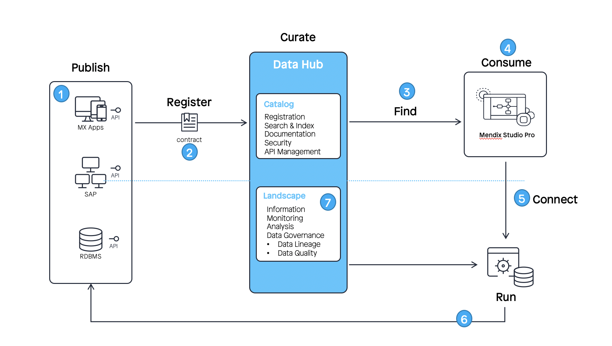

## 1 Introduction

[Mendix Data Hub](https://hub.mendix.com) is a product for integrating app development with the data available from the many applications in an organization. It is the central hub in an organization for finding and connecting to the relevant shared datasets. It also ensures consistency in the data used throughout the organization. Data Hub enables reliable data sources to be located centrally from one point and for users to connect to them through it. 

{}
To use the Mendix Data Hub a license is required, which also includes the integration of Data Hub in Studio Pro. For more information, see the [Data Hub License Limitations](/refguide/consumed-odata-service-requirements#license-limitations) section of *Consumed OData Service Requirements*.
{}

{}
The Data Hub integration is available in Studio Pro version [8.14](/releasenotes/studio-pro/8.14) and above. To use the latest functionality of Data Hub, download the latest version of [Studio Pro](https://marketplace.mendix.com/link/studiopro/). {}

Follow the journey for building an app using available datasets (or entity sets for services from Mendix apps) from the [Data Hub](https://hub.mendix.com) home page, or try building a quick app by following [How to Share Data Between Apps](share-data/).

## 2 Overview of Mendix Data Hub

Mendix Data Hub has components to enable the flexible sharing of datasets. The following diagram shows how these components enable app development using shared datasets:

1. Published apps and other software expose datasets in OData services that can be used to provide a consistent and reliable network of shared data. The data is maintained in the respective source apps.
2. In Studio Pro, exposed OData services (or entity sets as they are named in Studio Pro) are automatically registered in the [Data Hub Catalog](data-hub-catalog/) when your app is deployed. OData services from other applications can also be manually registered. For each service, metadata is registered in the Data Hub Catalog. Owners of the service, [Mendix Admins](#admin), and [Data Hub Curators](#curator) can curate this metadata.
3. Search in the Data Hub Catalog or use the integrated Data Hub in Studio Pro to find suitable shared data assets to use in your app development.
4. Consume registered datasets in Studio Pro to create new apps. 
5. Upon deployment of an app in Studio Pro, registered services are updated in the Data Hub Catalog to show published dependencies and consumed dependencies, and a connection is established to the shared data sources.
6. The consuming application directly connects to the source system (as defined in the published service metadata) to use the data associated with the consumed dataset.
7. The [Data Hub Landscape](data-hub-landscape/) enables users to see the dependencies between components and the relevance of data and to ascertain data lineage.

## 3 Roles in Data Hub{#data-hub-roles}

In Mendix Data Hub, governance is the cornerstone. Curation of shared assets is essential for defining how the shared data assets can be used, identifying the relevance to users, ensuring that the resources can be found by the right users, and managing the accessibility, security and confidentiality levels of the shared data.

This section describes the general Data Hub user as well as the assigned [Mendix Admin](#admin) and [Data Hub Curator](#curator) roles.

### 3.1 Data Hub Users

The typical Mendix user is able to use the Data Hub Catalog to search and use registered services. Users can also register new services through published OData services, and as owners, users are able to have curation rights over their OData services.

Data Hub users can do the following: 

* Publish services and register them in the Data Hub Catalog from Studio Pro
* Register published OData V4 Services for non-Mendix apps manually
* Update the metadata such as descriptions, tags, and contact information of their own registered services
* Owners can set the discoverability of their services, thereby publishing the service and the exposed datasets for use by other users
* See all the discoverable services and datasets registered in their organization’s Data Hub Catalog and connect to the data by using the published entities as external entities in their apps in the Mendix Studios

{}
A user who publishes an OData service is the technical owner of the service and thereby has a [Data Hub Curator](#curator) role over their own services. If they have registered services which are not published and are non-discoverable, only they will be able to find and consume these services. 
{}

### 3.2 Mendix Admin {#admin}

A Mendix Admin can do the following:

* Act as a technical administrator of the organization’s Data Hub
* Assign [Data Hub Curator](#curator) roles
* Curate the Data Hub according to the organization's data governance policy
* Access all the registered assets in the Data Hub Catalog for the organization

For more information, see the [Data Hub](/developerportal/control-center#data-hub) section of *Control Center*. For details on Mendix Admin tasks for Data Hub, see [Data Hub Administration](/developerportal/control-center/data-hub-admin).

### 3.3 Data Hub Curator {#curator}

The Data Hub Curator curates registered services in the Data Hub Catalog to ensure that registered services are visible to the relevant users and to enrich the information on registered assets. An organization can have several Data Hub Curators. 

Curators are assigned by the a [Mendix Admin](#admin) and they perform the following functions:

* Maintain registered OData services and manage versions
* Ensure the discoverability of their assets by the relevant users
* Enrich the metadata of registered services and datasets – for example descriptions, tags, and contact information

## 4 Data Hub Licences {#data-hub-licences}

There are two types of licences for Mendix Data Hub: Data Hub Free and Data Hub Premium.

All Mendix users have access to the Data Hub Free edition. With this, you can retrieve or edit 1000 objects per application per day for each runtime instance when deployed. When that limit is exceeded, you get an error when your applications tries to retrieve more data. For more information, see the [Data Hub License Limitations](/refguide/consumed-odata-service-requirements#license-limitations) section of *Consumed OData Service Requirements*.

With the Data Hub Premium licence, apps are not limited by any means and can retrieve or edit unlimited objects.

Contact your [Mendix Admin](/developerportal/control-center/#company) to find out what type of Data Hub license your organization has.

## 5 Guide Categories

The *Data Hub Guide* is divided into the following categories:

* [How to Share Data Between Apps](share-data/)
* [How to Write Data to Another App](write-data/)
* [Data Hub Catalog](data-hub-catalog/)
* [Data Hub Landscape](data-hub-landscape/)
