## 1 Introduction

This how-to will demonstrate how easy it is to build apps using data from different sources using Mendix Data Hub. The steps will describe the following: 

* Create a simple app in Studio Pro
* Publish an entity from the app and register it in the Data Hub Catalog 
* Use the Data Hub Catalog to explore the entities that are available in the organization 
* Connect to the registered entity in a new app
* Change data in the original app and see it updated in the consuming app
* See the network of shared data in the Data Hub Landscape

{}
To use the Mendix Data Hub a license is required, with also includes the  integration of Data Hub in Studio Pro, in order to discover shared assets in you organization and consume the shared data for building apps.
{}

## 2 Prerequisites

Before starting this how-to, make sure you have completed the following prerequisite:

* Install Studio Pro version [8.14.0 or above](https://appstore.home.mendix.com/link/modelers/)

## 3 Creating an App 

Follow these steps to create a simple app in Studio Pro whose data you will use in another app: 

1. In Studio Pro, click **New App** to create a new app project using the **Blank App** template. Call this app *{yourname}CustomerServiceApp*.
2. Open **MyFirstModule** > **Domain Model** and click **Entity** in the toolbar above the main window to add an entity to your domain model.
3. Double-click the entity to open its properties and change its **Name** to *Customer*.
4.  In the **Attributes** tab, click **New** to create the following attributes for the entity:

	| Name | Type |
	| :---------- | :--------- |
	| CustomerId  | Autonumber |
	| FirstName   | String     |
	| LastName    | String     |
	| CompanyName | String     |
	| Address     | String     |

	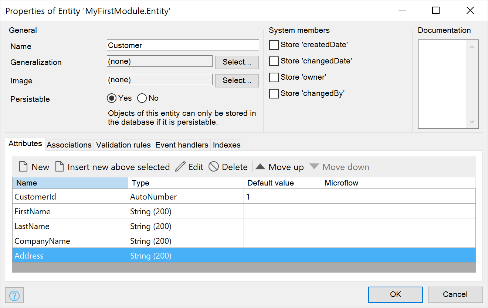
	
5. Click **OK** to see the entity and attributes in the domain model.
6. Right-click the entity and from the menu,  select **Generate overview pages**.
7. In the **Generate pages** dialog box, select **Atlas_Default(Atlas_UI_Resources)** as the **Content layout** and click **OK**. Overview pages for the new entity will be added in the **OverviewPages** folder of **MyFirstModule**.

	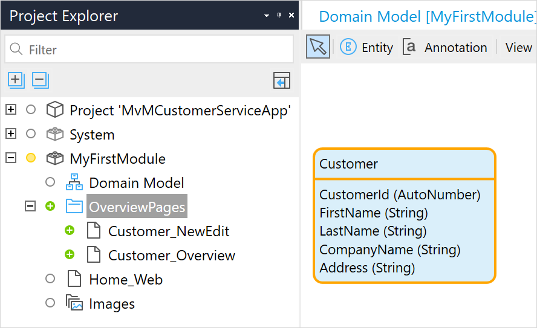

7.  In the **Project Explorer**, double-click **Home_Web** to open the **Home_Web** page.
8. From the **Project Explorer** drag **Customer_Overview** into the **Auto-fill** container under the "Welcome" banner.

	You have now created a simple app with the entity **Customer** and a web page where you can add data and view and edit details for this entity. Go ahead and customize your Home page further by changing the banner text.
	
	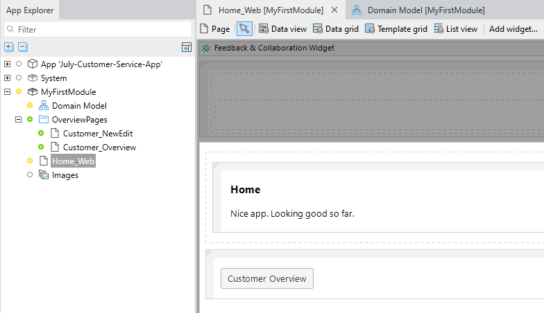

## 4 Publishing to the Data Hub Catalog {#publishing}

You are going to register the **Customer** entity in the Data Hub Catalog. This means you will be providing access to the data that will be associated with this entity for use in other apps. To do this you have to expose the **Customer** entity in a published OData service in Studio Pro. OData V3 is a REST-based protocol  and a standard format that is used for registering services and the entities that are exposed in the service in the Data Hub Catalog.  

When the app is deployed to the Mendix Cloud v4, the service is automatically registered in the Data Hub Catalog along with the exposed entity.

The following steps take you through creating an OData service for your app to expose the **Customer** entity and register it in the Data Hub Catalog.

1.  Add a folder called *APIs* to **MyFirstModule**.

	{}The published OData service functions as an API to your app. Some apps may have several published services, so it is good practice to keep them together in a folder for each module.{}

2.  In the domain model, right-click the **Customer** entity and select **Expose as OData resource…**.

	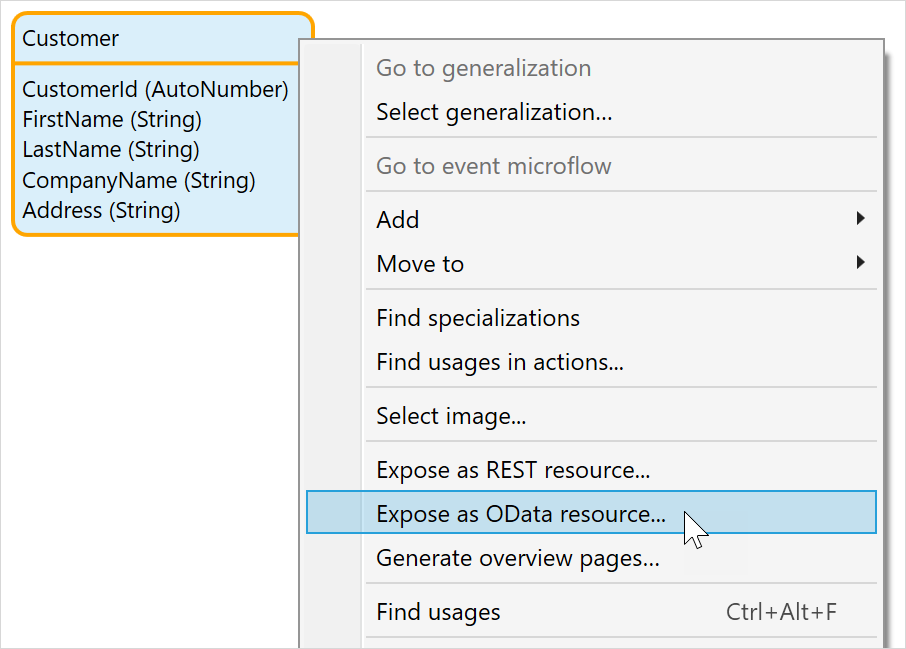

3.  In the **Select Published OData Service** dialog box, select the **MyFirstModule** > **APIs** folder and click **New** to add a new OData service. Call this published OData service *{yourname}CustomerODataService* and press **OK**. 

	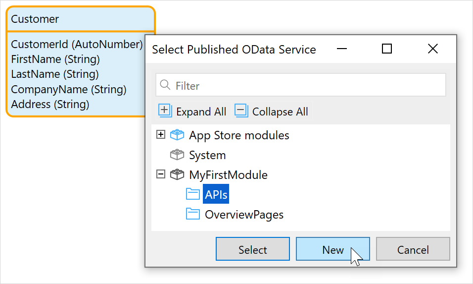

	The new **{yourname}CustomerODataService** is added to the module and the **Edit published resource** dialog box is displayed for the entity **Customer**. 

	
	
4.	Click **Select…** to take a look at the list of **Exposed attributes and associations**. You will see the list of attributes that you defined in the last section. When publishing an entity to an OData service you can select the attributes that you want to expose in the service from here.

5.  Click **OK** twice to display the **OData Service** document. You will see the details of  the service that will be included in the service metadata files and be registered in the Data Hub Catalog. 

	{}   The **Version** number that is assigned to a service is important. It is possible to have different versions of the same OData service registered in the Data Hub Catalog. A connection to an entity by a consuming app will be through a specific service and version number. {}

	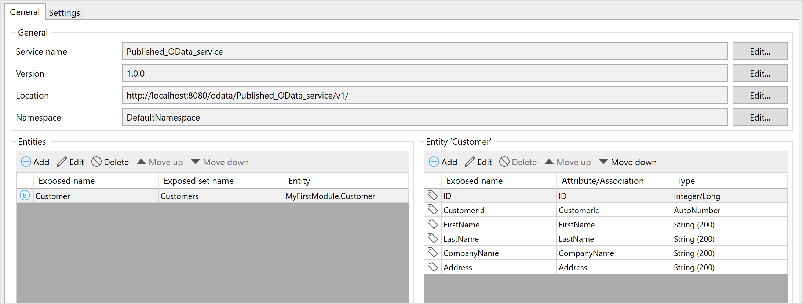

	Under **Resources**, the **Customer** entity is listed. 

	{} If you want to expose several entities in a service, they can be added and edited in the **OData service** page. {}
   
6.  Click **Run** to deploy the app. When prompted, click **Save and continue** to save any unsaved changes to the app. The app will be deployed, and the OData service will be automatically registered in the Data Hub Catalog.

	{}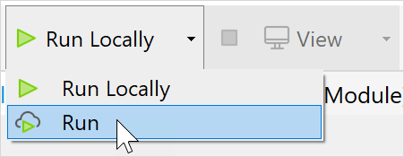{}

	{}The app has to be deployed to the Mendix Cloud or to your organization's environment using **Run** for the service to be registered in the Data Hub Catalog.{}

7. Once the app is deployed, click **View** to open the app in your browser. Your app is now ready to use.

8. On the app's home page, click **Customers Overview**.

9. Click **New** to add data for a customer entry.

10. You can now add data to this entity. Go ahead and add several customers. 

	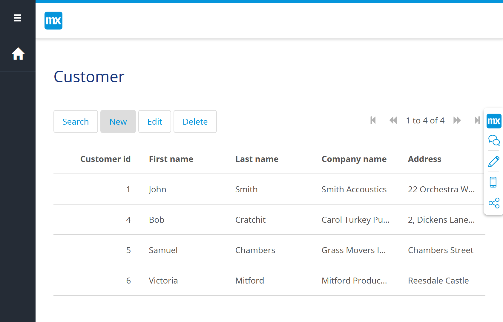

	When this entity is consumed in another app via the Data Hub Catalog, a connection will be made to the data that that you enter here.

## 5 Using the Data Hub Catalog and Curating your own Service

The **{yourname}CustomerODataService** from your app is now registered in the Data Hub Catalog and can be used in other apps. To explore the Data Hub Catalog and find this service and the exposed **Customer** entity, follow these steps:

1.  Go to [Mendix Data Hub](https://hub.mendix.com/):

	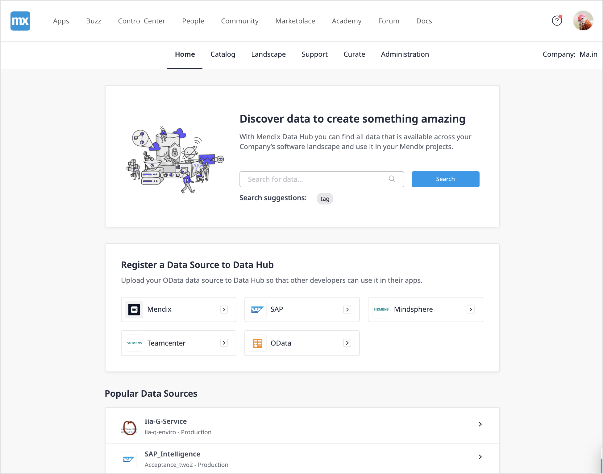

2. In the search field, enter the search term *customer*. All services and entities that satisfy this search string will be displayed in the **Search Results** pane in the **Search Details** screen.

3. When you look for your app in the search results you will not find it there. This is because there is a **Filter** active which is indicated by the **1**: 

   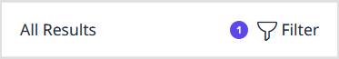

   By default, a filter is set to show results in **Production** environments.  

4. Your app was deployed to the **Mendix Free App** or **Sandbox** environment so you will have to change the filter settings so that search will also show results in this environment. Click **Filter** to see the **Filters** dialog box: 

   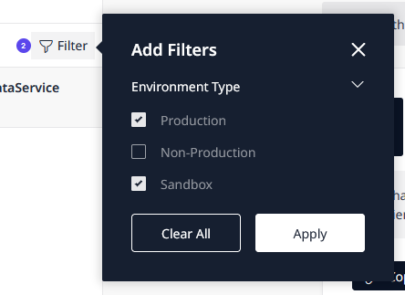

5. You can either check **Sandbox** to include it in the search results and  or you can click **Clear Filters** to clear all active filters and then click **Apply Filters**. 

6. From the new search results list, find the service that you published and click to select it. 

7. Full details for the service is displayed in the search details screen and the service metadata panel on the right. This information was published in the OData service contract.

8. As you are the owner of the service is also displayed. You have curate permissions to edit the metadata for this service and also enrich it further.  The curation bar will state "**You are the owner of the service**":

  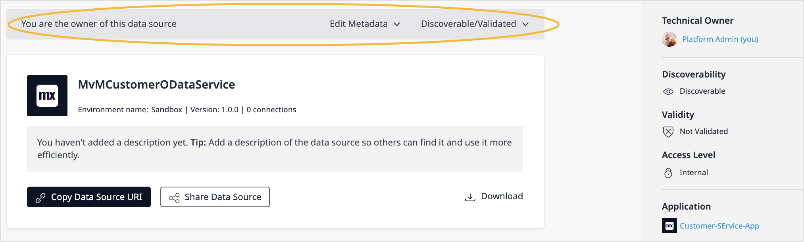

​	{}For more information about the user and curator roles in Data Hub see [Roles in Data Hub](../index#data-hub-roles).{}

Owners of assets registered in the catalog and curators can edit details of the registered service and also set the **Discoverability** to other users. By default, services registered through a Studio Pro deployment will be set to **Discoverable** meaning that it is visible to all users.  For further details about curating functions, see [How to Curate Registered Assets](../data-hub-catalog/curate).

For more details on searching in the Data Hub Catalog and the **Search Details** screen, see [How to Search in the Data Hub Catalog](../data-hub-catalog/search). You can also explore registered services in the Data Hub Landscape. For more information, see [How to Use the Data Hub Landscape](../data-landscape/../data-hub-landscape/index).

## 6 Using the Customer Entity in Another App

You are now going to create a new app and consume the data you have added to the **Customer** entity through the **{yourname}CustomerODataService** service.

Perform the following steps:

1. In Studio Pro, create a new app using the **Blank App** template and call it *{yourname}CustomerActionsApp*.

2. Go to the domain model.

	The **Data Hub** pane will be displayed on the right. 
	
	  {}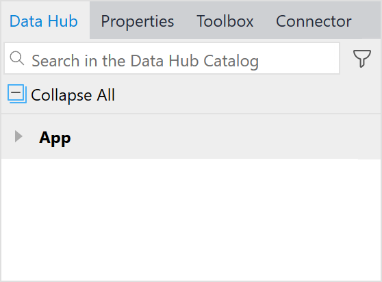{}
	
	If you do not see the Data Hub pane, click  **View** > **Data Hub** to display the **Data Hub** pane:
		{}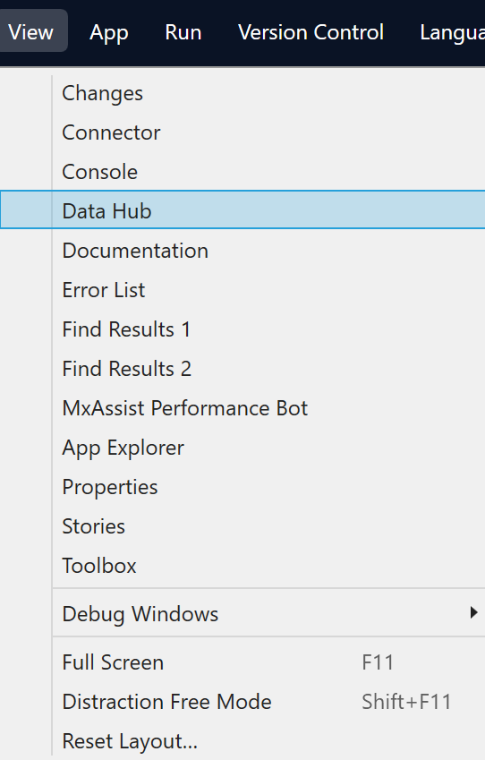{}

3. In the [Data Hub](/refguide/data-hub-pane) pane, enter the search string *customer*.

	The search results will be listed in the **Data Hub** pane showing all the services and entities satisfying this search string. You will note that the app that you have created is not listed.
	
	By default, search in the **Data Hub** pane will only show services in production environments. The app that you have deployed in this how-to was deployed to the Mendix Cloud for Free Apps. 

4. Click the **Filter** icon next to the search area to include this non-production environment in your search:  

	{}{}

5.  Check **Show development environments**. The search results will now show results for all environments including the **{yourname}CustomerOData_service** which is available in the Mendix Free App environment (which is displayed as **Sandbox** in the example below):

	{}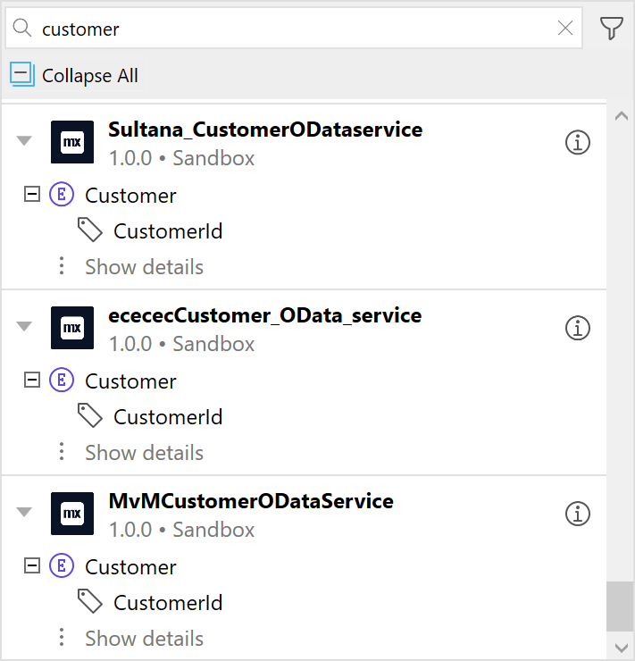{}

6.  Find **{yourname}CustomerODataService** and drag the **Customer** entity from this service into the domain model for your app. The consumed service and entity will be shown in the **Data Hub** pane with a green check mark against them.

	{}Entities that are used in an app from the **Data Hub** pane are called external entities. They are displayed as purple containers in the domain model, and the name of the OData service they are exposed in is displayed.{}

	{}The properties of external entities are different from other kinds of entities because the properties that define the data in the publishing app cannot be changed in the consuming app. For further information on external entities, see [External Entities](/refguide/external-entities) in the *Studio Pro Guide*. 
	{}
	
7.  Click the information icon for the consumed service in the **Data Hub** Pane to see further information about the service as it is registered in the Data Hub Catalog. You can also click **View in Data Hub Catalog** to go to the service details screen in the Data Hub Catalog.

	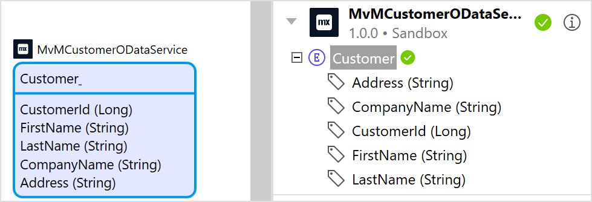

	In the **Project Explorer**, the service and location documents for the external entity that you have just included in your domain model are now listed. These documents contain the metadata for the service and provide the links for connecting to the shared data.
   
	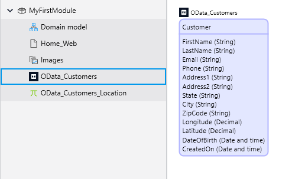

9. Right-click the entity and select **Generate overview pages** to generate overview pages for this entity.

10. In the **Generate pages** dialog box, for **Content layout** select **Atlas_Default(Atlas_UI_Resources)** and click **OK**. Overview pages for the new entity will be added to the **MyFirstModule** module.

11. Open the **Home_Web** page and, from **Project Explorer**, drag **Customers_Overview** into the **Auto-fill** container under the "Welcome" banner. Go ahead and add a new banner and welcome text.

12. Click **Run** to deploy the app. The app will be deployed and a link established to the data associated with the **Customer** entity in the publishing app (**{yourname)CustomerServiceApp**) through the **{yourname)CustomerODataservice**.

## 7 Viewing the Shared Data in Your New App 

To view the consumed data in your new app, follow these steps:

1. When the app has successfully been deployed, click **View** to open the app in the browser.
2. Click **Customer Overview**.

	The overview page displays the list of the customers that you entered in the **{yourname}CustomerServiceApp** app. 
	
	{}As this page displays data shared from another app, there are no buttons for adding or changing this data.{}

## 8 Seeing Changes in Data in the Consuming App

To see an example of consumed data being updated when data is changed in the originating app, follow these steps:

1. Open both apps that have been created in this how-to in separate browser windows and display them side by side. 
2. Make some changes to the customer list in **{yourname}CustomerServiceApp** by adding a few more customers to the list and editing some existing entries.
3. Refresh the **{yourname}CustomerActionsApp** window by doing a **Search** to see the changes in the data displayed. 

In the example below, the consuming app is on the right:

Congratulations, you have successfully used the Data Hub Catalog functionality to share data between Mendix apps! 

You can now see your new apps in your organization's Data Hub Landscape. 

## 9 Viewing Your Apps in the Data Hub Landscape

You will now learn how to do the following:

* Use and understand the [Data Hub Landscape](../data-hub-landscape/index) for locating sources of data
* View the dependencies between deployed apps and the direction of the dependencies in your Data Hub Landscape 

You can view the two apps that you have created in the Data Hub Landscape and see the associations by following these steps:

1. Open the [Data Hub](https://hub.mendix.com/#/home) home page.
2.  Click the **Landscape** tab to see a graphical representation of your company's data landscape
3. Find your app using the search pane. Remember to use the filter to ensure you can see sandbox apps: 

	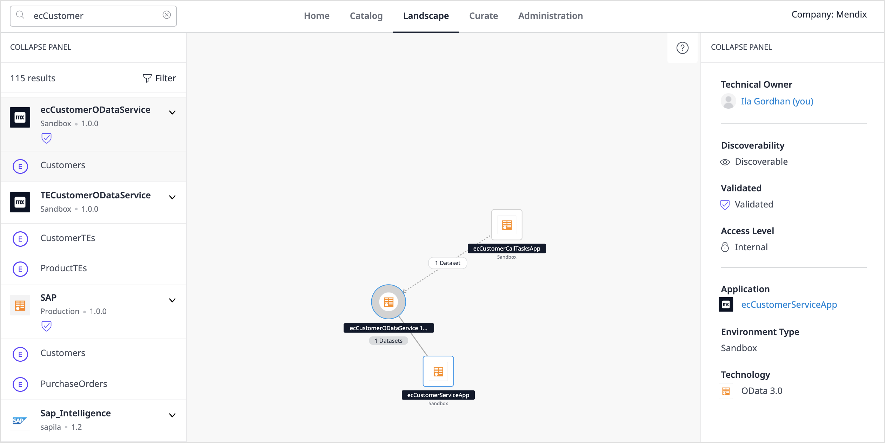
	
	In the Data Hub Landscape registered services are shown as circles with the number of entities that have been exposed in the service.
	
	The service **{yourname}CustomerODataAPI** is linked by a solid line to the runtime instance of **{yourname}CustomerCustomerServiceApp** (shown as a square icon), which is deployed as a Free App.
	
	The service is also linked by a dotted grey line to **{yourname}CustomerActionsApp** with an arrow that indicates that it is making a call to the service for data (or consuming data from it). If you click the entity icon on this consume line, the entities that are being consumed will be listed in the metadata panel.

4. Click a node to see details of the selected item in the Data Hub Catalog metadata panel on the right. You can also click the **Search** tab to see full details in the **Search Details** screen.

5. Go ahead and search for another item. For large networks, you can use your mouse to zoom in out and pan around the landscape. 
