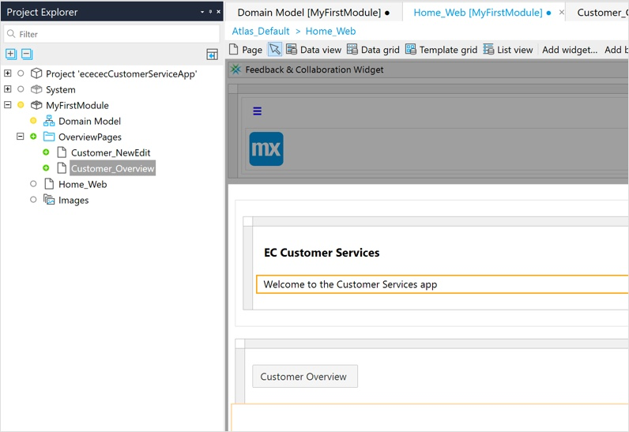
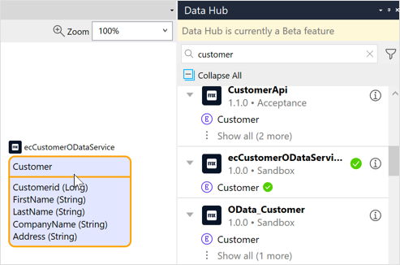

{}[EC: PM suggests posting a link to the Hallo World run through that users can play before doing this how-to.  Is this necessary? The animated How to will have to be updated to show beta functionality . It could also be the "Tour" on the welcome pages]{}

{}[**AD: I believe a similar note to the one above is in the DHG index?**]{}

## 1 Introduction

This how-to shows you how to share data between apps using the Mendix Data Hub.

{}[**AD: list of what the how-to will teach is good, but could use more substantial intro sentences relating to using Data Hub simply, vision, etc.**]{}

**This how-to will teach you how to do the following:**

* Enable Data Hub in Studio Pro
* Create a simple app in Studio Pro
* Publish an entity from the app and register it in the Data Hub Catalog 
* Use the Data Hub Catalog to explore the entities that are available in the organization 
* Connect to the registered entity in a new app
* Change data in the original app and see it updated in the consuming app

## 2 Prerequisites

Before starting this how-to, make sure you have completed the following prerequisites:

* Install Studio Pro version [8.14.0 or above](appstore.home.mendix.com/link/modelers/)

{}[**AD: verify it should be 8.14.0 before publication**]{}

## 3 Accessing the Data Hub Catalog

You can explore the services and entities giving access to shared data in your organization in the [Data Hub Catalog](https://hub.mendix.com/).

{}[**AD: is there a deep-link that will take the user directly to the Catalog tab?**]{}

In Studio Pro, when you have an open project, the **Data Hub** pane will be displayed on the right. 

If you do not see the above, click  **View** > **Data Hub** to display the **Data Hub** pane. 

{}[**AD: this section now only states info about opening the Data Hub pane, thus making the section superfluous. Is section 7 the best place to move this info so as to delete this section?**]{}

## 4 Creating an App 

Follow these steps to create a simple app in Studio Pro whose data you use in another app: 

1. In Studio Pro, click **New App** to create a new app project using the **Blank App** template. Call this app *{yourname}CustomerServiceApp*.
2. Open **MyFirstModule** > **Domain Model** and click **Entity** in the toolbar above the main window to add an entity to your domain model.
3. Double-click the entity to open its properties and change its **Name** to *Customer*.
4.  In the **Attributes** tab, click **New** to create the following attributes for the entity:

	| Name | Type |
	| :---------- | :--------- |
	| CustomerId  | Autonumber |
	| FirstName   | String     |
	| LastName    | String     |
	| CompanyName | String     |
	| Address     | String     |

	
	
	{}[**AD: screenshots continue to be a little blurry/unsharp - wonder if you can adjust your monitor settings to take better ones?**]{}

5. Click **OK** to see the entity and attributes in the domain model. Right-click the entity and from the menu,  select **Generate overview pages**.
6.  In the **Generate pages** dialog box, for **Content layout** select **Atlas_Default(Atlas_UI_Resources)** and click **OK**. Overview pages for the new entity will be added in the **OverviewPages** folder for **MyFirstModule**.

	

7.  In the **Project Explorer**, double-click **Home_Web** to open the **Home_Web** page. From the **Project Explorer** drag **Customer_Overview** into the **Auto-fill** container under the "Welcome" banner. You have now created a simple app with the entity **Customer** and a web page where you can add data and view and edit details for this entity. Go ahead and customize your Home page further by changing the banner text.

	

## 5 Publishing to the Data Hub Catalog

You are going to register the **Customer** entity in the Data Hub Catalog. This means you will be providing access to the data that will be associated with this entity for use in other apps. To do this you have to expose the **Customer** entity in a published OData service in Studio Pro. OData v3 is a standard format that is used for registering services and the entities that are exposed in the service in the Data Hub Catalog.  

When the app is deployed to the cloud, the service is automatically registered in the Data Hub Catalog along with the exposed entity.

{}[**AD: which "cloud"? If "Mendix Cloud," write full name and add cross-reference**]{}

The following steps take you through creating an OData service for your app to expose the **Customer** entity and register it in the Data Hub Catalog.

1.  Add a folder called *APIs* to **MyFirstModule**.

	{}The published OData service functions as an API to your app. Some apps may have several published services, so it is good practice to keep them together in a folder for each module.{}

2.  In the domain model, right-click the **Customer** entity and select **Expose as OData resource**.

	

3.  In the **Select Published OData Service ** dialog box, select the **MyFirstModule** > **APIs** folder and click **New** to add a new OData service. Call this published OData service *{yourname}CustomerODataService* and press **OK**. 

	

4.  The new **{yourname}CustomerODataService** is added to the module and the **Edit published resource** dialog box is displayed for the entity **Customers**. 

	
	
	{}[**AD: this is not really a step in which the user has to do something - it should come at the bottom of step 3, below the image, as additional info**]{}

5. Take a look at the list of **Exposed attributes and associations** by clicking **Select**. You will see the list of attributes that you defined in the last section. When publishing an entity to an OData service you can select the attributes that you want to expose in the service from here. 
6.  Click **OK** twice to display the **OData Service** document. You will see the details of  the service that will be included in the service metadata files and be registered in the Data Hub Catalog. 

	{}   The **Version** number that is assigned to a service is important. It is possible to have different versions of the same OData service registered in the Data Hub Catalog. A connection to an entity by a consuming app will be through a specific service and version number. {}

	

7.  Under **Resources**, the **Customer** entity is listed. 

	{} If you want to expose several entities in a service, they can be added and edited in the **OData service** page. {}
   
	{}[**AD: this is also not really a step in which the user has to do something - it should come at the bottom of step 7, below the image, as additional info**]{}

8.  Click **Run** to deploy the app. When prompted, click **Save and continue** to save any unsaved changes to the app. The app will be deployed, and the OData service will be automatically registered in the Data Hub Catalog.

	

	{}The app has to be deployed to the Mendix Cloud or to your organization's environment using **Run** for the service to be registered in the Data Hub Catalog.{}

9. When the app is deployed, click **View** to open the app in your browser. Your app is now ready to use.
10. You can now add data to this entity. When this entity is consumed in another app via the Data Hub Catalog, a connection will be made to the data that that you enter here. 

	{}[**AD: this is also not really a step in which the user has to do something - it should come at the end of step 10, as additional info**]{}

11. On the app's home page, click **Customers Overview**.
12. Click **New** to add data for a customer entry. Go ahead and add several customers. 

	

## 6 Using the Data Hub Catalog and Curating your own Service

The **{yourname}CustomerODataService** from your app is now registered in the Data Hub Catalog and can be used in other apps. To explore the Data Hub Catalog and find this service and the exposed **Customer** entity, follow these steps:

1.  Go to [Mendix Data Hub](https://hub.mendix.com/):

	
	
	{}[**AD: screenshot file missing**]{}

2.  In the search field, enter the search term *customer*. All services and entities that satisfy this search string will be displayed in the **Search Results** pane in the **Search Details** screen.
3. From the search results, find the service that you published and select it. Full details will be displayed in the **Search Details** screen and the **Service Metadata** pane on the right. This information was defined in the OData service document in Studio Pro. 
4.  If you have curate permissions (meaning, you are the owner of a service, a curator, or a Data Hub Admin), you will also see the **Curation Bar** and you will see that it will show that "**You are the owner of the service**":

	
	
	{}[**AD: we write for "you" over "the user"; add cross-references to these roles of "owner," "curator," "Data Hub Admin"**]{}

5. The **Curation Bar** enables you to edit details of the registered service and also set the **Discoverability** to other users. By default, services registered through a Studio Pro deployment will be set to **Discoverable**.  For further details about curating services, see [Curating](??).

{}[**AD: steps 4 and 5 are not really steps in which the user has to do something - they can be pulled out of the numbered list and added as additional info below**]{}

{}[**AD: is "Curation Bar" in the Data Hub UI? If not, it should not be capitalized or bolded.**]{}

{}[**AD: "Curating" needs a cross-reference link, otherwise wil break the build**]{}

For more details on searching in the Data Hub Catalog and the **Search Details** screen, see [How to Search in the Data Hub Catalog](../data-catalog/search). You can also explore registered services in the Data Hub Landscape. For more information, see [How to Use the Data Hub Landscape](../data-landscape/use-data-hub-landscape).

## 7 Using the Customer Entity in Another App

You are now going to create a new app and consume the data you have added to the **Customer** entity through the **{yourname}CustomerODataService** as follows:

1. In Studio Pro, create a new app using the **Blank App** template and call it *{yourname}CustomerActionsApp*.
2. Go to the domain model. In the [Data Hub](/refguide/data-hub-pane) pane, enter the search string *customer*.
3. The search results will be listed in the **Data Hub** pane showing all the hits satisfying this search string. You will note that the app that you have created is not listed.
4.  By default, search in the **Data Hub** pane will show hits for services in production environments. The app that we have deployed in this how-to was deplyed to the Mendix Cloud for Free Apps. To include this non-production environment in your search, click the **Filter** icon next to the search area:  

	

5.  Click **Show development environments**. The search results will now show all hits in all environments including the **{yourname}CustomerOData_service** which is available in the Mendix Free App environment.

	

6.  Find **{yourname}CustomerODataService** and drag the **Customer** entity from this service into the domain model for your app. The consumed service and entity will be shown in the **Data Hub** pane with a green check mark against them.

	{}Entities that are used in an app from the **Data Hub** pane are called external entities. They are displayed as purple containers in the domain model, and they display the name of the OData service name from which they are being consumed.{}

	{}The properties of external entities will differ from other kinds of entities in that the properties defining the data in the publishing app cannot be changed in the consuming app. For further information on external entities, see [entities/external entity](x-ref){}
	
	{}[**AD: Cross-reference needed above, otherwise will break the build**]{}

7.  In the **Data Hub Pane**, if you click the information icon for the consumed service, you will see further information about the service as it is registered in the Data Hub Catalog. You can also click **View in Data Hub Catalog** to go to the **Service Details** screen in the Data Hub Catalog.

	{}[**EC: add x-ref**]{}
	{}[**AD: is "Service Details" in the Data Hub UI? If not, it should not be capitalized or bolded.**]{}

	
   
	{}[**AD: if "virtual entities" is no longer being used, all image captions as well as image filenames should be updated**]{}

8. In the **Project Explorer**, the service and location documents for the external entity that you have just included in your domain model are now listed. These documents contain the metadata for the service and provide the links for connecting to the shared data.

   

9. Generate overview pages for this entity by right-clicking it and selecting **Generate overview pages**.
10. In the **Generate pages** dialog box, for **Content layout** select **Atlas_Default(Atlas_UI_Resources)** and click **OK**. Overview pages for the new entity will be added to the **MyFirstModule** module.
11. Open the **Home_Web** page and, from **Project Explorer**, drag **Customers_Overview** into the **Auto-fill** container under the "Welcome" banner. Go ahead and add a new banner and welcome text. 
12. Click **Run** to deploy the app. The app will be deployed and a link established to the data associated with the **Customer** entity in the publishing app (**{yourname)CustomerServiceApp**) through the **{yourname)CustomerODataservice**.

## 8 Viewing the Shared Data in Your New App 

To view the shared data in your new app, follow these steps:

1. When the app has successfully been deployed, click **View** to open the app in the browser.
2. Click **Customer Overview**.
3.  The overview page displays the list of the customers that you entered in the **{yourname}CustomerServiceApp** app. 

	{}Notice that, as this page displays data shared from another app, there are no buttons for adding or changing this data.{}

## 9 Seeing Changes in Data in the Consuming App

To see an example of consumed data being updated when data is changed in the originating app, follow these steps:

1. Open both apps that have been created in this how-to in separate browser windows and display them side by side. 
2. Make some changes to the customer list in **{yourname}CustomerServiceApp** by adding a few more customers to the list and editing some existing entries.
3. Refresh the **{yourname}CustomerActionsApp** window by clicking **View** or **Search** to see the changes in the data displayed. 

In the example below, the consuming app is on the right:

Congratulations, you have successfully used the Data Hub Catalog functionality to share data between Mendix apps! 

You can now see your new apps in your organization's Data Hub Landscape. 

## 10 Viewing Your Apps in the Data Hub Landscape

You will now learn how to do the following:

* Use and understand the [Data Hub Landscape](.\use-data-hub-landscape) for locating sources of data
* View the dependencies between deployed apps and the direction of the dependencies in your Data Hub Landscape 

You can view the two apps that you have created in the Data Hub Landscape and see the associations by following these steps:

1. You can find the service that you have published in the Data Hub Catalog from the [Data Hub](https://hub.mendix.com/#/home) home page. Alternatively, you can also navigate directly to the service from the Studio Pro **Data Hub** pane.
2.  With the service selected in the Data Hub, click the **Landscape** tab to see  a graphical representation of the context of the selected item in the **Search Pane**: 

	

3. In the **Search** pane, search for **{yourname}CustomerActionsApp** and select it from the **Search Results**. The two apps that you created and the service linking them will be shown.

    {}[replace with the ececapp]{}

4. In the Data Hub Landscape registered services are shown as circles with the number of entities that have been exposed in the service.

    {}[replace with the ececapp]{}

5. The service **{yourname}CustomerODataAPI** is linked by a solid line to the runtime instance of **{yourname}CustomerCustomerServiceApp** (shown as a square icon), which is deployed as a Free App.

    {}[find out if they can just see sandbox deployments becasue this is what will be shown for this app]{}

6. The service is also linked by a dotted grey line to **{yourname}CustomerActionsApp** with an arrow that indicates that it is making a call to the service for data. If you click the entity icon on this consume line, the entities that are being consumed will be listed in the metadata panel. 
7. Click a node to see details of the selected item in the Data Hub Catalog **Metadata panel**. You can also click the **Search** tab to see full details in the **Search Details** screen.

{}[**AD: is "Metadata panel" in the Data Hub UI? If not, it should not be capitalized or bolded.**]{}

8. Go ahead and search for another item. For large networks, you can use your mouse to zoom in out and pan around the landscape. 
