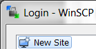

Mendix is now available in the Amazon marketplace as an App that can run on a virtual server in the cloud. This means you can run your own Mendix server for an hour, day, week, or even a year, and gives you full control over the environment. This how-to will guide you through a couple of simple steps to get your Mendix app up and running.

**After completing this how-to you will be able to:**

*   Add a Mendix image to Amazon Web Serivces (AWS)
*   Configure a Mendix Instances in AWS
*   Create a Mendix Package
*   Connect to a Mendix instance on AWS with SFTP (WinSCP) and SSH (Putty)
*   Unpack and start a Mendix app on a Mendix server
*   Configure access to a Mendix instance on AWS

## Preparation

Before starting this how-to, please make sure you have completed the following prerequisites:

*   Install [WinSCP](https://winscp.net/eng/download.php)
*   Install [Putty](http://www.chiark.greenend.org.uk/~sgtatham/putty/download.html)
*   An [AWS account](https://portal.aws.amazon.com/gp/aws/developer/registration/index.html?nc2=h_ct)
*   [Mendix Modeler](https://appstore.home.mendix.com/link/modelers/) 5.18+ installed

## 1. Adding Mendix from the Amazon marketplace

The first thing to do when you want to run a Mendix instance on AWS is adding a Mendix version to your Amazon account.

1.  Go to [http://aws.amazon.com](http://aws.amazon.com).
2.  Scroll down and click on **aws marketplace** or go to [https://aws.amazon.com/marketplace](https://aws.amazon.com/marketplace):
    [](https://aws.amazon.com/marketplace)
3.  Search for **mendix**.
4.  Select the Mendix app you want to deploy. This how-to will use **Mendix Pro Edition - Linux based Runtime - 50 users**. You can use this version for free for 5 days.
    
5.  Click **Continue** to start configuring the instance settings.
    
6.  **Login** with your Amazon Web Services account.
7.  Under Software Pricing select **Hourly**.
8.  For the **Applicable Instance Type** select **m3.medium**. This is the default setting.
    For this how-to we'll use the default instance type, because we're only using the application for a short time. When you deploy your own app you'll need to adjust the instance type to your own requirements.
9.  In the **Region** section select the region where you want to server to run. I'll leave it at US East (N. Virginia) for this how-to.
    The region where you server runs is not necessarily where you are currently located. If you are in the US and your app users are mostly in Japan it's better to select Asia Pacific (Tokyo).
10.  In the Security Group section make sure the instance is accessible through SSH, HTTP, and HTTPS. You can change these settings later.
    
    **Key Pair**
    Before you can launch the instance you have to create a key pair. A key pair consists of a public key that AWS stores, and a private key file that you store. Together, they allow you to connect to your instance securely. For Windows AMIs, the private key file is required to obtain the password used to log into your instance. For Linux AMIs, the private key file allows you to securely SSH into your instance.
    The selected key pair will be added to the set of keys authorized for this instance. Learn more about [removing existing key pairs from a public AMI](https://docs.aws.amazon.com/console/ec2/launchinstance/key-pair/remove).
    Let's follow the instructions to create a pair.

11.  Go to the **Amazon EC2 Console**: [https://console.aws.amazon.com/ec2/home?region=us-east-1#s=KeyPairs](https://console.aws.amazon.com/ec2/home?region=us-east-1#s=KeyPairs).
12.  Click on **Create Key Pair**.
    
13.  Enter a **name** for the key pair.
    
14.  Click Create and download the .pem private key. Save this in a secure location, you will need this later in the how-to.
15.  Go back to the **1-Click Launch** page and refresh it.
16.  Scroll down to the Key Pair section. Your newly created key should now be selected.
    
17.  Review the instance settings and, if you are happy with them, click **Accept Terms & Launch with 1-click**.
    
    The instance will be launched and an overview screen of all your settings will be shown.
18.  Close the overview screen. You should now see the software subscriptions:
    
19.  Refresh the page after a short time to view the running instance.
    

**Congratulations, the Mendix instance is now running!**

## 2\. Creating a Deployment Package

Now that you've got your Mendix instance up and running it's time to run an app on it. To do this you need to create a deployment package of your Mendix app and upload it to the AWS instance.

1.  Open the **Mendix Modeler**.
2.  Login with your credentials.
3.  Open a **project** you want to run on the Mendix AWS instance.
4.  Create a deployment package of your project (**F7**).
    

    The deployment package will be stored in the **releases** folder of your project folder.

    Your app must be converted to Mendix 5.18 or higher before it can run on Amazon Web Services.

## 3\. Uploading the Deployment Package to AWS

To upload the deployment package to the instance you need SFTP access. Keep your **key pair** file ready, you will need it for this step.

1.  Open **WinSCP**.
2.  Select **New Site** on the left:
    
3.  Select **SFTP** as File protocol.

    For the hostname you'll have to go back to AWS.
4.  Open the AWS EC2 Console: [http://console.aws.amazon.com/ec2/](http://console.aws.amazon.com/ec2/).
5.  Go to **Instances**.
    
6.  Select the instance you launched in the previous section.
7.  From the pane below, copy the **Public DNS address**:
    

8.  Go back to WinSCP and paste the Public DNS address on the **Host name** field.
9.  In the username field type **admin**.
10.  Click **Advanced**.
11.  Go to **SSH > Authentication**.
12.  Under Authentication parameters select the private key you generated earlier. If the key doesn't show up in the select window, change the extension to All Files. Putty doesn't recognize the file because it has a .pem extension.
    
13.  Click **Open**.
14.  Click **OK** when you get the following window:
    
    You then need to save the key with the Putty extension (.ppk). You can add a passphrase if you want.
15.  Click **Save private key** and save it to your computer.
16.  Open the select window for the private key file again, this time selecting the private key with the .pkk extension:
    
17.  Click **OK** to save the settings.
18.  Click **Save** to save this configuration. Give it a recognizable name:
    
19.  Select the site in the left pane and click **Login**.
    
20.  Click **Yes** to add the server and host key to a cache.
21.  On the remote server browse to **/srv/app/data/model-upload/**.
22.  On your computer browse to the **releases** folder of the app you want to deploy.
23.  **Upload the deployment package** to the model-upload folder on the server:
    
    Learn more about [transferring files to your Linux Instance Using WinSCP](http://docs.aws.amazon.com/AWSEC2/latest/UserGuide/putty.html#Transfer_WinSCP).

## 4\. Running the Mendix App on AWS

Now that the deployment package is in place you can deploy it on the instance. You'll use PuTTY to connect to the instance with SSH.

1.  Open **PuTTY**.
2.  In the **Host Name** field type **admin@**.
3.  Add the **Public DNS address** behind the admin@ part. This is the same address you used for WinSCP.
    
4.  Enter a name in the **Saved Sessions** field and click **Save**.
5.  In the tree on the left navigate to **Connection > SSH > Auth**.
    
6.  Click **Browse** and select your saved private key.
    
7.  Click **Open** and click **Yes** when you receive the security message.
    You now have SSH access to the AWS instance.
8.  In the console type **m2ee**. This will allow you to configure a Mendix app.
9.  Execute the following command:

    ```bash
    m2ee(admin): unpack [Deployment_Package]
    ```

10.  Enter **y** to confirm that all content will be overwritten.
11. If this is the first time you are unpacking a deployment package, Mendix may give a warning that it cannot find the Mendix Runtime. To solve this execute the following command, which will download the Mendix runtime:

    ```bash
    m2ee(admin): download_runtime
    ```

12. Execute the following command:

    ```bash
    m2ee(admin): start
    ```

13. You may receive a message that the database needs to be updated. Enter **e** to execute and save the changes. If successful, you will receive a message that the MXRuntime has started.
14. Finally, make the app accessible by configuring a password for the administrator by executing the following command:

    ```bash
    m2ee(admin): create_admin_user
    ```

15. Enter a new password for the user. It needs to be at least 8 characters. The app can now be accessed through the browser.

## 5\. Accessing the App

The Mendix instance on AWS is now fully configured and ready for use. Let's try and see if the app works!

1.  Open a browser and enter the **Public DNS address** in the address bar. The browser will load the page over HTTP by default. The app is also accessible over HTTPS. Simply add https:// before the Public DNS. Alternatively you can also use the Public IP. If you want to configure access to your app read more [here](https://docs.aws.amazon.com/AWSEC2/latest/UserGuide/using-network-security.html?console_help=true).
2.  Login with **MxAdmin** and your admin **password**.

**Congratulations! You have deployed a Mendix app on Amazon Web Services.**


## 6\. Read more

*   [Trends in Mendix Cloud v3](/developerportal/operate/trends)
*   [How to Deploy to the Mendix Cloud](/developerportal/howto/deploying-to-the-cloud)
*   [How to deploy a Mendix app on Azure](/deployment/azure/how-to-deploy-a-mendix-app-on-azure)
*   [Sending Email](/deployment/mendixcloud/sending-email)
*   [Different user logins when integrated with Mendix SSO](/deployment/mendixcloud/different-user-logins-when-integrated-with-mendix-sso)
*   [Integrate your app with Mendix SSO](/deployment/mendixcloud/integrate-your-app-with-mendix-sso)
