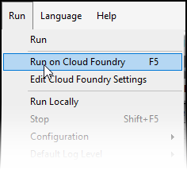

## 1 Introduction

Mendix apps can be deployed to a variety of different environments, for example Mendix Cloud, On-premises, or Kubernetes.

Mendix apps can also be deployed to any cloud platform which supports Cloud Foundry. This includes Pivotal Web Services, On-premises Cloud Foundry, SAP Cloud Platform, and IBM Cloud Portal (formerly Bluemix).

The advantages of Cloud Foundry are:

* Open source
* Horizontal scaling
* Applications run inside stateless containers
* Applications are only reachable over HTTP, HTTPS, or WebSockets
* Binding services to applications for persistence, monitoring, e-mail, etc.
* Source code as input, running application as output
* Extending to more software architectures via custom buildpacks
* Automatic health monitoring and recovery

Mendix is compatible with all known versions of Cloud Foundry as long as there are compatible database services (for example, PostgreSQL or MySQL) and custom buildpacks can be used. Cloud Foundry is supported in the Desktop Modeler and external file store support for FileDocuments can be set up with Amazon S3 or compatible systems.

For more information on running Mendix apps on Cloud Foundry, see the [Mendix Cloud Foundry BuildPack](https://github.com/mendix/cf-mendix-buildpack). This Git also explains how Mendix apps can also be deployed to Cloud Foundry environments using command line instructions.

**In this how-to you will learn how to do the following using the Desktop Modeler and browser-based configuration options:**

* Configure Cloud Foundry in the modeler and the service providing it
* Add services to the app
* Deploy your app to Cloud Foundry
* Troubleshoot

### 1.1 Cloud Foundry on **SAP** and **IBM**

{}
Mendix provides deployment tools in the Developer Portal for deploying apps to Cloud Foundry on the SAP Cloud Platform and IBM Cloud Portal. It is recommended that for these platforms you use the following documentation:

* [SAP Cloud Platform](/developerportal/deploy/sap-cloud-platform)
* [IBM Cloud](#) (under development, please contact Mendix for more details)

Only use the instructions in this document if you have specific requirements which the recommended method does not support.
{}

## 2 Prerequisites

Before starting this how-to, make sure you have completed the following prerequisites:

* Download the latest version of the Mendix Modeler from the [Mendix App Store](https://appstore.home.mendix.com/link/modelers)
* Have access to a service account with the rights to create new applications and services. One service which you can use is [Pivotal Web Services](https://run.pivotal.io/) which is free to try for a limited period.

## 3 Configuring Cloud Foundry in the Desktop Modeler

To deploy a Mendix app to Cloud Foundry, you have to configure the settings in the Modeler.

1. Open the Modeler, click **Run**, and select **Edit Cloud Foundry Settings**:

    

2. Enter the following in the credentials of the **Edit Cloud Foundry Settings** window:

  * **API endpoint** is the endpoint of the platform which you will be able to get from the platform documentation. Examples are:
    * *https://api.run.pivotal.io* for Pivotal
    * *https://api.ng.bluemix.net* for IBM region US South
    * *https://api.cf.eu10.hana.ondemand.com* for SAP Frankfurt
  * **User name** is the name of your account on the platform
  * **Password** is the password which authenticates your account

    

3. Click **Next**. You will be logged onto the platform.

    

4. Enter the following details, which will be constrained by the platform account you are using:

    * **Organization**
    * **Space**
    * **App**: *Create new app*
    * **Domain**: depending on the platform there may be a choice of domain name
    * **App name**: the name of your app. The windows indicates what the full URL will be by appending the domain name.
    * **Buildpack**: depending on the platform, you may be able to customize the buildpack.

5. Click **Next**. The Cloud Foundry *App* will be created on the platform. Note that this is currently just the environment for the app and will not contain the Mendix app until you have deployed it.

    

{}
Your Cloud Foundry environment needs to be configured with the resources needed by the Mendix app. You cannot run your app until it has the resources it needs. 
{}

Apps make use of services (for example, databases, load balancers, and memory tools). A Mendix application requires the following services on the platform:

* Database
* Route (*This may be configured automatically, or may have to be added as a service*)

In addition to these required services, the following services are optional:

* File Store
* XSUAA Service (*SAP platform only*)
* Connectivity Service (*SAP platform only*)

This how-to will describe adding the database and file store only. Additional services can be added in the same way. There is usually a limit to how many resources you can add to a trial account so you may only be able to deploy a single app into a trial account without running out of resources.

## 4 Add a Database Service to Your App

To configure the Cloud Foundry environment, you will need to go to the console for your platform. You must logon with the same credentials which you used when creating Cloud Foundry environment from the Desktop Modeler.

All these consoles have similar features which allow you to select services, bind them to your app, and view details of the environment and the app. Some example consoles are:

* Pivotal: [http://console.run.pivotal.io](http://console.run.pivotal.io/)
* IBM: [https://console.bluemix.net/dashboard/apps/](https://console.bluemix.net/dashboard/apps/)
* SAP: [https://account.hanatrial.ondemand.com/cockpit#/home/trialhome](https://account.hanatrial.ondemand.com/cockpit#/home/trialhome)

{}
The images in this document are mainly taken from the *Pivotal* console
{}

To add a database service to your app, follow these steps:

1. Navigate to the space where you created your app:

    The environment for the app you created is there, but it isn't running yet. This is because it doesn't have any services attached to it.

2. Find the list of services which you can add. This may be in a **Service Marketplace** or you may need to **Add Service** to get a list of services you can add. Note that services are provided to spaces, not to individual apps.

3. Select a database which is supported by Mendix. Supported databases include PostgreSQL, DB2, DashDB, Compose For PostgreSQL, ClearDB MySQL, and ElephantSQL (PostgreSQL as a service)

    

4. Select the plan that fits your needs. Each database will have different plans with, for example, different memory, space, and clustering. These will each have different costs associated with them, but there will usually be a development version which you can use for free. 

    

5. Configure the database by setting the following:

    * **Name**: the name which you want to give the database. It is recommended that this includes the name of the app to which you are going to bind it. Then you can easily select the correct database if you have deployed several in the same space.
    * **Space**: the space to which you want to add the instance
    * **App**: this is the app to which you want to bind this database. That is, the app which is going to store its data in this database.

    

    {}Different consoles may use slightly different names for these configuration items.{}

Once you have configured the database, you can deploy your app, provided there are no other requirements for the platform you have selected (*You may, for example, need to bind a route to your app if it is not created automatically*).

## 5 Add a File Store Service to your App

FileDocuments in your application (for example, binary objects such as images) are not stored in the database. If you use them in your app, and want them to persist between sessions, they need to be stored in persistent file storage.

This is a service which you need to attach to your application in the same way as the database, above. Supported File Stores are S3 Object Stores (such as Amazon S3), IBM Swift, or Azure Blob store.

{}
Some trial accounts may not include object storage.

You may need to configure your file store by using environment variables. See the [Mendix BuildPack Documentation](https://github.com/mendix/cf-mendix-buildpack) for more information.
{}

## 6 Deploy Your App to Cloud Foundry

1. Open the Modeler
2. Open the app you want to deploy to Cloud Foundry.
3. Click the arrow for the **Run** options and select **Run on Cloud Foundry**:

     

The Mendix app will now be deployed to the configured Cloud Foundry app and started automatically

## 7 Cloud Foundry Environment Variables

After deploying an app from the Modeler, two variables will be added automatically to the application environment.

* **ADMIN_PASSWORD**: the password of the default admin of your Mendix app. Note that if you haven't changed it in the Modeler, you will be unable to deploy your app until you change it to something more secure
* **DEVELOPMENT_MODE**:  *true* by default; this allows the app to be run in the cloud without security being turned on: change it to false to run the app in production 

## 8 Troubleshooting

If you encounter any problems, you should consult the application logs. These are available from the console of your chosen platform.

1. Navigate to your app in the platform console.
2. Open the **Logs**.

## 9 Related Content

* [Mendix BuildPack Documentation](https://github.com/mendix/cf-mendix-buildpack)
