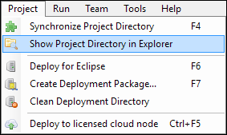
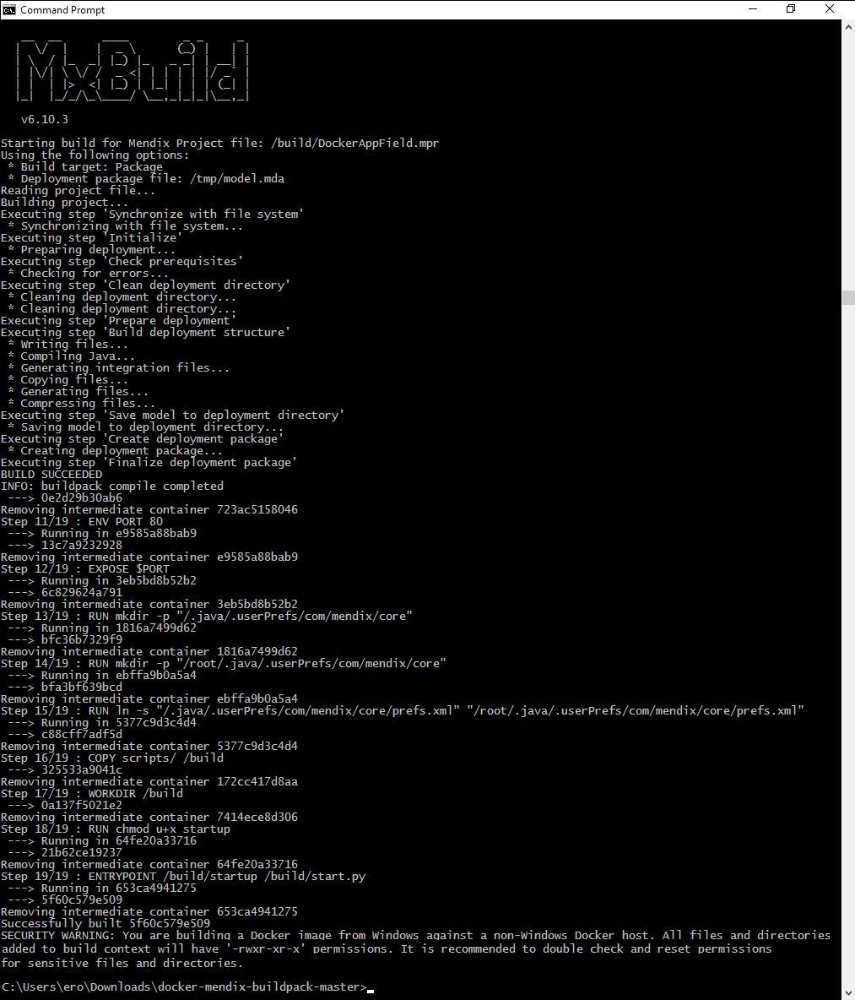

## 1 Introduction

This how-to explains how to build a Docker image from your Mendix Project. Each release of a project will result in a unique Docker image that can be pushed through the different stages of your application pipeline.

**This how-to will teach you how to do the following:**

* Build the image
* Push the image

## 2 Prerequisites

Before starting this how-to, make sure you have completed the following prerequisites:

* Download the latest version of the Mendix Modeler from the [Mendix App Store](https://appstore.home.mendix.com/index3.html)
* Install Docker [here](https://docs.docker.com/engine/installation/)
* Download the [Mendix Docker Buildpack](https://github.com/mendix/docker-mendix-buildpack)

## 3 Building the Image

To build the Docker image, follow these steps:

1. Install Docker on your working machine.
2. Unzip the buildpack in a location according to your choice.
3. Open the **Command Prompt** and navigate to the buildpack folder. 
4.  Open the Desktop Modeler and in the top menu, select **Project** > **Show project directory in Explorer**:

    

5. Copy the project folder to the unzipped docker build folder. The project folder needs to be on the same level as the Docker file. The Docker build is not allowed to access files outside the context of the Docker build location.
6.  Execute the following command:

    * `docker build --build-arg BUILD_PATH=<relative-mendix-project-location> -t <image name>` .

    

## 4 Pushing the Image

A new Docker image has been created with the name you gave it. You can see the image by using the following command:

* `docker images`

Next, you need to push the image to a registry. This can be a public registry or your own. To push it to your own registry, use this command:

* `docker push <image name>`

## 5 Related Content

* [How to Run a Mendix Docker Image](run-mendix-docker-image)
* [Mendix Docker Buildpack](https://github.com/mendix/docker-mendix-buildpack)
* [Mendix Azure Kubernetes CI/CD Reference Implementation](https://github.com/mendix/azure-kubernetes-cicd-reference-impl)
