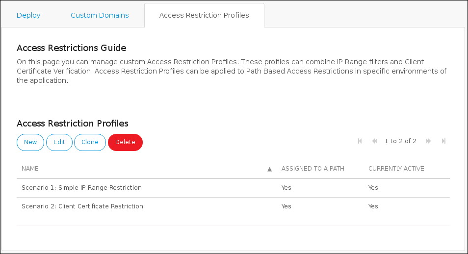
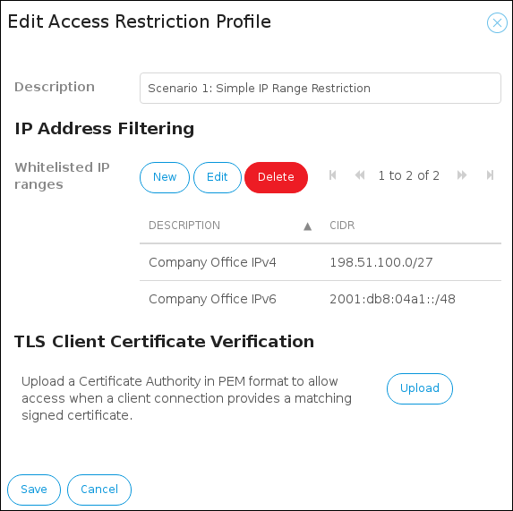
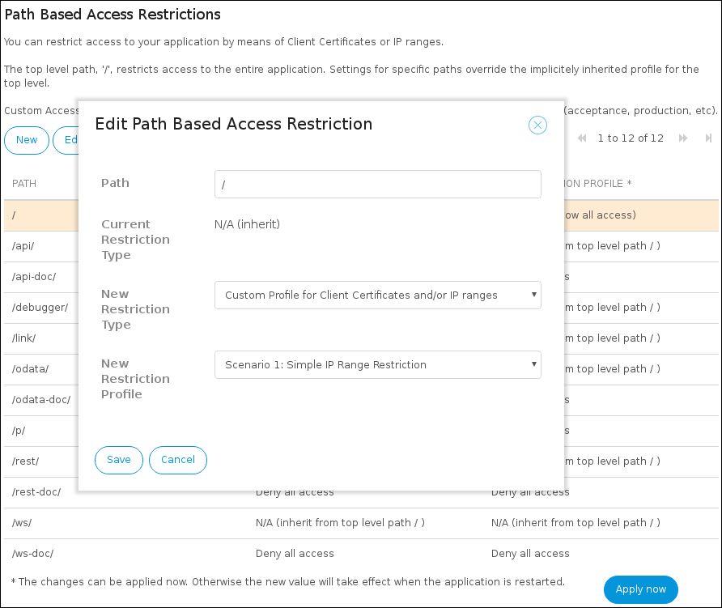
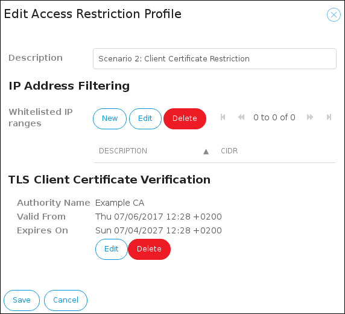

## 1 Introduction

This how-to will teach you how to do the following:

* Restrict access for incoming requests to your app
* Configure an access restriction profile
* Apply a restriction to an app environment

## 2 Restricting Access for Incoming Requests to Your Application

By configuring access restrictions, you have fine-grained control over external access to your application.

Restrictions can be applied to the top level of the application URL (`/`), and also to more specific paths (for example, `/ws/` or `/odata/`.

Presets are available to simply allow or deny all access.

In addition, custom profiles can be assembled using IP range filters and a client certificate authority.

## 3 Configuring an Access Restriction Profile

These are the most important things you should know about configuring an access restriction profile:

* Access restriction profiles are configured at the application level and they can be reused in all the environments (test, acceptance, production) of an app
* Access restriction profiles can contain any number of IPv4 and IPv6 address ranges, or a client certificate authority, or both
* If an access restriction profiles contains both IP address ranges and a client certificate authority, then any match on either the IP range or the client certificate will grant access

### 3.1 Known Limitations

These are the known limitations:

* The IP range filter option is not available in Mendix Cloud v3 environments hosted outside of the Netherlands
* When using client certificate restrictions, the client certifcate CA in all active profiles must be identical (in other words, it's only possible to use a single CA for the entire application environment)

## 4 Applying a Restriction to an Application Environment

To apply a restriction to a specific application environment, follow these steps:

1. Go to the [Developer Portal](http://home.mendix.com) and select your app.
2. Click **Environment** under the **Deploy** category.
3. Click the **Details** of the desired environment.
4. Go to the **Network** tab.
5. The section **Path Based Access Restrictions** allows for applying access restrictions to a single environment.

{}

* The top level path `/` restricts access to the entire application
* The settings for specific paths override the implicitly inherited profile for the top level
* Besides being able to apply a customized access restriction profile, there are also presets available for simply allowing or denying all access

{}

### 4.1 Default Settings

These are the default settings:

* When deploying a deployment package to an environment using the **Deploy** or **Transport** functionality, paths representing known functionality in the Mendix version that is used will automatically be added to the list of paths
* All paths ending in `-doc` will have a preset **Deny all access** profile set by default
* All the remaining paths will have no restriction applied by default

## 5 Use Cases for Access Restrictions

The two scenarios in which you can use access restrictions are described below.

### 5.1 Example Scenario 1 – Restricting Access Based on an IP Range

An example scenario in which a basic IP range restriction could be used is when an app running in the Mendix Cloud is only to be accessed from a single office. The interactive web browser interface of the app should only be accessible to employees in the office of the company running the app. From the rest of the internet, the login screen of the application should not even be visible.

To restrict access to the app to an IP range, follow these steps:

1. Go to the [Developer Portal](http://home.mendix.com) and select your app.
2. Click **Environment** under the **Deploy** category.
3. Go to the **Access Restriction Profiles** tab of the application.

    

4. Create a restriction profile.
5. Add one or more IP ranges to the restriction profile.

    

6. Go to the **Deploy** tab and click the **Details** of the desired environment.
7. Select the **Network** tab of an application environment.

    

8. Apply the profile to the top level path `/`. All other more specific paths will inherit this profile if they do not have a setting of their own.

### 5.2 Example Scenario 2 – Backend Administration with Third-Party Web Service Integrations

The second example scenario is an extended version of the first scenario. The app that was protected with the IP range restriction now starts to provide web service integrations that will be called by third-parties. Since the IP range restriction is in place already, the web service endpoints are not reachable by external parties.

However, by adding an additional access restriction profile and applying it on the `/ws/` path only, you can specifically grant access to the web service endpoints. Moreover, the example company has decided to standardize the usage of TLS client certificates, so they do not have to manage lists of IP ranges for each external third party.

To add this additional access restriction profile, follow these steps:

1. Go to the [Developer Portal](http://home.mendix.com) and select your app.
2. Click **Environment** under the **Deploy** category.
3. Go to the **Access Restriction Profiles** tab of the application.

    

4. Create a restriction profile.
5. Add the certificate of the internal certificate authority that is used to sign the client certificates to the restriction profile.

    

6. Go to the **Deploy** tab and click the **Details** of the desired environment.
7. Select the **Network** tab of an application environment.

    

8. Apply the restriction profile to the `/ws/` path of the environment. For this specific path, the profile that was chosen for the top level `/` will now be overridden.

{}

If it is desired that the `/ws/` path can still be reached from the office location without using a client certificate, then also add the IP ranges of the office location to the profile that is used on `/ws/`.

{}

## 6 Related Content

* [Certificates](/deployment/mendixcloud/certificates)
* [Deploy](/developerportal/deploy)
* [Environments](/developerportal/deploy/environments)
* [Environment details](/developerportal/deploy/environments)
