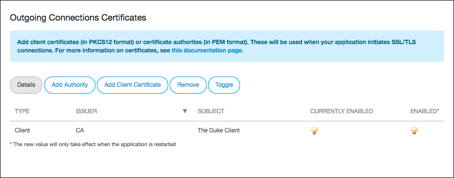
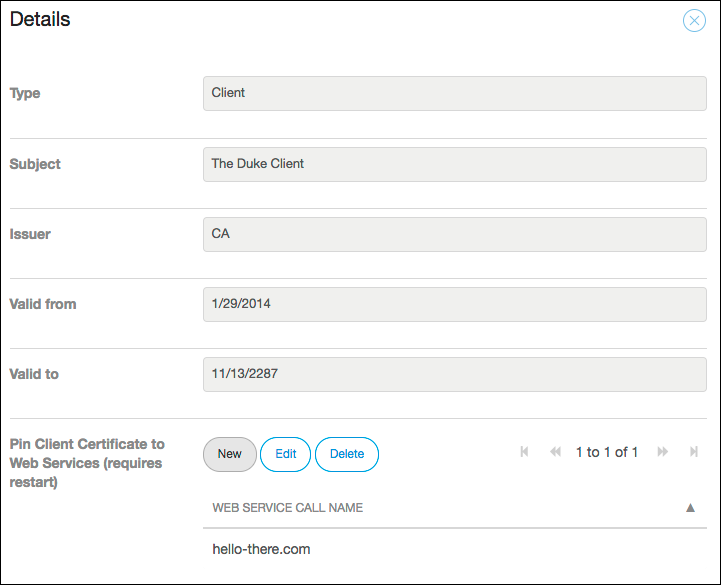

## 1 Introduction

You may want to use certificates to integrate with third parties that require SSL/TLS. There are two possible scenarios for this:

* A third party may require authentication via certificates (client certificates)
* A third party may use a certificate that is signed by their own authority (certificate authorities)

## 2 Client Certificates

For client certificates, only the Public-Key Cryptography Standard #12 (PKCS12) format is supported.

You can upload a PKCS12 file by following these steps:

1. Go to the [Developer Portal](http://home.mendix.com).
2. Click **Apps** in the top navigation panel and select your node.
3. Click **Environments** and select the desired environment by clicking **Details**.
4. Select the **Network** tab.
5.  Below **Outgoing Connections Certificates** click **Add Client Certificate**.

    

6. Upload a PKCS12 (pfx) container. Within this container there has to be an X.509 certificate, a private key, and (optionally) a certificate chain.
7. After uploading a client certificate, you will be requested to fill in a password to unlock the certificate container.

{}
Certificates require an app restart before they become active.
{}

  

For more information, see the following:

* [Transport_Layer_Security](http://en.wikipedia.org/wiki/Transport_Layer_Security)
* [How Encryption Works](http://computer.howstuffworks.com/encryption.htm)

### 2.1 Converting Certificates to PKCS12

Virtually all certificate formats can be converted to the PKCS12 format. For more information, see the following:

*   [Create a pkcs12 (.pfx or .p12) from OpenSSL files (.pem , .cer, .crt, ...)](https://www.tbs-certificates.co.uk/FAQ/en/288.html)
*   [openssl](https://www.openssl.org/docs/manmaster/man1/openssl.html)

## 3 Certificate Authorities

Loading certificate authorites works much the same way, although they do not require authentication, as these are public certificates.

To upload a certificate authority, follow these steps:

1. Go to the [Developer Portal](http://home.mendix.com).
2. Click **Apps** in the top navigation panel and select your node.
3. Click **Environments** and select the desired environment by clicking **Details**.
4. Select the **Network** tab.
5. Below **Outgoing Connections Certificates**, click **Add Authority**.
6. Upload a certificate authority in the PEM format.

If you run into any problems installing a client certificate or certificate authority, file a ticket at [https://support.mendix.com](https://support.mendix.com).

