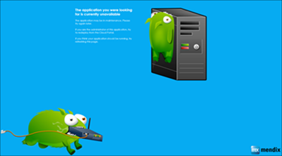
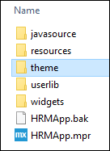
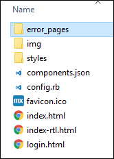
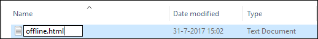

## 1 Introduction

Whenever your application is stopped, you are presented with the infamous green monsters. To present your app users a more professional looking page when the application is down, Mendix enables creating custom error pages.

You can create an `offline.html` page, a `404.html` page, and a `403.html` page.

The different files serve different purposes:

* `offline.html` page will be used when your application has been stopped manually
* `404.html` will be served whenever a path does not exist
* `403.html` will be served when access to a resource is denied, because of the used IP filter or client certificate restriction

If you do not create these files, the default "green monsters" will be used instead for each scenario.



**This how-to will teach you how to do the following:**

* Create a custom error page

## 2 Prerequisites

Before starting this how-to, make sure you have completed the following prerequisites:

* Have a local repository of the app
* Have your app hosted in the Mendix Cloud

## 3 Create a Custom Error Page

1. Open the local folder of your app.
2.  Go to **theme**.

    

3.  Create a new folder named *error_page*.

    

4.  In the **error_page** folder, create a new *.txt* file and name it *offline.html*. 

    

    Optionally, you can create also *404.html* and *403.html* pages. In these *.html* files, you can only refer to external resources or resources under the absolute path `/error_page/`. 
5. Commit the changes in the Desktop Modeler.

{}
The `/error_page/` path is the only one that will be available when the application is stopped.
{}

Note that it might take up to an hour to before the custom error page is visible when the app is offline.

### 3.1 Example Offline Page

An example `offline.html/404.html/403.html` page would look like this:

```html
<!doctype html>
<html>
  <head>
    <link rel="stylesheet" type="text/css" href="/error_pages/style.css">
    <script src="/error_pages/script.js"></script>
  </head>
  <body>
    This application is currently offline.
  </body>
</html>
```

This example refers to *style.css* and *script.js*, which you should also create and place in the **error_page** directory if you want to have special styling and/or JavaScript.
