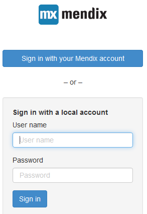

After adding the `AppCloudServices` module to your app, users can automatically login with their Mendix account: they start at the launchpad and then click on the logo of your app. This sends them to the OpenId auto-login url, e.g. `https://yourapp.mendixcloud.com/openid/login`, and then they are redirected to the (role-based) home page that is configured in the app model.

While this is enough for many users, in some cases, you also want to be able to use the root app url, `https://yourapp.mendixcloud.com/`. However, when users go to that url, they will be presented with the default Mendix login page, which does not provide them the option to log in with their Mendix account. To create a more fluent experience, you should consider two things: (1) whether you need to support non-Mendix account (local) users, and (2) whether you need to support anonymous users in your app.

## 1\. Four Scenarios

As described above, after adding the `AppCloudServices` module to your app, users can automatically login with their Mendix account: they start at the launchpad and then click on the logo of your app. This sends them to the OpenId auto-login url, e.g. `https://yourapp.mendixcloud.com/openid/login`, and then they are redirected to the (role-based) home page that is configured in the app model.

And again, while this is enough for many users, in some cases, you also want to be able to use the root app url, `https://yourapp.mendixcloud.com/`. However, when users go to that url, they will be presented with the default Mendix login page, which does not provide them the option to log in with their Mendix account. To create a more fluent experience, you should consider two things: (1) whether you need to support non-Mendix account (local) users, and (2) whether you need to support anonymous users in your app.

This leads to four scenarios, for which different solutions should be implemented:

|   | Local users disabled | Local users enabled |
| --- | --- | --- |
| Anonymous users disabled | (1) Automatically log in users with their Mendix account | (2) Allow users the option to login with a local account or with a Mendix account |
| Anonymous users enabled | (3) Allow users to login with a Mendix account from an anonymous session | (4) Users can login with a Mendix or local account from an anonymous session |

Based on your need to support local users and/or anonymous users, implement the solution mentioned in the table. The final four sections of this How To each describe one of the solutions.

{}

Anonymous users are not supported on Sandboxes, only on non-free editions.

{}

## 2\. Automatically log users in with their Mendix account

When only users with a Mendix Account are supported in your app, it makes sense to just log users in automatically. This means that they should be redirected to `/openid/login` when they reach the app, i.e., when they open `/index.html`. Add the four lines marked with a pound sign (`#`) to your custom index.html file in the theme directory in the project root (do not copy the pound signs):

```html
<!doctype html>
<html>
    <head>
        <meta charset="utf-8">
        <meta http-equiv="X-UA-Compatible" content="IE=edge,chrome=1">
        <title>Mendix 5</title>
        <meta name="viewport" content="width=device-width, user-scalable=no, initial-scale=1, maximum-scale=1">
        <meta name="apple-mobile-web-app-capable" content="yes">

        <!-- Mendix Stylesheets-->
        <link rel="stylesheet" href="lib/bootstrap/css/bootstrap.min.css">
        <link rel="stylesheet" href="mxclientsystem/mxui/ui/mxui.css">

        <!-- Custom Stylesheet -->
        <link rel="stylesheet" href="css/theme.css">

    </head>
    <body class="" dir="ltr">

        <!-- Page Area Mendix Modeler -->
        <div id="content"></div>

        <!-- Mendix Client JS -->
        <script>
            dojoConfig = {
                isDebug: false,
                rtlRedirect: "index-rtl.html",
                baseUrl: "mxclientsystem/dojo/"
            };
        </script>
#       <script>
#           if (!document.cookie || !document.cookie.match(/(^|;)originURI=/gi))
#               document.cookie = "originURI=/openid/login";
#       </script>
        <script src="mxclientsystem/mxui/mxui.js"></script>
    </body>
</html>

```

If you do not have a custom index.html yet, you can take the one that is generated on deployment by the modeler, and customize it. Find that file and copy it to the theme/ directory:

1.  From the menu bar, choose Project → Deploy for Eclipse
2.  Then choose Project → Show Project Directory in Explorer
3.  Open the folder `deployment`, and then the folder `web`.
4.  Copy the `index.html` file to the `/theme/` folder in the root of your project (two folders up), and update it with the change mentioned above.

Once this is done, after deploying your app in the mendix cloud, you can test the implementation by pointing your browser to `https://yourapp.mendixcloud.com/`, after which you should be automatically redirected to the Mendix Account login page, and then redirected and logged in to your app.

## 3\. Allow users the option to login with a Mendix account or with a local account

When users should be able to log in with either a Mendix account or with a local account, the default login page is not sufficient: it only allows users to login with a local account. To solve this, you should create a custom login page, which also allows users to login with their Mendix acccount. As an example, you could create this page:



Additionally, you want users to automatically be redirected to this page when they reach the app. To implement this, you need to do two things.

1.  You need to automatically redirect users from `/index.html` to `/login.html` (in a similar manner as in the previous scenario)
2.  You need to implement a custom `/login.html` page with two login options, a local account-based login and a Mendix account-based login.

Similar to the previous scenario, change your `index.html` file in the `/theme` directory to redirect users, but now to `/login.html`:

```html
<!doctype html>
<html>
    <head>
        <meta charset="utf-8">
        <meta http-equiv="X-UA-Compatible" content="IE=edge,chrome=1">
        <title>Mendix 5</title>
        <meta name="viewport" content="width=device-width, user-scalable=no, initial-scale=1, maximum-scale=1">
        <meta name="apple-mobile-web-app-capable" content="yes">

        <!-- Mendix Stylesheets-->
        <link rel="stylesheet" href="lib/bootstrap/css/bootstrap.min.css">
        <link rel="stylesheet" href="mxclientsystem/mxui/ui/mxui.css">

        <!-- Custom Stylesheet -->
        <link rel="stylesheet" href="css/theme.css">

    </head>
    <body class="" dir="ltr">

        <!-- Page Area Mendix Modeler -->
        <div id="content"></div>

        <!-- Mendix Client JS -->
        <script>
            dojoConfig = {
                isDebug: false,
                rtlRedirect: "index-rtl.html",
                baseUrl: "mxclientsystem/dojo/"
            };
        </script>
#       <script>
#           if (!document.cookie || !document.cookie.match(/(^|;)originURI=/gi))
#               document.cookie = "originURI=/login.html";
#       </script>
        <script src="mxclientsystem/mxui/mxui.js"></script>
    </body>
</html>

```

To implement the previously shown reference login page, you need a `login.html` page, and an accompanying `login.css` stylesheet. Place the files in the theme directory, next to the `index.html`:

`login.html`

```html
<!doctype html>
<html>
    <head>
        <meta charset="utf-8">
        <meta http-equiv="X-UA-Compatible" content="IE=edge,chrome=1">
        <title>Mendix 5 - Login</title>
        <meta name="viewport" content="width=device-width, user-scalable=no,
              initial-scale=1, maximum-scale=1">
        <meta name="apple-mobile-web-app-capable" content="yes">
        <link rel="stylesheet" href="lib/bootstrap/css/bootstrap.min.css">
        <link rel="stylesheet" href="/login.css">
    </head>
    <body>
        <div class="login-container">
            <form id="loginForm" class="login-form">
                <div class="login-logo"></div>
                <a id="ssoButton" href="/openid/login" class="login-sso-button btn btn-primary">
                    Sign in with your Mendix account
                </a>

                <label class="login-or-label">&ndash; or &ndash; </label>

                <div class="login-form-inputs well">
                    <label class="login-local-label">Sign in with a local account</label>
                    <div id="loginMessage" class="alert alert-danger login-message"></div>

                    <div class="form-group">
                        <label id="usernameLabel" for="usernameInput">User name</label>
                        <input id="usernameInput" class="form-control" type="text"
                               placeholder="User name" autocorrect="off" autocapitalize="none">
                    </div>
                    <div class="form-group">
                        <label id="passwordLabel" for="passwordInput">Password</label>
                        <input id="passwordInput" class="form-control" type="password"
                               placeholder="Password" autocorrect="off" autocapitalize="none">
                    </div>
                    <button id="loginButton" type="submit" class="btn btn-primary">Sign in</button>
                </div>
            </form>
        </div>

        <script src="js/login_i18n.js"></script>
        <script src="js/login.js"></script>
    </body>
</html>

```

`login.css`

```css
html, body {    height: 100%;
}o
.login-cntainer {
    display: table;
    width: 90%;
    max-width: 300px;
    min-width: 180px;
    height: 80%;
    margin: auto;
    text-align: center;
}
.login-form {
    display: table-cell;
    padding: 30px 10px 10px;
    vertical-align: middle;
    text-align: center;
}
.login-logo {
    height: 40px;
    margin-bottom: 50px;
    background: url(images/mendix-logo.png) no-repeat center;
}
.login-message {
    display: none;
}
label {
    font-weight: bold;
}
.login-form input {
    box-sizing: border-box;
    -moz-box-sizing: border-box;
    -webkit-box-sizing: border-box;
    width: 100%;
    height: 30px;
}
.login-sso-button {
    display: block;
    margin: auto;
}
.login-or-label {
    display: block;
    width: 80%;
    margin: 20px auto;
    text-align: center;
    font-weight: normal;
}
.login-form-inputs .login-local-label {
    font-weight: bold;
}
.login-form-inputs {
    text-align: left;
}
.login-form-inputs label {
    font-weight: normal;
}

```

To test your implementation, deploy to the Mendix Cloud, and browse to your app, e.g. `https://yourapp.mendixcloud.com/`. You should be redirected to the new login page. Try to login with a local user (e.g. the administrator, if you set it up), log out, and try to log in with a Mendix account by using the link.

## 4\. Allow users to log in with a Mendix account from an anonymous session

When part of your app targets anonymous users, there are anonymous pages in your app. You need to support the case where users login to your app with their Mendix account from an anonymous page.

To solve this problem, add somewhere in the anonymously accessible part of your app a link to `/openid/login`. Use the HTML/JS snippet widget from the app store to create a link. Set the content of the snippet to: `<a href="/openid/login">Log in with your Mendix account</a>`

To try out your implementation, deploy your app to the Mendix Cloud, and go to your app, e.g., `https://yourapp.mendixcloud.com/`. Go to the page where you inserted the link, and click on it. You should be redirected to the Mendix Account login page, and then back to your app, to the (role-based) homepage of the user with which you logged in.

## 5\. Users can log in with a Mendix or local account from an anonymous session

This scenario is similar to the previous one, except now users need to be able to either login to your app with a Mendix account, or a local account. This can be implemented by adding a link to a custom login page, similar to the one in scenario 2.

To implement this, add a link to the custom login page in the anonymous part with your app. Similar to in the previous scenario, this can be implemented with the HTML/JS snippet custom widget from the app store. Set the content of the snippet to: `<a href="/login.html">Log in</a>`.

The custom login page can be created in a similar manner as in scenario 2, with the same `login.html` and `login.css` files.

You can view the implementation by deploying your app to the Mendix Cloud and going to your app, e.g. `https://yourapp.mendixcloud.com/`, and going to the page where you inserted the link. Click on the link, and you should see the custom login page. Test the local account login, and logout. Then test the Mendix account login.

## 6\. Related content
*   [Different user logins when integrated with Mendix SSO](different-user-logins-when-integrated-with-mendix-sso)
*   [Trends in Mendix Cloud v3](/developerportal/operate/trends)
*   [How to Deploy to the Mendix Cloud](/developerportal/howto/deploying-to-the-cloud)
*   [How to deploy a Mendix app on Azure](/deployment/azure/how-to-deploy-a-mendix-app-on-azure)
*   [Sending Email](sending-email)
