# How to deploy a Mendix app on Azure

Mendix is now available in the Microsoft Azure marketplace as an App that can run on a virtual server in the cloud. This means you can run your own Mendix server for an hour, day, week, or even a year, and gives you full control over the environment. This how-to will guide you through a couple of simple steps to get your Mendix app up and running.

**After completing this how-to you will know how to:**

*   Add a Mendix image to Microsoft Azure

*   Configure a Mendix Instances in Azure

*   Create a Mendix Package

*   Connect to a Mendix instance on Azure with SFTP (WinSCP) and SSH (Putty)

*   Unpack and start a Mendix app on a Mendix server

*   Configure access to a Mendix instance on Azure

## 1. Preparation

Before you can start with this how-to, please make sure you have completed the following prerequisites.

*   Install [WinSCP](https://winscp.net/eng/download.php)
*   Install [Putty](http://www.chiark.greenend.org.uk/~sgtatham/putty/download.html)
*   Register for an [Azure account](https://azure.microsoft.com/nl-nl/account/)
*   [Mendix Modeler ](https://appstore.home.mendix.com/link/modelers/)5.18+ installed

## 2\. Adding Mendix from the Azure marketplace

The first thing to do when you want to run a Mendix instance on Azure is adding a Mendix version to your Azure account.

1.  Go to [https://portal.azure.com](https://portal.azure.com/).
2.  **Log in** with your Azure account.
3.  Select the Azure marketplace from the dashboard:
    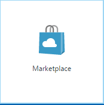
4.  Search for **mendix.**

5.  Select the Mendix app you want to deploy. For this how-to we'll use **Mendix Pro Edition - 50 users**.
    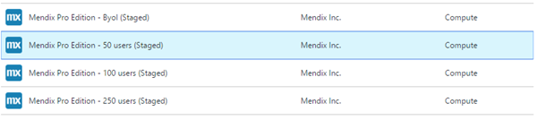

6.  Click **Create** to start configuring the instance settings.
    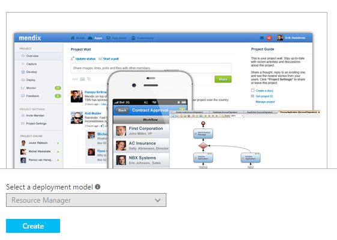

7.  Give the VM a Name.

8.  Select **authentication type: Password**.

9.  **Create** a **Username** that is not MxAdmin.

10.  Select or Create a **Resource Group** for the VM. 

11.  Select **OK.**

12.  Select the **Size** of the image, by default D1 is selected.
    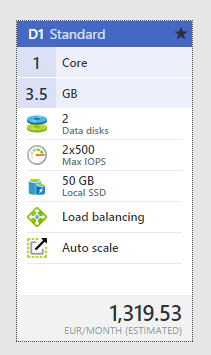

13.  Click **Select**.

14.  You can use the default settings. 

15.  Click **Ok**.

16.  A summary is shown, click on **Ok** to continue.

17.  The Offer detail is shown. Click on Purchase to create the VM.
    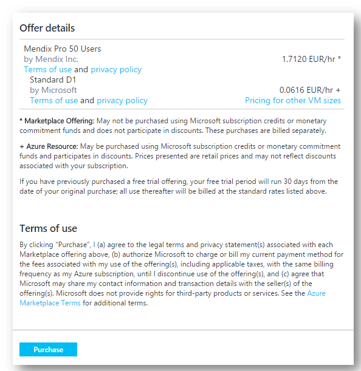

The image is now provisioning.

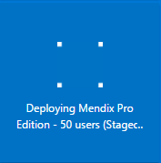

**Congratulations, the Mendix instance is now running!**

## 2\. Creating a Deployment Package

Now that you've got your Mendix instance up and running, it's time to run an app on it. To do this you need to create a deployment package of your Mendix app and upload it to the Azure instance.

1.  Open the **Mendix Modeler**.
2.  **Log in** with your Mendix credentials.
3.  Open a **project** you want to run on the Mendix Azure instance.
4.  Create a deployment package of your project (**F7**).
    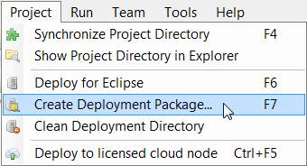

5.  The deployment package will be stored in the **releases** folder of your project folder.

{}

Your app must be converted to Mendix 5.18 or higher before it can run on Azure.

{}

## 3\. Uploading the Deployment Package to Azure

To upload the deployment package to the instance you need SFTP access.

1.  Open **WinSCP**.
2.  Select **New Site** on the left:
    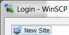 
3.  Select **SFTP** as File protocol.

    For the hostname/IP you'll have to go back to Azure.

4.  Open the Azure Console: [https://portal.azure.com/](https://portal.azure.com/).
5.  Go to **Virtual Machines**.
    

6.  Select the instance you launched in the previous section.
7.  From the pane below, copy the **Public IP address**:
    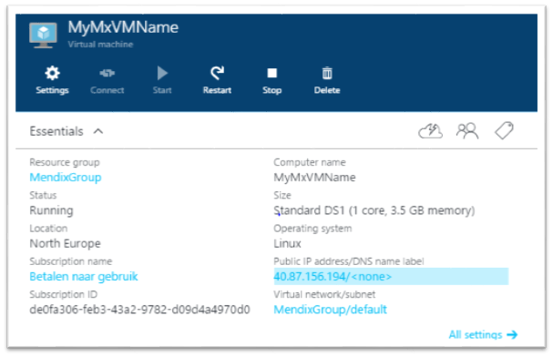 

8.  Go back to WinSCP and paste the Public IP address on the **Host name** field.
9.  Fill in the created username and password.
10.  Click **Login**. 
11.  Click **Yes** to add the server and host key to a cache.
12.  On your computer, browse to the **releases** folder of the app you want to deploy.
    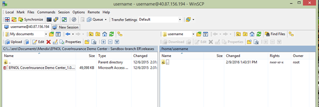 
13.  **Upload the deployment package** to the user’s home folder on the server.

## 4\. Running the image for the first time

To be sure the image is fully up to date with the latest patches, follow the below steps.

1.  Open **PuTTY**.
2.  In the **Host Name** field type **the public IP of the instance**. 
3.  Click **Open** and click **Yes** when you receive the security message.

    You now have SSH access to the Azure instance. 
4.  Execute below commands:

    ```java
    sudo su

    echo "deb http://packages.mendix.com/platform/debian/ jessie main contrib non-free" > /etc/apt/sources.list.d/mendix.list

    apt-get update
    apt-get dist-upgrade
    ```

5.  On the question to update waagent use default (N)

## 5\. Running the Mendix App on Azure

Now that the deployment package is in place you can deploy it on the instance. You'll use PuTTY to connect to the instance with SSH.

1.  Open **PuTTY**.
2.  In the **Host Name** field type **the public IP of the instance**. 
3.  Click **Open** and click **Yes** when you receive the security message.

    You now have SSH access to the Azure instance. 
4.  Before you start, switch to the MxAdmin user with the following command:

    ```java
    sudo su MxAdmin
    ```

    You are now MxAdmin on the instance.

5.  Copy the deployment package to the model-upload folder

    ```java
    cp [Deployment_Package] /srv/app/data/model-upload/
    ```

6.  In the console type **m2ee**. This will allow you to configure a Mendix app.
7.  Execute the following command:

    ```java
    m2ee(admin): unpack [Deployment_Package]
    ```

8.  Enter **y** to confirm that all content will be overwritten.
9.  If this is the first time you are unpacking a deployment package, Mendix may give a warning that it cannot find the Mendix Runtime. To solve this execute the following command:

    ```java
    m2ee(admin): download_runtime
    ```

10.  This will download the Mendix runtime.

11. Execute the following command:

    ```java
    m2ee(admin): start
    ```

12. You may receive a message that the database needs to be updated. Enter **e** to execute and save the changes.

    If successful, you will receive a message that the MXRuntime has started.

13. Finally, make the app accessible by configuring a password for the administrator with the following command:

    ```java
    m2ee(admin): create_admin_user
    ```

14. Enter a new password for the user. It needs to be at least 8 characters.

**The app can now be accessed through the browser.** 

## 6\. Accessing the App

The Mendix instance on Azure is now fully configured and ready for use. Let's try and see if the app works!

1.  Open a browser and enter the **Public DNS/IP address** in the address bar.

    The browser will load the page over HTTP by default. The app is also accessible over HTTPS. Simply add https:// before the Public DNS. Alternatively, you can also use the Public IP. 

2.  Login with **MxAdmin** and your admin **password**.

**Congratulations! You have successfully deployed a Mendix app on Microsoft Azure.**
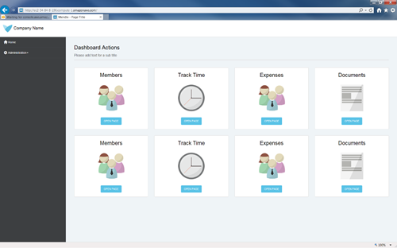

## 7\. Related content

*   [How to deploy a Mendix app on Azure](how-to-deploy-a-mendix-app-on-azure)
*   [Trends in Mendix Cloud v3](/developerportal/operate/trends)
*   [How to Deploying to the Mendix Cloud](/developerportal/howto/deploying-to-the-cloud)
*   [Sending Email](sending-email)
*   [Different user logins when integrated with Mendix SSO](different-user-logins-when-integrated-with-mendix-sso)
*   [Integrate your app with Mendix SSO](integrate-your-app-with-mendix-sso)
