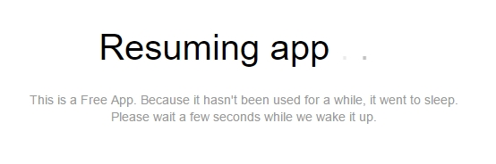

## 1 Introduction

The Mendix Cloud is the public cloud service and the default deployment option for Mendix applications.

Learn how to deploy your app, either in a Sandbox or to the Cloud. And go check out our AppCloudServices.

## 2 Free App

If you are new to the Mendix community and would like to deploy and share your own app, you can use the free tier of our public cloud offering. The free app environment (also called sandbox) is set up to allow any Mendix engineer to create and share their applications with their users. It is not the same as a cloud environment and it does not support complex or large applications.

{}

If you would like to be a client and use a licensed cloud node you can contact our team **[HERE](http://ww2.mendix.com/BuyNow.html)**. If you are an existing customer, you should deploy into your licensed cloud node. Free apps are part of our community edition and require Mendix 5.18 or higher.

{}

In our free tier, your app will go to sleep after a couple of minutes of inactivity. When it is inactive, you will see the image below. If you wait for a couple of minutes and the app does not come up, please contact our support team at [support.mendix.com](http://support.mendix.com).

## 3 Node

A Free App can be upgraded to a licensed app with a node in the Mendix Cloud. A node has several environments and is hosted on **Mendix Cloud V3** or **Mendix Cloud V4**. 

## 4 Environment

A node has a minimum of two environments: **production** and **acceptance**. A **test** environment is the third optional environment. You can deploy your licensed app (that is linked to a node) to its environments.

## 5 Documents in This Category

* [Different User Logins when Integrated with Mendix SSO](different-user-logins-when-integrated-with-mendix-sso)
* [Java in the Cloud](java-in-the-cloud)
* [How to Restrict Access for Incoming Requests](access-restrictions)
* [Securing Outgoing Connections from Your Application](securing-outgoing-connections-from-your-application)
* [Sending Email](sending-email)
* [Mendix Cloud v4 - FAQ](mxcloudv4)
