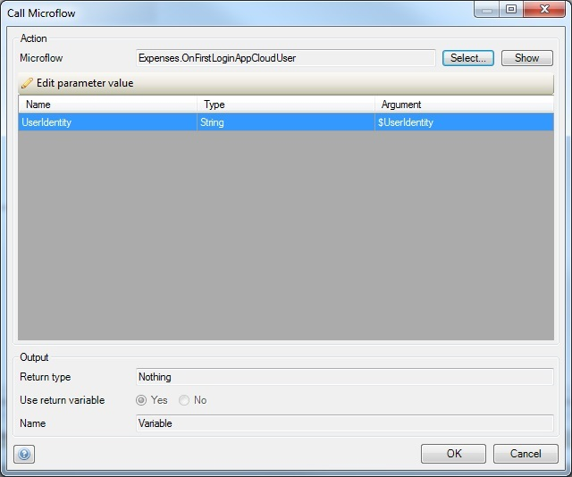
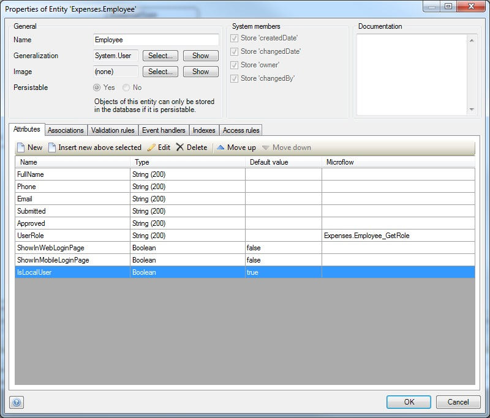
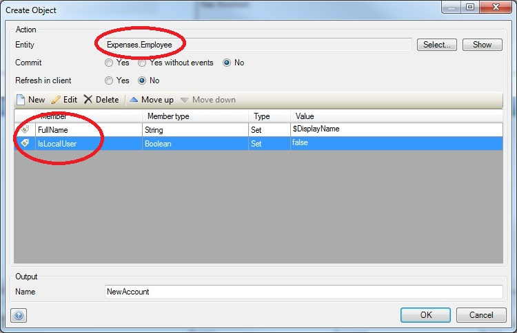
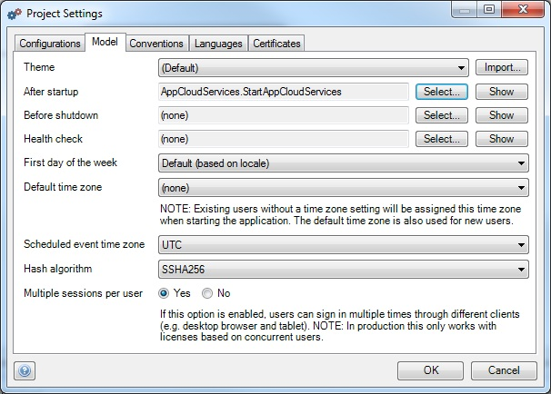

## 1 Introduction

With the release of the AppCloud, Mendix introduced a new project layout and module that makes use of the new Mendix AppCloud services. With the **AppCloud Default Project** layout, you can easily create new apps use the AppCloud services out of the box. You can upgrade your existing app with the separate [AppCloudServices module](https://appstore.home.mendix.com/link/app/934/).

Want to know more about all the possibilities this opens up? Take a look at the [New Mendix AppCloud Ignites Application Innovation by Connecting All Custom Apps, Developers, Data, and Users in One Enterprise Cloud Ecosystem](http://www.mendix.com/press/new-mendix-appcloud/) blog post.

This how-to will explain how you can incorporate the AppCloudServices module into your existing app.

**## 2 Prerequisites [KEEP?]**

**The AppCloudServices module requires version 5.3.2 of the Mendix Desktop Modeler. If your app was not created with Mendix 5.3.2 or newer, you need to convert it first. For more information about converting apps, see [this page](/refguide6/moving-from-5-to-6).**

## 3 Steps & Example

This how-to uses the [Company Expenses](https://appstore.home.mendix.com/link/app/240/).

1. Open your app project in the Desktop Modeler.
2. Open the **App Store** inside the Mendix Modeler.
3. Search for "AppCloudServices," then open and download the Mendix **AppCloudServices** module.
4.  Select **Add as a new module** and click **Import**. The module should now be visible in the project explorer:
    
    Once the module has been imported, you can make use of the Mendix AppCloud Navigation widget. In order to do this, make sure all starting pages in your app use the `AppCloudMasterLayout` as their master layout. In the CE app, we need to apply the master layout to both `UserLoginLayout` and `DesktopLayoutRightSideBar`.

    Do not forget pages which can be opened through microflows and deeplinks.

    If your app does not make use of Mendix 5 layouts yet, you need to convert your app to use Mendix 5 layouts on every page (in Mendix 4, pages were called "forms"). Alternatively, you can manually add the Mendix AppCloud Navigation widget to all pages that are used as starting pages.

    

5.  Copy and rename the (excluded) microflow **`Example_OnFirstLoginAppCloudUser`** (located in the folder `Single Sign On/` `API`) to an appropriate module and include it.

    In the CE app, copying it to the `Expenses` module and renaming it to `OnFirstLoginAppCloudUser` is a logical choice.
    

    Any changes made to the AppCloudServices module in your app will be overwritten when you upgrade to a newer version of the AppCloudServices module.

6.  Open the **`InvokeOnFirstLoginAppCloudUser`** microflow from the **`Single Sign On/Implementation`** folder. There you will find an action called **`Call OnFirstLoginAppCloudUser`** . You need to change this action so it will call the microflow created in the previous step.
    

7.  Add the boolean attribute `**IsLocalUser** (with default **true**` ) to your app user entity. This is the entity that represents your user accounts. It extends the `System.User` entity. The boolean attribute allows you to differentiate between Mendix accounts and local accounts. For the CE app this entity is located in the `Expenses` module and is called `Expenses.Employee`.
    
    It is a good idea to give the administrator role(s) (or equivalent) read access to the `IsLocalUser` attribute with an access rule.

8.  Open the microflow you copied in step 5.

9.  Open the **Create** action and select your app user entity as the object type to be created, instead of the pre-selected `UserManagement.Account`. You will need to re-set the two attributes in the **Create** action afterwards.

10.  In the CE app you want to change it to `Expenses.Employee`, and change the first attribute to `FullName` and the second to `IsLocalUser`.
    
    Now you want to make sure the `StartAppCloudServices` microflow is called during startup.

11. Open the **Project Settings**.
12. Go to the **Model** tab, and set `AppCloudServices.StartAppCloudServices` as the **After startup** microflow.
    
    Alternatively, you can call this microflow in your own After startup microflow.

    If this microflow is not called during startup, your users will encounter 404 Not Found errors when trying to navigate to your app from the Launchpad.

    Congratulations! Your app now makes use of the AppCloud services.

    When you deploy your upgraded app in the AppCloud it will now be automatically added to your Launchpad. Opening the app from your Launchpad will automatically log you in with your Mendix account, and you can easily invite other Mendix accounts through app user management.

## 4 Related Content

*   [Different user logins when integrated with Mendix SSO](different-user-logins-when-integrated-with-mendix-sso)
*   [Trends in Mendix Cloud v3](/developerportal/operate/trends)
*   [How to Deploy to the Mendix Cloud](/developerportal/howto/deploying-to-the-cloud)
*   [How to deploy a Mendix app on Azure](/deployment/azure/how-to-deploy-a-mendix-app-on-azure)
*   [Sending Email](sending-email)

After completing this how to on configuring AppCloud services, you might want to check out [how to improve logging in with different types of user accounts](different-user-logins-when-integrated-with-mendix-sso).
