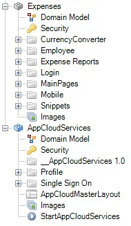
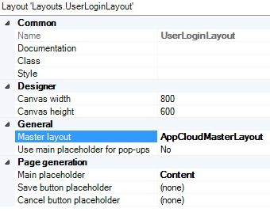
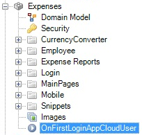

## 1 Introduction

With the release of the AppCloud, Mendix introduced a new project layout and module that makes use of the new Mendix AppCloud services. With the **AppCloud Default Project** layout, you can easily create new apps use the AppCloud services out of the box. You can upgrade your existing app with the separate [AppCloudServices module](https://appstore.home.mendix.com/link/app/934/).

Want to know more about all the possibilities this opens up? Take a look at the [New Mendix AppCloud Ignites Application Innovation by Connecting All Custom Apps, Developers, Data, and Users in One Enterprise Cloud Ecosystem](http://www.mendix.com/press/new-mendix-appcloud/) blog post.

This how-to will explain how you can incorporate the AppCloudServices module into your existing app.

## 2 Steps & Example

This how-to uses the [Company Expenses](https://appstore.home.mendix.com/link/app/240/) (CE) app.

1. Open your app project in the Desktop Modeler.

2. Open the **App Store** inside the Mendix Modeler.

3. Search for "AppCloudServices," then open and download the Mendix **AppCloudServices** module.

4. Select **Add as a new module** and click **Import**. The module should now be visible in the **Project Explorer**:

    

    Once the module has been imported, you can make use of the Mendix AppCloud Navigation widget. In order to do this, make sure all the starting pages in your app use **AppCloudMasterLayout** as their master layout. If necessary, you can manually add the Mendix AppCloud Navigation widget to the starting pages:

    

    In the CE app, you need to apply the master layout to **Sidebar_Right**. Also, do not forget pages that can be opened through microflows and deeplinks.

5. Move and rename the (excluded) microflow **Example_OnFirstLoginAppCloudUser** (which is located in **AppCloudServices** > **Single Sign On** > **API**) to an appropriate module and include it. In the CE app, moving it to the **Expenses** module and renaming it to *OnFirstLoginAppCloudUser* is a logical choice.

    

    Any changes made to the AppCloudServices module in your app will be overwritten when you upgrade to a newer version of the AppCloudServices module.

6. Open the **InvokeOnFirstLoginAppCloudUser** microflow from the **Single Sign On** > **Implementation** folder. There you will find an action called **Call OnFirstLoginAppCloudUser** . You need to change this action so it will call the microflow created in the previous step.

  

7. Add the Boolean attribute **IsLocalUser** (with default **true** ) to your app user entity. This is the entity that represents your user accounts and extends the **System.User** entity. The Boolean attribute allows you to differentiate between Mendix accounts and local accounts. For the CE app, this entity is called **Expenses.Employee**.

  

  It is a good idea to give the administrator role(s) (or equivalent) read access to the **IsLocalUser** attribute with an access rule.

8. Open the microflow you copied in step 5.

9.  Open the **Create** action and select your app user entity as the object type to be created (instead of the preselected **UserManagement.Account**). You will need to reset the two members in this action afterwards. In the CE app, you want to change the **Entity** to **Expenses.Employee**, and then change the first member to **FullName** and the second to **IsLocalUser**.

	

10. Now you want to make sure the **StartAppCloudServices** microflow is called during startup, so open the project **Settings**.
11. Go to the **Runtime** tab and set **AppCloudServices.StartAppCloudServices** as the **After startup** microflow:

	

	Note that if this microflow is not called during startup, your users will encounter "404 not found" errors when trying to navigate to your app.

Congratulations! Your app now makes use of the AppCloud services. When you deploy your upgraded app in the AppCloud, it will now be automatically added to your [Launchpad](https://home.mendix.com/home/). Opening the app from your Launchpad will automatically log you in with your Mendix account, and you can easily invite other Mendix accounts through app user management.

## 3 Related Content

*   [Different user logins when integrated with Mendix SSO](different-user-logins-when-integrated-with-mendix-sso)
*   [Trends in Mendix Cloud v3](/developerportal/operate/trends)
*   [How to Deploy to the Mendix Cloud](/developerportal/howto/deploying-to-the-cloud)
*   [How to deploy a Mendix app on Azure](/deployment/azure/how-to-deploy-a-mendix-app-on-azure)
*   [Sending Email](sending-email)

After completing this how-to on configuring AppCloud services, you might want to check out [how to improve logging in with different types of user accounts](different-user-logins-when-integrated-with-mendix-sso).
