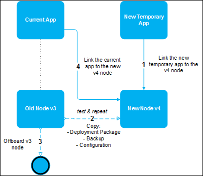

## 1 Introduction

This how-to describes everything about the migration from v3 to v4.

**This how-to will teach you how to do the following:**

*   Migrate your licensed app from Mendix Cloud v3 to v4

    

## 2 Prerequisites

Before starting this how-to, make sure you have completed the following prerequisites:

*  Have an available v4 [Mendix Cloud](/deployment/mendixcloud) node (to request a licensed v4 Cloud Node, contact your Customer Success Manager (CSM))
* Have the [Technical Contact](/developerportal/general/technical-contact) role for both v3 and v4 Cloud Nodes
* Create a new temporary Free App without a Sandbox

## 3 The Migration Process

To migrate your app from a v3 node to a v4 node in the Mendix Cloud, follow the steps in the sections below.

### 3.1 Linking the New Free App to the v4 Node

First, link the new temporary app to the cloud v4 node.

To learn how to do this, see [How to Link Your Free App to a Licensed Cloud Node](/developerportal/howto/how-to-link-app-to-node).

### 3.2 Copying Data from v3 to v4

Before migrating, you need to copy the data from the v3 node to the v4 node. After copying, test your app and correct errors if needed. Repeat this until all the errors are solved.

#### 3.2.1 Backup

Transfer the backup data of the app on Mendix Cloud v3 to the app on Mendix Cloud v4 by follow these steps:

1. Download a backup from your app hosted in Mendix Cloud v3 (for details, see [How to Download a Backup](/developerportal/howto/how-to-download-a-backup)).
2. Upload the downloaded backup to your app hosted in Mendix Cloud v4 (for details, see [How to Restore a Backup](/developerportal/howto/how-to-restore-a-backup)).

#### 3.2.2 Downloading and Uploading the Deployment Package

Download the deployment package of your app hosted in cloud v3 and upload the deployment package to the app hosted in Cloud v4.

To download a deployment package, follow these steps:

1. Go to **Environments** of the v3 app.
2. Click **Details** for a **Deployment Package**.
3. Click **Download Package**.

To upload the deployment package, follow these steps:

1. Go to **Environments** of the v4 App.
2. Below the **Deployment Package Repository**, click **Upload**.
3. Browse and select the downloaded deployment package from your device.

#### 3.2.3 Configuration

Before starting your app in Mendix Cloud v4, make sure it has the same configurations as the v3 node. You can find the node settings on the [Environment Details](/developerportal/deploy/environments-details) page under **Model Options**, **Network**, **Runtime**, and **Maintenance**.

#### 3.2.4 Testing and Repeating

Now that the app on Mendix Cloud v4 contains your data and is configured, deploy the deployment package to an evironment and start your app.

To learn how to do this, see [How to Deploy the App to an Environment](/developerportal/howto/deploying-to-the-cloud#4-deploy-the-app-to-an-environment).

### 3.3 Offboarding the v3 Node

Your app is now running in Mendix Cloud v4. If everything works correctly, submit a request at [Mendix Support](https://support.mendix.com) to offboard the v3 node. This means that the app will be detached from the node.

With the node removed, the app will still remain in the [Developer Portal](http://home.mendix.com) as a Free App.

{}

Make sure you have downloaded the latest backup and deployment package before offboarding the node.

{}

### 3.4 Linking the App to the v4 Node

After the v3 node has been offboarded, follow these steps to link the app to the v4 Node:

1.  In the [Developer Portal](http://home.mendix.com), go to **Apps** and select the app that has been detached from the v3 node.
2.  Once you are in the app, go to the **Environments** tab in the left menu.
3.  Click **Select Node**.
4.  Select the v4 node by clicking **Use this Node** and link it to your app. The currently linked (temporary) app will be unlinked automatically. The temporary app can be deleted.

For more information, see [How to Link a Different App to a Cloud Node](/developerportal/howto/how-to-link-a-different-app-to-a-node).

## 4 Related Content

*   [Certificates](/deployment/mendixcloud/certificates)
*   [How to Create and Deploy Your First App](/howto/modeling-basics/create-and-deploy-your-first-app)
*   [How to Configure Custom Domains](/developerportal/howto/custom-domains)
*   [How to Deploy to the Mendix Cloud](/developerportal/howto/deploying-to-the-cloud)
*   [How to Download a Backup](/developerportal/howto/how-to-download-a-backup)
*   [How to Link a Different App to a Cloud Node](/developerportal/howto/how-to-link-a-different-app-to-a-node)
*   [How to Link Your Free App to a Licensed Cloud Node](/developerportal/howto/how-to-link-app-to-node)
*   [How to Restore a Backup](/developerportal/howto/how-to-restore-a-backup)
*   [How to Unlink Your Free App from a Sandbox Environment](/developerportal/howto/how-to-unlink-sandbox)
