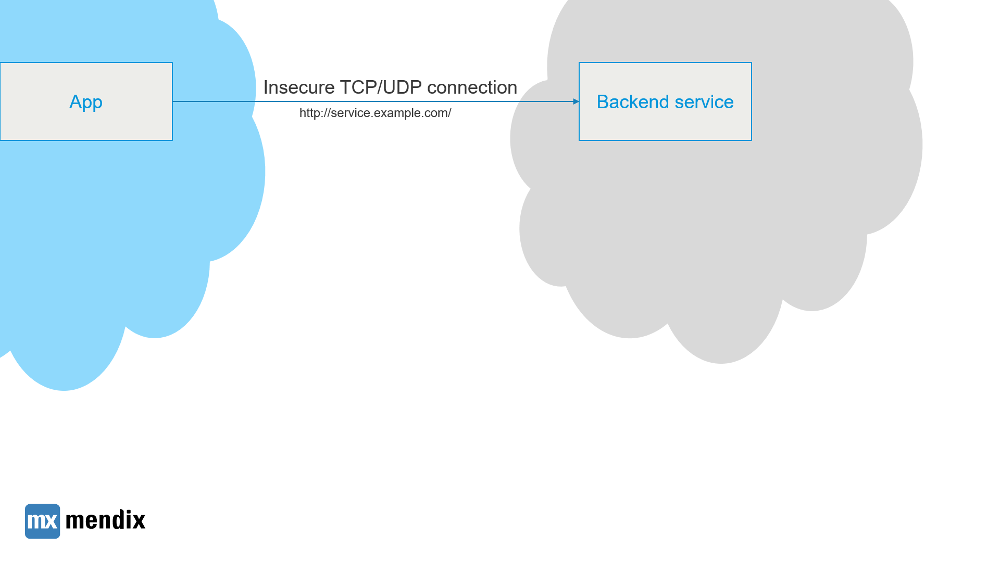
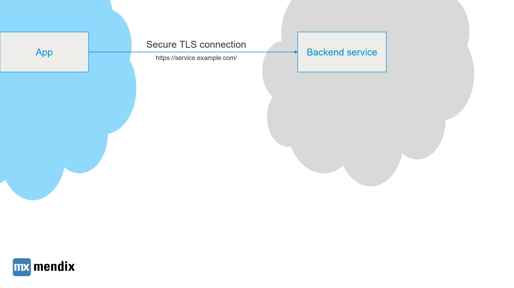
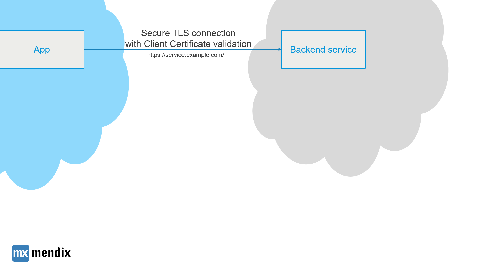
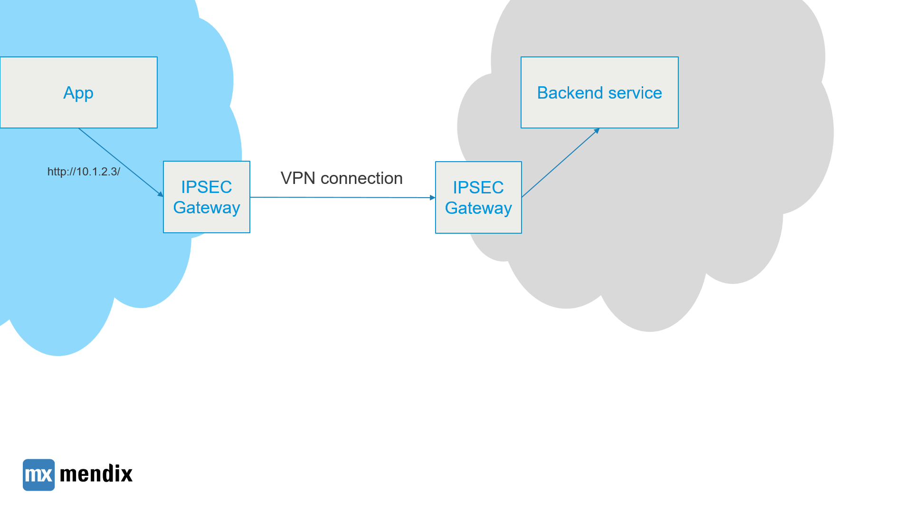
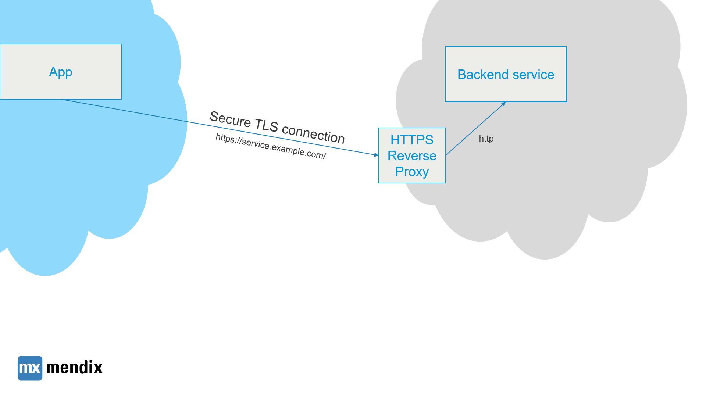
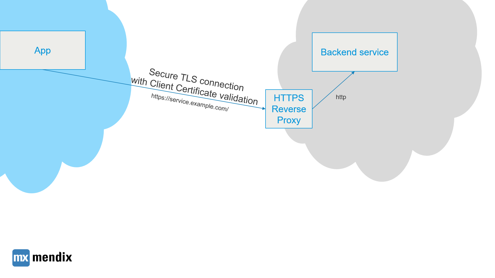
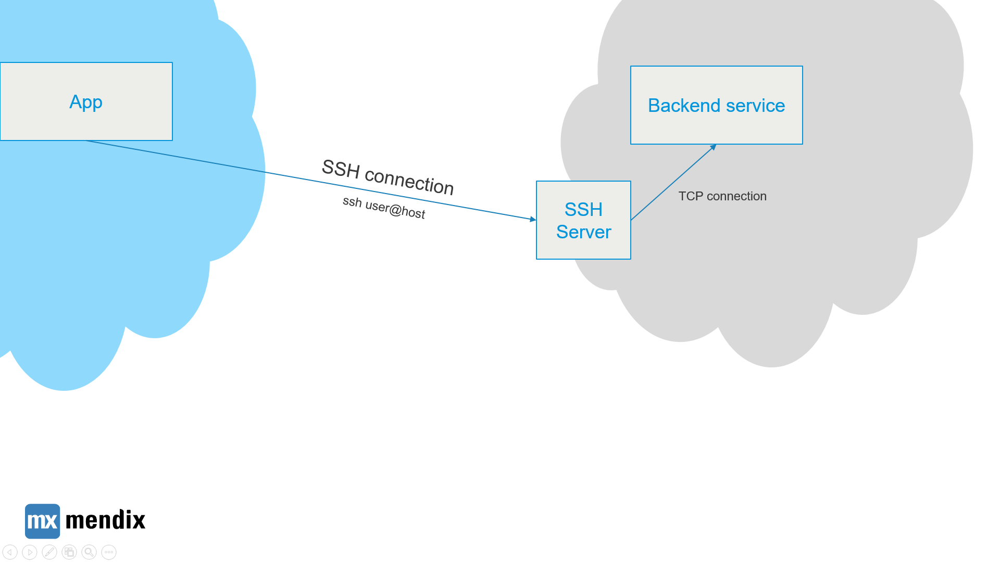

## Introduction

While all inbound connections to apps in the Mendix Cloud are secured with TLS, your apps can also connect to other services on the Internet. In this how-to we'll see which methods are available for securing connections from your app to the outside world.

This how-to is written for the Mendix Cloud but the methods are applicable to all other set-ups, such as public cloud or on-premises deployments.

## Scenario 1 - No encryption

In some cases, encryption and authentication on connections is unnecessary. In this case unencrypted TCP/UDP based protocols can be used.

## Scenario 2 - TLS/HTTPS

This is the most common scenario, where the client verifies the server certificate and sets up an encrypted connection. Trust is verified by verifying the chain of trust to a Certificate Authority in the client's trust store. Using encryption, data sent and received over the connection can not be intercepted by other parties, so to authenticate the client, a username/password or token can be used with, for example, HTTP headers. This can be used for services that natively support TLS. To connect to your service from the Mendix Cloud, the service can be exposed on an external IP address and port. This can be firewalled to only allow the Mendix Cloud to connect to it. To get the IP address ranges of your application in the Mendix Cloud, you can file a ticket at Mendix Support.

## Scenario 3 - TLS/HTTPS with client certificate validation

For additional security, the server can validate the client's identity by checking its client certificate.

The rest of the security features of Scenario 2 can also be applied.

## Scenario 4 - VPN (deprecated in Mendix Cloud)

Many companies use VPN to secure network connections between their own offices / data centers and other companies. Mendix offered IPSEC VPN in the Mendix Cloud on some legacy connections, but is currently moving towards other secure protocols that work well with modern Cloud native best practices, such as scaling horizontally, failover to other data centers and multi-tenant cloud environments.

In this scenario, unencrypted TCP/UDP protocols can be used, all inter-network traffic is transparently encrypted by the VPN IPSEC Gateways. Which subnets should be routed over the VPN connections have to managed manually, and because DNS resolving is done locally, the application will have to connect to the back end service by its IP address rather than its domain name.

The following disadvantages apply:

*   DNS is not available
*   With failover data centers VPN becomes extremely difficult to manage
*   Connections are added to (virtual) machines, this makes deployment to multi-tenant public cloud environments based on containerization a challenge
*   VPN gateways potentially add two more single point of failures

## Scenario 5a - Proxy server for TLS offloading

In case your backend service does not support HTTPS out of the box, you can add a HTTPS reverse proxy server such as NGINX or HAProxy in front of it. This HTTPS reverse proxy can optionally also act as a firewall and can be deployed in a highly available way. Migrations of back-end services within your data center can be done transparently by decoupling it from the public address of your service. The application in the Mendix Cloud simply connects to an HTTPS endpoint.

## Scenario 5b - Proxy server for TLS offloading with Client Certificate validation

This scenario is identical to 5b, with one exception: your application includes a Client Certificate and the proxy server uses this to validate the identity of the application.

## Scenario 6 - SSH Server as a TCP proxy

For certain deployments (where e.g. non-HTTP protocols are used), you can set up an SSH Server as a proxy. Then you can use the [Jsch](http://www.jcraft.com/jsch/) library from a Java Action within Mendix to set up a secure channel to the other network, and then using a SOCKS or HTTP proxy to make your requests to. Setting up an SSH enabled server and setting up a public/private keypair is a trivial task for most system administrators, but it's also not as simple and standardized as HTTPS (reverse) proxy servers. When HTTP based protocols are available, scenarios 2, 3, 5a and 5b are preferable.

## Notes

Client certificates can be added to your Mendix Cloud application from within the Cloud Portal. See [this page](/deployment/mendixcloud/certificates) for documentation.

Scenarios 2, 3, 5a and 5b work best for HTTP based protocols, which will work out of the box from Mendix core functionality, but also for many AppStore modules and other content. However, by calling out to Java actions, most TCP based connections can be wrapped in TLS connections for added security.
