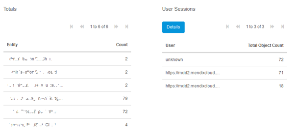
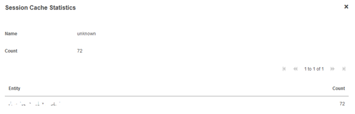
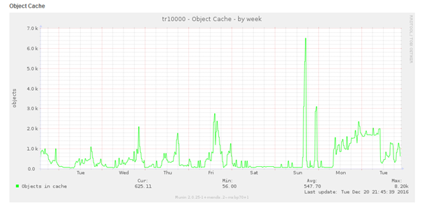

## 1 Introduction

The "Cache" tab can be found on the **Metrics** page of your Cloud node. It can be used to monitor all Mendix objects that are currently being held in the memory of your environment.

## 2 About the "Cache" tab in the Mendix Cloud

It looks something like this (entity names are normally not obfuscated):

The **Totals** data grid will show the current number of Mendix objects in cache and list them by entity type. For example: MyModule.MyEntity (Count: 79)

The **User Sessions** data grid will show the entities per session, you can press the **Details** button to zoom in on the specific user.

The **unknown** user means the entities are part of a system session, for example a [scheduled event](/refguide/scheduled-events).

If you fear your application might contain a memory leak you should always check this graph to see if an abnormally large amount of objects stay in cache. Especially a graph with the following shape over a long period of time should be worrisome:

In this case, you can refer back to the **Cache** tab. And see how many of each entity type are in cache and what session is keeping them in cache. You might be able to deduce the most likely source of the memory leak this way. 
For example, if you have 50500 entities in cache and 50000 are of type Car.Tyre, you might want to look into all places where you process a lot of Car. Tyre entities to see if you made a mistake somewhere that could explain the memory leak.

The cache statistics might also help you identify the most commonly used entities in your application.

## 3 Related Content

* [Metrics](/developerportal/operate/metrics)
* [Security - Node Permissions](/developerportal/settings/node-permissions)
* [Troubleshooting your application in the Mendix Cloud: Running now](troubleshooting-mxcloud-runningnow)
