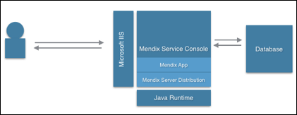
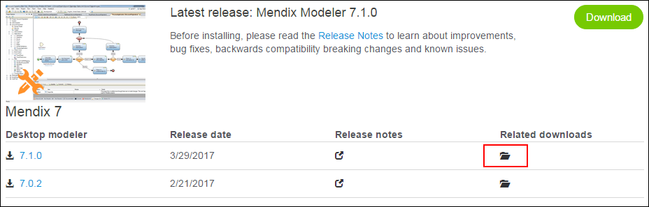
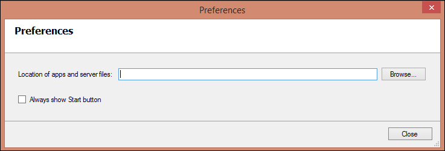
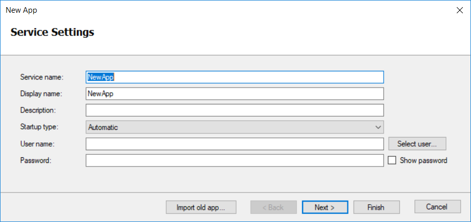
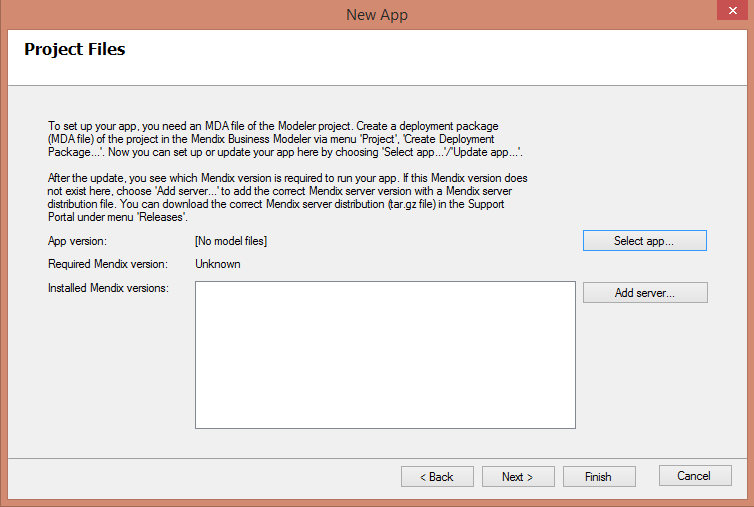
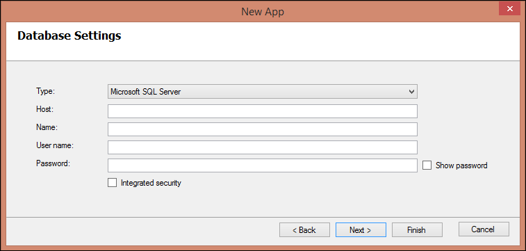

## 1 Introduction

This document describes the installation and configuration of the Mendix software on a system running Microsoft Windows.

**This how-to will teach you how to do the following:**

* Install the Mendix Service Console
* Deploy a Mendix app
* Configure the MS Internet Information Services (IIS) server

## <a name="Prerequisites"></a>2 Prerequisites

In order to set up an environment to run Mendix applications, you will need to install the Mendix software. For each Mendix application that will be run, a separate user (service) account is required. This section presents an overview of the setup.



Before starting this how-to, make sure you have the following prerequisites:

* Microsoft Windows 2008 SP2 or higher
* .NET 4.5 or higher
* IIS 7 or higher with the following service roles enabled:
    * IIS Management console
    * Static content
    * ASP.NET
* Microsoft Application Request Routing (ARR) Installed (for more information, see [Microsoft Application Request Routing](http://www.iis.net/downloads/microsoft/application-request-routing))
* Java Runtime 8
    * This depends on your Mendix Server Distribution (for example, Mendix Server Distribution 4 requires Java 6, Mendix Server Distribution 5 requires Java 7)
* Mendix deployment archive (MDA) of your Mendix project
* Mendix server distribution corresponding with your Modeler (see the [Mendix App Store](https://appstore.home.mendix.com/link/modelers))
* Database with sufficient security rights. Suitable database servers are IBM DB2, MariaDB, Microsoft SQL Server, MySQL, Oracle Database and PostgreSQL. See https://docs.mendix.com/refguide/system-requirements for more information.
* A local or domain user with the “log on as a service” local security policy set

## 3 Installation of the Mendix Service Console

To download and install the Mendix Service Console, follow these steps:

1. Download the latest version of the Mendix Service Console from the [App Store](https://appstore.home.mendix.com/link/modelers):

    

2. Install the Mendix Service Console by following the installation wizard.
3. Start the Mendix Service Console after the installation. The first time you launch the application, the **Preferences** dialog box will be shown (it will always be shown if no valid location is configured for all the apps and server files):

    

4. In the **Preferences** dialog box, enter a **Location of apps and server files**. Mendix recommends using a directory that is NOT on the system partition where you can easily control the security rights. This location is used for storing your app files and Mendix server files. The app directory consists of four sub-directories:

    * Backup – this directory stores any database changes due to model upgrades
    * Log – this directory stores all of the application log files
    * Project – this directory contains all of your application files; within this directory you will find the directory data/files that contain all of your uploaded files
    * Service – this directory contains files for configuring the Windows Services

    In addition, there will be a file called `Settings.yaml` that contains your application configuration.

## 4 Deploying a Mendix App

To deploy a Mendix app using the Mendix Service Console, follow these steps:

1. Start the Mendix Service Console.
2. Click **Add app** to add a new app. A wizard will appear for configuring the new app.
3. Configure the **Service Settings** as follows:
    * **Service name** – this name must be unique within all existing Windows services
    * **Display name** – this is the description of the app, which is visible as a tooltip for the app in the left bar of the Mendix Service Console or as a column in the list of Windows services
    * **Description** – enter a description for the application that will be visible in the Mendix Service Console
    * **Startup type** – select whether you want the app to be started automatically when the server starts, started with a delay, started manually, or disabled altogether
    * **User name** and **Password** – the app will always run under the user account given here, and the service will be installed with this user account configured (for more information, see [Prerequisites](#Prerequisites))

    
4. Click **Next**.
5. On the **Project Files** screen, click **Select app...**:

    

6. Now select the **MDA** file that was created in the Modeler and contains your application logic. After the installation of your MDA file, you will see which Mendix server (Mendix runtime) version is needed.
7. Configure the **Database Settings**

    * **Type** – the database server type
    * **Host** – the IP address or host name of the database server
    * **Name** – the database name
    * **User name** and **Password** – the database user name and password

    

8. Click **Next**.
9. On the **Common Configuration** screen, keep the settings default. Only change these specific settings if needed for your application setup.
10. Click **Finish** and start the application.

## 5 Configuring Microsoft Internet Information Server

To configure the MS IIS server, follow the steps in the sections below.

### 5.1 Activating a Proxy in ARR

In order to use the proxy functionality within ARR, you need to enable this feature within IIS. To activiate a proxy in ARR, follow these steps:

1. Start the IIS Manager.
2. Select the **Server** in the **Connections** pane.
3. Open the **Application Request Routing** feature.
4. Click **Server Proxy Settings** in the **Actions** pane on the right side of the screen.
5. Select **Enable proxy** and click **Apply** in the **Actions** pane.

### 5.2 Creating a Website

To create a website, follow these steps:

1. Start the IIS Manager.
2. In the **Connections** pane, right-click the **Sites** node in the tree and select **Add Web Site**.
3. In the **Add Web Site** dialog box, enter a friendly name for your web site in the **Web site name** field.
4. In the **Physical path** field, enter the physical path of your application-project-web folder (for example, *D:\Mendix\Apps\Application\Project\Web*).
5. Select the **Protocol** for the website from the **Type** list.
6. The default value in the IP address box field is **All Unassigned**. If you must specify a static IP address for the website, enter the address in the **IP address** box.
7. Enter a port number in the **Port** field.
8. Click **OK**.

### 5.3 Configuring the MIME Type

To configure the MIME type, follow these steps:

1. Open the IIS Manager and navigate to the website you want to manage.
2. In the **Features View**, double-click **MIME Types**.
3. In the **Actions** pane, click **Add.**
4. In the **Add MIME Type** dialog box, enter *.mxf* in the **File name extension** field.
5. Enter *text/xml* in the **MIME type** field.
6. Click **OK**.

### 5.4 Configuring the URL Rewrite

#### 5.4.1 Rule 1 – xas

1. Open the IIS Manager and navigate to the website you want to manage.
2. In the **Features View**, double-click **URL Rewrite**.
3. In the **Actions** pane on the right side of the screen, click **Add rule(s)…**.
4. In the **Inbound Rules** field, enter *localhost:8080* (if 8080 is the port your Mendix App is configured for), then  click **OK**.
5. Select **ReverseProxyInboundRule1** in **Features View**.
6. In the **Actions** pane on the right side of the screen, click **Rename**.
7. Rename *ReverseProxyInboundRule1* to *xas*.
8. Double-click **xas** in **Features View**.
9. In the **Pattern field** enter `^(xas/)(.*)`.
10. In the **Rewrite URL** field, enter `http://localhost:8080/{R:1}{R:2}`.
11. Click **Apply**.
12. Click **Back to Rules**.

#### 5.4.2 Rule 2 – ws

1. Click **Add rule(s)…**.
2. In the **Inbound Rules** field, enter *localhost:8080* (if 8080 is the port your Mendix App is configured for), then click **OK**.
3. Select **ReverseProxyInboundRule1** in **Features View**.
4. Click **Rename**.
5. Rename *ReverseProxyInboundRule1* to *ws*.
6. Double-click **ws** in **Features View**.
7. In the **Pattern** field, enter `^(ws/)(.*)`.
8. In the **Rewrite URL** field, enter `http://localhost:8080/{R:1}{R:2}`.
9. Click **Apply**.
10. Click **Back to Rules**.

#### 5.4.3 Rule 3 – doc

1. Click **Add rule(s)…**.
2. In the **Inbound Rules** field, enter *localhost:8080* (if 8080 is the port your Mendix App is configured for), then click **OK**.
3. Select **ReverseProxyInboundRule1** in **Features View**.
4. Click **Rename**.
5. Rename *ReverseProxyInboundRule1* to *ws-doc*.
6. Double-click **ws** in **Features View**.
7. In the **Pattern** field, enter `^(ws-doc/)(.*)` (you use the trailing slash because it points to an exact path, for example, */ws-doc/mydoc/1234*.)
8. In the **Rewrite URL** field, enter `http://localhost:8080/{R:1}{R:2}`.
9. Click **Apply**.
10. Click **Back to Rules**.

#### 5.4.4 Rule 4 – file

1. Click **Add rule(s)…**.
2. In the **Inbound Rules** field, enter *localhost:8080* (if 8080 is the port your Mendix App is configured for), then click **OK**.
3. Select **ReverseProxyInboundRule1** in **Features View**.
4. Click **Rename**.
5. Rename the *ReverseProxyInboundRule1* to *ws-file*.
6. Double-click **ws** in **Features View**.
7. In the **Pattern** field, enter `^(file)(.*)`.
8. In the **Rewrite URL** field, enter `http://localhost:8080/{R:1}{R:2}`.
9. Click **Apply**.
10. Click **Back to Rules**.

#### 5.4.5 Rule 5 – link

1. Click **Add rule(s)…**.
2. In the **Inbound Rules** field, enter *localhost:8080* (if 8080 is the port your Mendix App is configured for), then click **OK**.
3. Select **ReverseProxyInboundRule1** in **Features View**.
4. Click **Rename**.
5. Rename *ReverseProxyInboundRule1* to *file*.
6. Double-click the **ws** in **Features View**.
7. In the **Pattern** field,  enter `^(link/)(.*)` (you use the trailing slash because it points to an exact path, for example */link/myentity/1234*)
8. In the **Rewrite URL** field, enter `http://localhost:8080/{R:1}{R:2}`.
9. Click **Apply**.
10. Click **Back to Rules**.

### 5.5 Additional Request Handlers

If you need to add additional request handlers, use this example:

1. Click **Add rule(s)…**.
2. In the **Inbound Rules** field, enter *localhost:8080* (if 8080 is the port your Mendix App is configured for), then click **OK**.
3. Select **ReverseProxyInboundRule1** in **Features View**.
4. Click **Rename**.
5. Rename *ReverseProxyInboundRule1* to *requesthandler*.
6. Double-click **ws** in **Features View**.
7. In the **Pattern** field, enter `^(requesthandler)(.*)`.
8. In the **Rewrite URL** field, enter `http://localhost:8080/{R:1}{R:2}`.
9. Click **Apply**.
10. Click **Back to Rules**.

Replace **requesthandler** with your own request handler needed for the application.

### 5.6 Adding the `Cache control: no-cache` Header

In the application directory under **Project/Web**, you will find the `web.config` file that contains the Microsoft IIS configuration for the application. Here you should add the following code:

```xml
<configuration>
   <system.webServer>
      <staticContent>
         **<clientCache cacheControlMode="DisableCache" />**
      </staticContent>
   </system.webServer>
</configuration>
```

Afterwards, the contents of this file must be similar to the following example:

**web.config**

```xml
<?xml version="1.0" encoding="UTF-8"?>
<configuration>
    <system.webServer>
        <rewrite>
            <rules>
                <rule name="xas" stopProcessing="true">
                    <match url="^(xas/)(.*)" />
                    <action type="Rewrite" url="http://localhost:8080/{R:1}{R:2}" />
                </rule>
                <rule name="ws" stopProcessing="true">
                    <match url="^(ws/)(.*)" />
                    <action type="Rewrite" url="http://localhost:8080/{R:1}{R:2}" />
                </rule>
                <rule name="ws-doc" stopProcessing="true">
                    <match url="^(ws-doc/)(.*)" />
                    <action type="Rewrite" url="http://localhost:8080/{R:1}{R:2}" />
                </rule>
                <rule name="link" stopProcessing="true">
                    <match url="^(link/)(.*)" />
                    <action type="Rewrite" url="http://localhost:8080/{R:1}{R:2}" />
                </rule>
                <rule name="file" stopProcessing="true">
                    <match url="^(file)(.*)" />
                    <action type="Rewrite" url="http://localhost:8080/{R:1}{R:2}" />
                </rule>
            </rules>
        </rewrite>
        <staticContent>
            <mimeMap fileExtension=".mxf" mimeType="text/xml" />
            <clientCache cacheControlMode="DisableCache" />
        </staticContent>
    </system.webServer>
</configuration>
```

## 6 Preserving the Host Header

To make sure the correct application root URL is used within your web services, you must make sure the host header contains the original host header from the client request. To make sure the host header is preserved, follow these steps:

1. Click **Start**, and then click **All Programs**.
2. Click **Accessories**, and then click **Command Prompt**.
3. Execute the following command from the command prompt:

    ```java
    cd %windir%\system32\inetsrv
    ```

4. Enter:

    ```java
    appcmd.exe set config -section:system.webServer/proxy /preserveHostHeader:"True" /commit:apphost
    ```

## 7 Related Content

* [How to Build a Simple HRM App](/howto/tutorials/build-a-simple-hrm-app)
* [How to Test Microflows Using the UnitTesting Module](/howto/testing/testing-microflows-using-the-unittesting-module)
