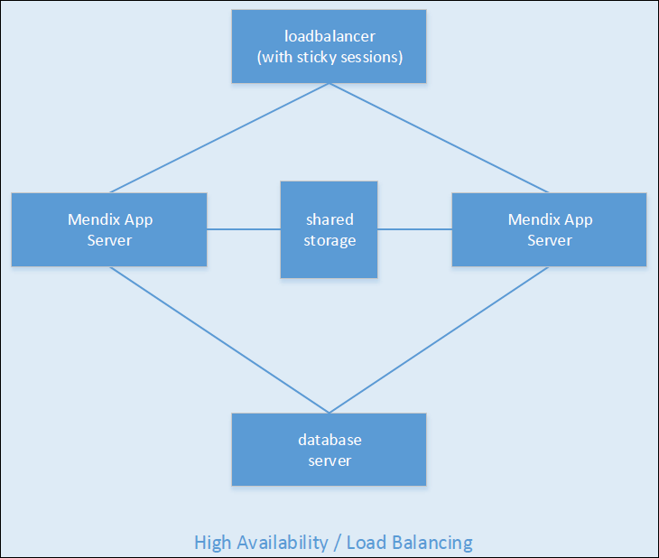
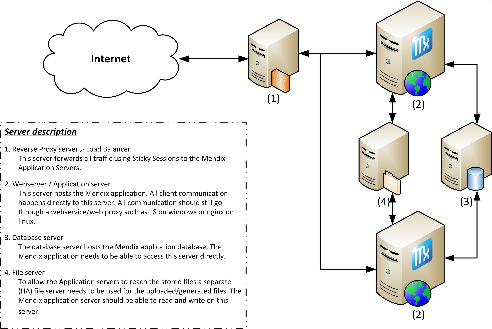

## 1 Introduction

This how-to describes the requirements and limitations of using a Mendix app in a high-availability architecutre.

**This how-to will teach you how to do the following:**

* Configure Mendix high-availability and load-balancing architecture

## 2 Prerequisites

* Basic knowledge of the Mendix runtime components

## 3 Mendix High Availability and Load Balancing Configuration

It is possible to use the Mendix platform in a load-balancing environment. However, it is important to know that the Mendix platform is not cluster-capable or -aware. The documentation doesn’t state exactly how the Mendix platform should be configured in a load high availability architecture. Since Mendix doesn’t have many requirements for how it should be installed, there are many options for running Mendix behind a load balancer.

This document explains the requirements for installing Mendix on a server behind a load balancer. The basic requirements for Mendix running behind a load balancer are having sticky sessions, a shared database, and non-persistent high-availability sessions.

### 3.1 Configuration Details

All Mendix runtime instances are to be installed and executed separately. Mendix runtime is not aware of a clustered setup. Because of this, the installation of the platform on all servers won’t vary from the normal setup with a single instance.

It is possible to keep the configuration synchronized between the Mendix runtimes (for example, the *m2ee.yaml* file, which holds all the configuration).

If you are using custom settings to influence the runtime behavior, it is critical that you keep those synchronized over the different instances. Having different settings in different instances will create unpredictable behavior.

These are some important details:

* Sticky sessions (in the load balancer) can be configured to your own preference as long as you are using sticky sessions
* MX runtime port – all available ports are allowed, this is no different than a regular server setup
* File share and document upload – images and uploaded files should be stored on HA shared storage
* Application root URL setting – must be identical on each instance
* The keep-alive port, health check, and monitoring – the Mendix runtime admin port can be used for a health check from the load balancer
    * To identify if the server is still available, the load balancer should check the keep-alive port in the configuration (the health-check microflow)
    * An HTTP status code of `200 OK` means the server is still available
* The IP addresses of end users – Mendix runtime does not require the IP addresses of the end-users
    * The application log shows the users who logged in, and it is possible to develop custom logic based on the IP address
    * It is useful to configure the IP address forwarding in the load balancer as well, so that the information is still usable
* Mendix runtime sessions – in case an instance goes down and that instance was facilitating any end-user sessions, it often isn’t desirable that those users are logged out
    * To allow this, you need to enable persistent sessions by setting the `PersistentSessions` custom setting to true
    * This will make the Mendix runtime store all the session information in the database so it can be picked up by other instances
* Scheduled event – running events on all instances 
    * This isn’t a recommended solution, but it is possible and will let Mendix runtime execute the schedule events at the same time on all instances
    * There are two options:

    1. Run events on a single instance. Having all the scheduled events executed on a single instance solves the problem of executing the same actions multiple times. This should be configured manually on each environment. This solution is not failover-capable, though. If the scheduled event instance goes down, the task will not be taken over by other instances.
    2. Develop a custom "Scheduled Event Cluster Manager." This is more complicated, but it is the most stable solution for the guaranteed execution of scheduled events. When developing a custom solution, it is important to focus on common problems such as: quorum, split brain scenarios, and fencing. For example:
        * Set up a heartbeat web service between the Mendix runtime instances and a configuration entity stating which instance should "execute" on scheduled events
        * If one instance goes down unexpectedly, the other instances notice on the heartbeat and take over scheduled events
        * A controlled shutdown for maintenance should also be captured in the configuration entity
        * All scheduled event microflow handling should first check the heartbeat or the configuration before "executing" the current process
        * This example requires one of the instances to stay online during maintenance, assuming changes by the service console are read into memory on startup and can be altered without risk

### 3.2 Detailed Example of High Availability Architecture

## 4 Related Content

* [How to Configure a Security Checklist for Your On-Premises Installation](security-checklist-for-your-on-premises-installation)
* [How to Update a Mendix Application](updating-a-mendix-application)
* [How to Set Up Mendix on Windows – Microsoft SQL Server](mendix-on-windows-microsoft-sql-server)
* [How to Set Up a New SQL Server Database](setting-up-a-new-sql-server-database)
* [How to Use Mendix SQL Maintenance Plans](mendix-sql-maintenance-plans)
* [How to Restore an SQL Server Database](restoring-a-sql-server-database)
* [How to Set Up an SQL Server User](setting-up-a-sql-server-user)
* [How to Set Up the Database User](setting-up-the-database-user)
* [How to Troubleshoot SQL Server](troubleshooting-sql-server)
