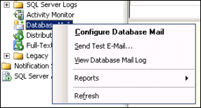
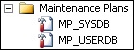

## 1 Introduction

This how-to will present guidelines for setting up Mendix SQL maintenance plans.

**This how-to will teach you how to do the following:**

* Set up SQL basic maintenance plans
* Set up notifications
* Set up user database maintenance plans

## 2 Prerequisites

Before starting this how-to, make sure you have completed the following prerequisites:

* For the purpose of this how-to, the following Mendix SQL data structure will be used, so please adapt the folder tree according to your organization's data structure:

    

* Make sure the SQL Server Agent Service is running, preferably using the Mendix service account for authentication
* Consider the amount of soft backups that need to be kept
* Consider what email address will receive maintenance notifications

## 3 SQL Basic Maintenance Plan

### 3.1 The Basics

Maintenance plans are created by the editor in the SQL Server Management Studio.

To add a task step, follow these steps:

1. Drag the corresponding item from the **Maintenance Plan Tasks** toolbox:

    

2. Drag connecting lines between the items to initiate a sequence of events.
3. To change a notification job from **Success** (which is the default connector) to **Failure**, right-click the connecting line and choose **Failure**:

    

### 3.2 Notifications

To configure notifications, follow these steps:

1. Start the SQL Management Studio.
2. Create an SQL operator (SQL Server Agent). The operator will receive maintenance notifications.
3. Right-click **DatabaseMail** and select **Configure Database Mail**:

    

4. Choose a valid e-mail sender address (for example, *mendix_sql@yourdomainname.com*)
5. Make sure the e-mail profile is set to both **Public** and **Default Profile**:

    

6. Verify your e-mail configuration by sending a test email:

    

7. Next, create two maintenance plans:

    

    For the sake of uniformity, the plan names **MP_SYSDB** and **MP_USERDB** will be used throughout this document. Changing the plan names to a different convention will not influence the functionality of the plan.

    On every (sub)plan, notifications will be configured. Whether to only send **Failed** events or both **Failed** and **Successful** is up to the user.

This is the pattern for a notification:

* Subject: `SQL Server Message - <SQL instance> - <maintenance plan name> - <subplan name> <successful/failed>`
    * For example: *SQL Server Message - Mendix-SQL1 – MP_USERDB - weekly maintenance failed*
* Body: `<SQL instance> - <subplan name> <successful/failed>`
    * For example: *Mendix-SQL1 – database backup (full) successful*

### 3.3 User Databases

In this section, you are going to create a new maintenance plan called **MP_USERDB** containing subplans:

1. Create a subplan called **backup database (full)**.
2. Schedule the plan to run every working day at 22:00 (or whatever time does not conflict with your external backup application):

    

3. Choose to back up to disk.
4. Back up to *X:\sqldata\backup*.
5. Select **create a sub-directory for each database**.
6. Back up the file extension *.bak*.
7. Select **verify backup integrity**.
8. Set the backup compression to **Compress Backup**.
9. Create a subplan called **backup database (trn)**.
10. Schedule the plan to run every working day, as often as is necessary. If hourly backups are run, database recovery will be possible per hour. When run with a smaller interval, database recovery to a more recent point in time will be possible. High volume databases that perform many hourly transactions should back up more often than lesser-used databases.

    

11. Choose **Transaction Log** for the backup **Type**.
12. Choose to back up to disk.
13. Back up to *d:\sqldata\backup*.
14. Select **create a sub-directory for each database**.
15. Back up file extension *.trn*.
16. Select **verify back up integrity**.
17. Set the backup compression to **Compress Backup**.
18. Create a subplan called **weekly maintenance**.
19. Schedule the plan to run every Sunday at 01:00 (or whatever time the application is least used):

    

20. Set **Change free space per page percentage to: 10%** and select **Keep index online while reindexing** (please note that this option will only work in enterprise versions of Microsoft SQL server):

    

21. Create a subplan called **daily maintenance**.
22. Schedule to run every Tuesday till Friday at 02:00 (or whatever working days apply for your organization):

    

     .

{}

You should adapt the times set to your desired backup retention time. The cleanup might be set to smaller intervals in order to save disk space.

{}

### 3.4 System Databases

In this section, you are going to create a new maintenance plan called **MP_SYSDB** containing the following subplans:

1. Create a subplan called **backup database (full)**.
2. Schedule this to run Tuesday through Friday at 02:00 (or whatever working days apply for your organization):

    

3. Select to back up to disk.
4. Back up to *d:\sqldata\backup*.
5. Set **create a sub-directory for each database**.
6. Back up the file extension *.bak*.
7. Select **verify backup integrity**.
8. Set the backup compression to **Compress Backup**.
9. Create a subplan called **weekly maintenance**.
10. Schedule this to run every Sunday at 01:00:

    

11. Set the rebuild index task to reorganize pages with the **Default free space per page** and select **Keep index online while indexing**:

    

## 4 Related Content

* [How to Restore an SQL Server Database](restoring-a-sql-server-database)
* [How to Troubleshoot SQL Server](troubleshooting-sql-server)
* [How to Set Up a New SQL Server Database](setting-up-a-new-sql-server-database)
* [How to Set Up an SQL Server User](setting-up-a-sql-server-user)
* [How to Configure a Security Checklist for Your On-Premises Installation](security-checklist-for-your-on-premises-installation)
* [How to Deploy Mendix on Microsoft Windows](deploy-mendix-on-microsoft-windows)
* [How to Install Mendix on Debian GNU Linux](installing-mendix-on-debian-gnu-linux)
* [How to Install Mendix on RedHat and CentOS](installing-mendix-on-redhat-and-centos)
