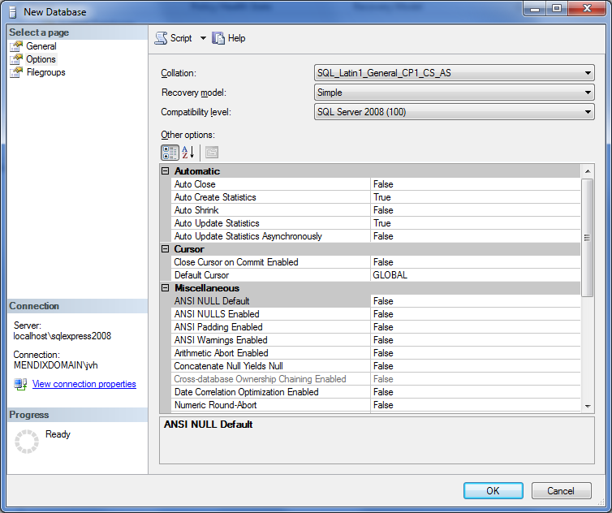

## 1 Introduction

This how-to will teach you how to set up a new SQL Server database.

## 2 Set Up a New Database

When setting up a new database for Mendix, most of the settings can be left to the default configuration. When looking at the general settings, you only need to set up the database name. Set up the database files according to the Microsoft SQL Server best practices (for details, see [Best Practices for Configuring SQL Server](https://msdn.microsoft.com/en-us/library/cc296885(v=bts.10).aspx)).


In the database options, the default properties need to be evaluated. When choosing a collation, pay attention to the type of collation you are going to use. Mendix uses UTF-8 for all data evaluation. Depending on your exact locale, you will most likely want to choose one of the `SQL_Latin1_General_` collations. The exact encoding will depend on your OS. For an *en_US* installation, this will be `CP1`.

The last two options identify how sorting and uniqueness is interpreted. For example, the collation option `_CS_` indicates that the collation sorting style will be case-sensitive. For more information on collations, see [Windows Collation Sorting Style](https://msdn.microsoft.com/en-us/library/ms143515.aspx).

As a recovery model, Mendix only requires the **Simple** mode. The functionality offered in the **Full** recovery model option is not used by Mendix; usage of this recovery model will not hurt Mendix, but it could increase the data usage of all the transactions and might slow down any rollbacks in case of an error.



After the database is created, the Mendix platform can initiate the initial setup and prepare all the tables and functions for usage by the platform. When starting the platform for the first time, there are two queries that require elevated privileges from a `sysadmin` role. The `sysadmin` role can be temporarily assigned to the user, or these queries can be executed by the administrator as well.

There are two more queries that are only executed once, but these privileges are implicitly assigned to the `db_owner` role. As long as the user is `db_owner`, the function and procedure can be created without problems.

## 3 Configuring the Read Committed Snapshot Isolation Level

The database schema needs to be configured so that the **Read Committed Snapshot** feature is enabled. This can be achieved by executing the following command on the database:

```
ALTER DATABASE [MySchema] SET READ_COMMITTED_SNAPSHOT ON;
```
{}
You need to replace `MySchema` with the name of your schema.
{}

## 4 Configuring the necessary SQL Server extensions

For the correct functioning of Mendix, some SQL Server extensions need to be installed. This can be achieved via the following command:

```
CREATE ASSEMBLY [Mendix.SqlServerExtensions] FROM "D:\MyFolder\Mendix\server\runtime\lib\Mendix.SqlServerExtensions.dll" WITH PERMISSION_SET = SAFE;
```

{}
Of course, the file path needs to be set to the corresponding file which is part of your Mendix installation.
{}

The permission above requires CLR to be enabled on the SQL Server instance. CLR can be enabled using this query:

```
EXEC sp_configure 'clr enabled' , '1';
RECONFIGURE;
```

### 4.1 Queries to Be Executed with the `db_owner` or `db_ddladmin` Database Role

The function and assembly need to be created for timezone handling. Also for these functions, Common Language Runtime (CLR) needs to be enabled on the SQL Server instance. If your are not working on the same timezone as UTC, you need to enable CLR and this function. Without time zone support in the platform, development of your functionality will be much more difficult. This can be achieved using the following commands:

```
CREATE FUNCTION [dbo].[mx_toLocalDateTime] (@utcDateTime datetime, @dstTimeZone nvarchar(50)) RETURNS datetime AS EXTERNAL NAME [Mendix.SqlServerExtensions].[Mendix.SqlServerExtensions.DateTimeLocalizer].[ConvertToLocalDateTime];
```

```
CREATE PROCEDURE [dbo].[usp_nextsequencevalue]
@SeqName nvarchar(128)
AS
BEGIN
DECLARE @NewSeqVal bigintSET NOCOUNT ON
UPDATE [mendixsystem$sequence]
SET @NewSeqVal = [current_value] = [current_value] + 1
WHERE [name] = @SeqName
RETURN @NewSeqVal
END;
```

## 5 Related Content

* [How to Activate a Mendix License on Microsoft Windows](activate-a-mendix-license-on-microsoft-windows)
* [How to Set Up the Database User](setting-up-the-database-user)
* [How to Share the Development Database](/howto/collaboration-project-management/sharing-the-development-database)
* [How to Restore a SQL Server Database](restoring-a-sql-server-database)
* [How to Troubleshoot](troubleshooting)
* [How to Troubleshoot an SQL Server](troubleshooting-sql-server)
* [How to Set Up Mendix SQL Maintenance Plans](mendix-sql-maintenance-plans)
