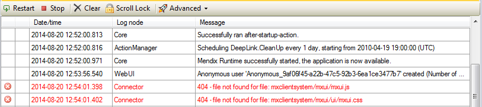
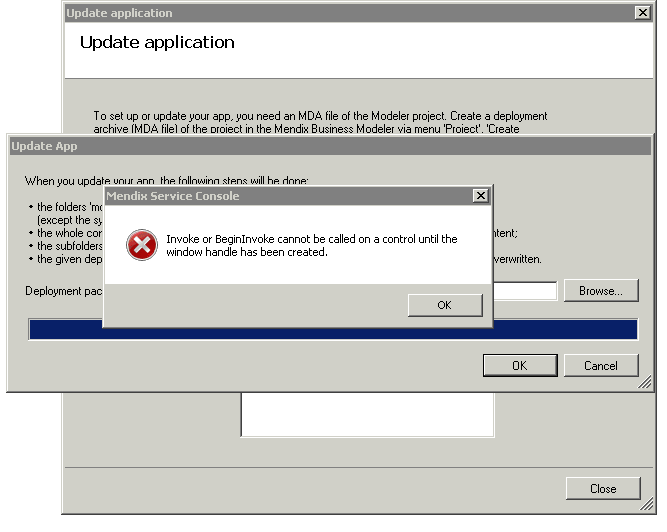
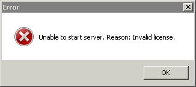

## 1. IIS Troubleshooting

When setting up IIS as a webserver in front of Mendix it could happen that you run into issues with your installation.
The first step you will need to take is to decide what is causing your problem, an incorrect Mendix installation or IIS.

To determine where to look for your problem you should start by validating the Mendix installation. Whenever you open your application from your laptop, it will always open it through IIS. We want to work around that, in order to test just Mendix without IIS you should open the browser on your server. 
When you open Internet Explorer and go to [http://localhost:8080/](http://localhost:8080/) (or the port that you have configured), you can test if the application is working.

If the test with Mendix application is successful you have to search for your problem in IIS, if the application isn't working you should start by validating your Mendix application installation.

### 1.1 Validating the Mendix installation

If there are issues with the Mendix installation you should see error messages in the Service Console or in the browser as well.

A common issue is related to critical files not being found.If you get these types of errors you will have to validate the installation of the server version. In order to do that you will need to confirm the location of the server installations. And search for the correct platform version, and the files that are referenced in the error message. If all files are present in the expected location there is an issue with security and the user running the Mendix service is not allowed to read and execute in the mxclientsystem folder. If the files are missing, somebody or some process removed the files. You should re-install the server distribution (tar.gz file).

### 1.2 Validating IIS

When you have confirmed that the Mendix installation is working, you should start with a step by step validation of the IIS configuration.

#### **Try to find the details of the problem.**

Open the application and inspect the request with your browser's developers tools. If the application isn't working you will see requests that are not successfully executed.

*   All the /xas/ requests fail with an error:   The rewrite is incorrectly configured.    Go to /xas/ in the browser, which should give you a blank page if everything is behaving correctly. Most likely you will find a more detailed explanation about the cause of your problem. 
*   Some javascript files can not be opened:   Try opening the files directly from your browser. If there is an issue in your IIS configuration you will get more information when opening that url. If that still results in the same error it is most likely a security problem. The user under which your website is executed, does not have sufficient privileges to access the required files. 

If just the login process seems to be failing you need to validate the response when trying to login. You should not use valid credentials to test the login! When analyzing the response, and using invalid credentials, the server should return a 401 status code with the response: {}  any other status code or response indicates an issue.

*   A 404 status code, indicates that the /xas/ url cannot be found. This is an issue in your rewriter configuration, the /xas/ requests should be redirected to the localhost/xas/ url. If the rewriter is not setup correctly IIS will try and open the folder called xas, which obviously does not exists. 
*   A 401 status code with an html page as response,    IIS should be configured to return detailed error messages. If IIS is not returning detailed error messages, for every message different than 200 it will return the default html error page. The client system needs to have the detailed (JSON) error message in order to correctly process the response. [See this IIS page for more info about detailed error responses](https://esus1.mendixcloud.com/index.html#mce_temp_url#) 

After you have identified the exact cause of your problem it is best to search on the exact error message you are receiving. There are numerous reasons why IIS might give that error, existing IIS blog and documentation pages give a much better understanding on how to solve your specific issue. 

## 2\. Mendix Service Console

### Error while updating an app (1)
Sometimes, shortly after the update process began, a popup tells you that the directory was not empty. Normally, before the app is updated, a backup is created and the current app files are removed. Sometimes, not all files can be removed, due to a lock by a Windows Explorer window or another process. Please install Mendix Service Console 4.1 or later to reduce the chance this error occurs.
However, it does not matter that some files are not removed. All needed files are overwritten by the new app version. From version 4.1 and up, the update process will go further after showing this error.

### Error while updating an app (2)
On some Windows server installations, the app update process shows an error just before the end of the process

Please upgrade the Mendix Service Console to version 4.1 or later.

### Unable to start server
Sometimes, each time you start a specific app, the following error occurs:

This occurs even if you have never activated a license. Normally, when the license is not valid, the app starts in trial mode. This popup should never be shown, unless there is a deeper cause. Maybe the database is corrupt, for instance you have migrated a database from a Mendix 4 app to a Mendix 3 app. Try starting the app on a new database.

### Security errors while starting service
When the system gives such errors while starting the service, make sure the configured service user has sufficient rights to the folders of the Mendix application. Sometimes you have to fill in the domain name with the user name, thus DOMAIN_NAME\user_name instead of user_name.

### Type-initialization
Sometimes the Event Viewer shows a message like this:

EventType clr20r3, P1 mendixservice.exe, P2 1.0.3810.25652, P3 4c0cf0d8, P4 mendixservice, P5 1.0.3810.25652, P6 4c0cf0d8, P7 2, P8 6, P9 system.typeinitialization, P10 NIL.

Make sure that the user account for the service has enough rights to the folders containing the Mendix Service executables and the subfolders x86 and x64.

## 3\. Related content

*   [Finding the Root Cause of Runtime Errors](/howto/monitoring-troubleshooting/finding-the-root-cause-of-runtime-errors)
*   [Clearing Warning Messages in Mendix](/howto/monitoring-troubleshooting/clear-warning-messages)
*   [Testing web services using SoapUI](/howto/testing/testing-web-services-using-soapui)
*   [Monitoring Mendix using JMX](/howto/monitoring-troubleshooting/monitoring-mendix-using-jmx)
*   [Debugging Java actions remotely](/howto/monitoring-troubleshooting/debug-java-actions-remotely)
*   [Log Levels](/howto/monitoring-troubleshooting/log-levels)
*   [Debugging Java Actions](/howto/monitoring-troubleshooting/debug-java-actions)
*   [Common Mendix SSO Errors](/howto/monitoring-troubleshooting/handle-common-mendix-sso-errors)
*   [Debugging Microflows](/howto/monitoring-troubleshooting/debug-microflows)
