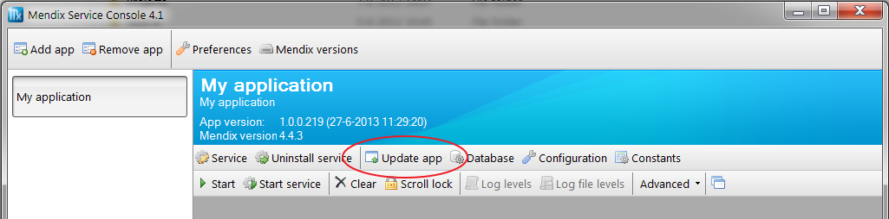
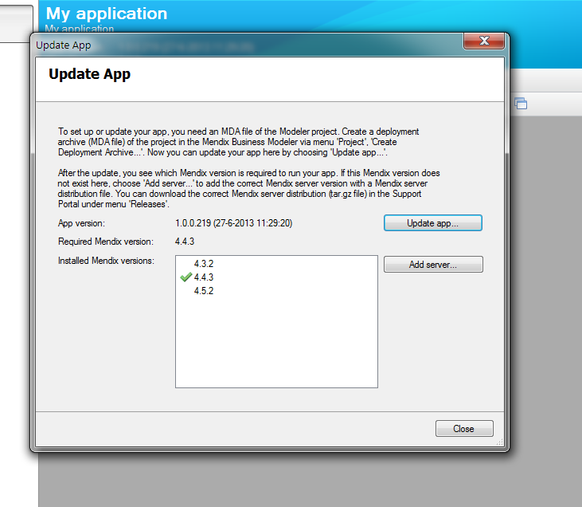
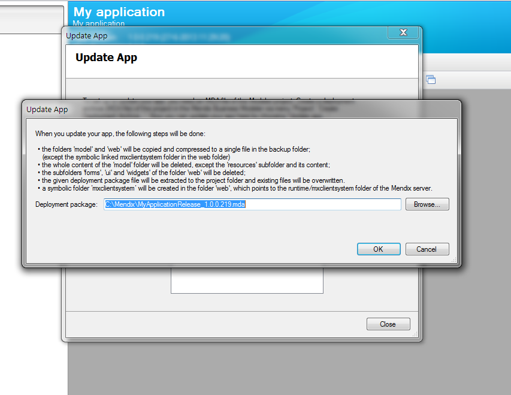
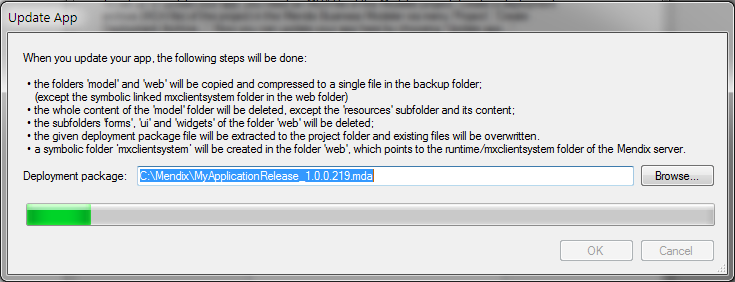
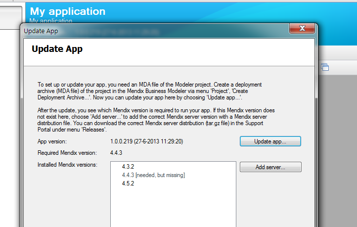
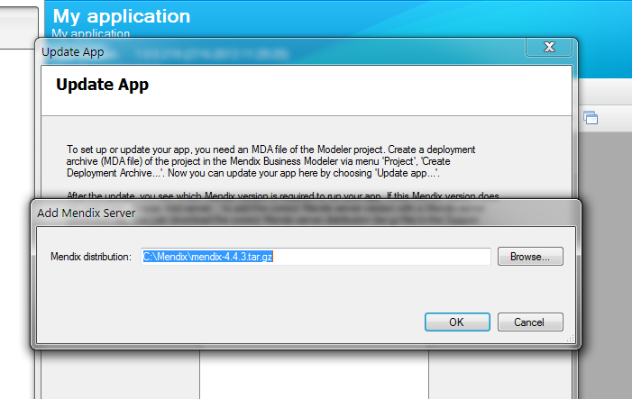
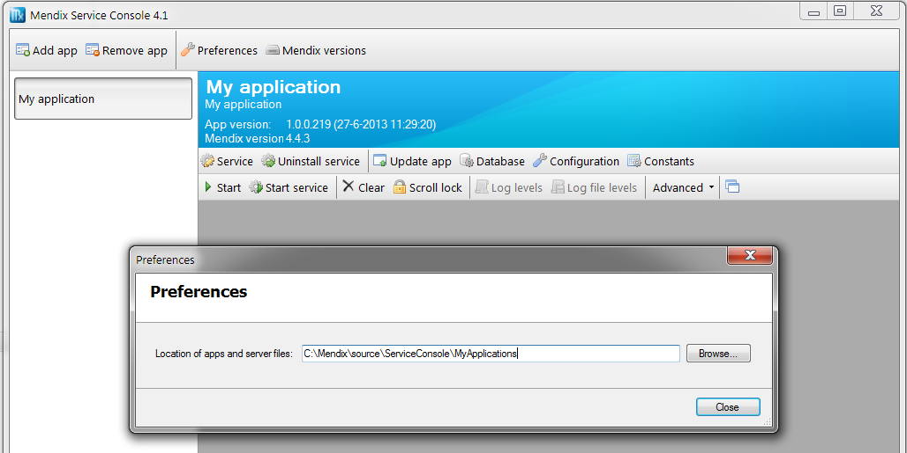

A Mendix application on a Windows server can be updated using the Mendix Service Console. Before starting with the server update, you need to make sure that you have a versioned deployment archive (*.mda file) accessible on your server and that the same version of the server distribution is either installed or also available as an installation package on the server.

The service console creates a backup of the project files, this allows you to restore a previous deployment. But before every update it is recommended to create a backup of your data and uploaded files. The Mendix Service Console does not do this for you. 

## 1\. Using the Update app button

1.  You can update the application by clicking on the button ‘Update app’. 

2.  The 'Update App' popup that appears shows you the information of the current active software version. The number of the App version shows the release number of the versioned deployment package. This is the release that is currently running on this server.
    The installed Mendix versions list shows all the Runtime versions that are available on the server. The Runtime version that is used by the current installation is marked by the green check box.  

    

To update the application press the button ‘Update app’ and select the new deployment archive (.mda)



This process will copy the new version of the project software into the configured location. All models will be extracted, and a symbolic link to the ‘mxclientsystem’ folder is automatically created so the JavaScript libraries can be easily included without any additional configuration in IIS.

You’ll see an progress bar appear after clicking the ‘OK’ button once the process has been completed the project software version has been updated. 


## 2\. Update The Mendix Runtime version

1.  After updating the Mendix application version it could happen that the Service Console shows the message ‘needed, but missing’. This would mean that the required server distribution is not installed on the server. You can download the server distribution from [home.mendix.com](http://home.mendix.com/), the server distribution can be found under the related downloads from the specific Mendix Modeler. The server distribution is a .tar.gz file
    
2.  Press the button ‘Add Server’ and select the required server distribution (.tar.gz). The Service Console will extract the server distribution to the same folder as the other server distributions.

    After the server distribution is updated you’ll be able to start the Service using the new project and Mendix Platform version. 
    

### 2.1 Location of the Mendix server distributions

In the Preferences of the Mendix Service Console you can configure the main directory for all applications and server distributions. You can find the installed platform version in the folder /servers. This folder is located directly in the configured base path from the service console.



This should be something like:

```
“D:\Mendix\MyApplications\Servers”
```
{}

The user that is configured as the Service Account should have Read&Execute privileges on this entire server folder. You could suffice with just granting access to the specific server distribution but that would mean that you’d have to update the folder access after every platform version update. 

{}

## 3\. Related content

*   [Restoring a SQL Server database](restoring-a-sql-server-database)
*   [Troubleshooting SQL Server](troubleshooting-sql-server)
*   [Mendix SQL Maintenance Plans](mendix-sql-maintenance-plans)
*   [Setting up a new SQL Server database](setting-up-a-new-sql-server-database)
*   [Setting up a SQL Server user](setting-up-a-sql-server-user)
*   [Security checklist for your on-premises installation](security-checklist-for-your-on-premises-installation)
*   [Mendix on Windows - Microsoft SQL Server](mendix-on-windows-microsoft-sql-server)
*   [Deploying Mendix on Microsoft Windows](deploy-mendix-on-microsoft-windows)
*   [Installing Mendix on Debian GNU Linux](installing-mendix-on-debian-gnu-linux)
*   [Installing Mendix on RedHat and CentOS](installing-mendix-on-redhat-and-centos)
