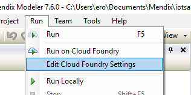
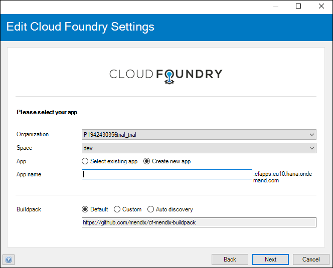
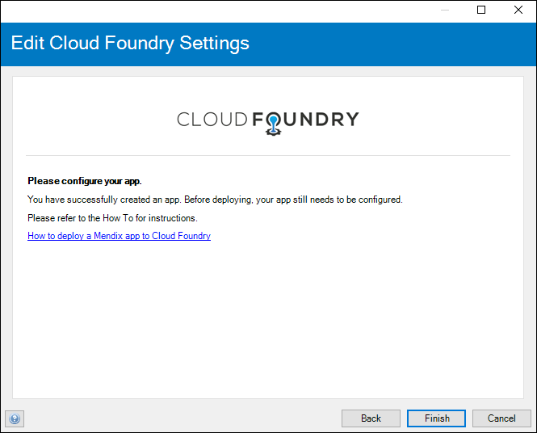
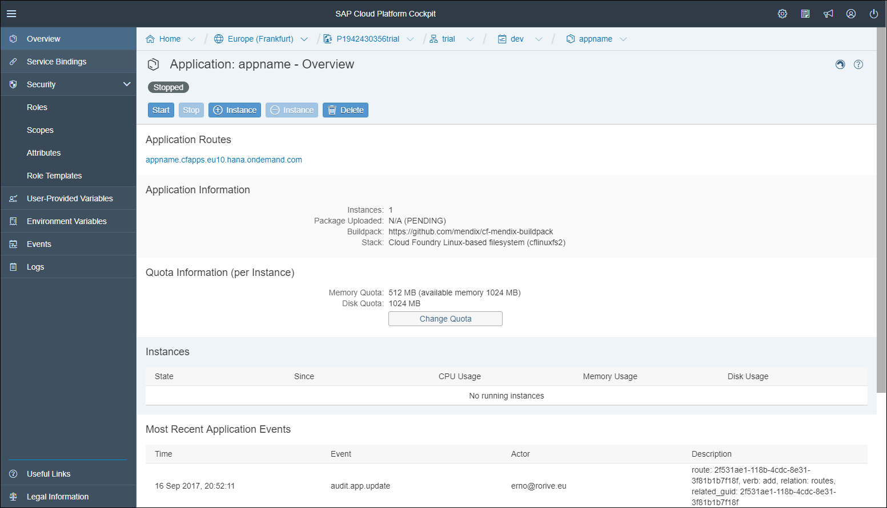
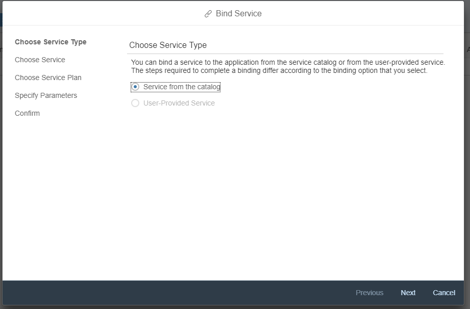
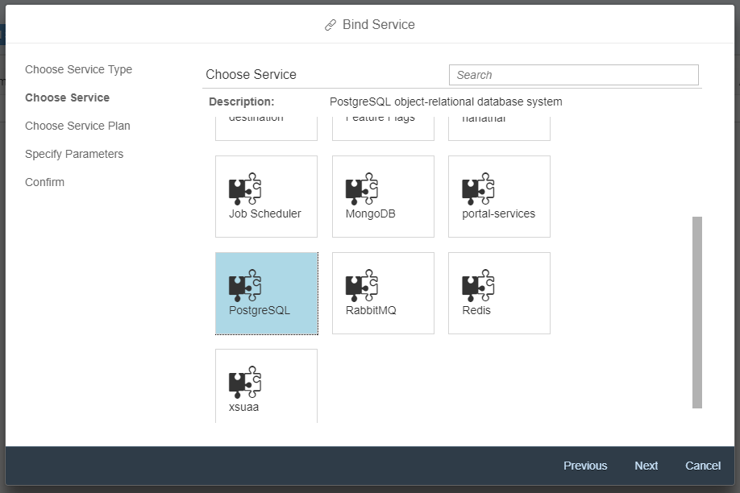
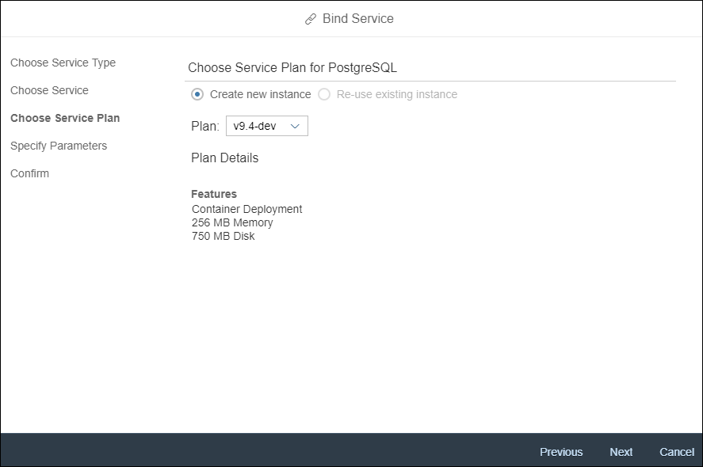
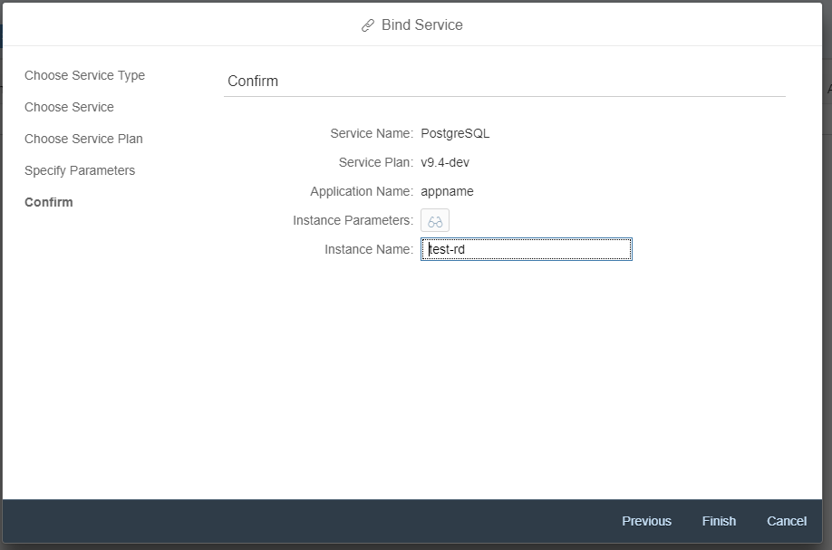
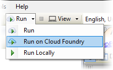

## 1 Introduction

This document describes how a Mendix application is deployed on SAP Cloud Platform.

## 2 SAP Cloud Platform Cloud Foundry

To run a Mendix application on SAP Cloud Platform you need a subscription on SAP Cloud Platform Cloud Foundry. This can be a trial account or a commercial account.

A Mendix application requires the following services on SAP Cloud Platform:

* PostgreSQL database
* Route

In addition to these required services, the following services are optional:

* XSUAA Service
* Connectivity Service
* ObjectStore (S3)

When using the Mendix [Developer Portal](/developerportal/deploy/sap-cloud-platform), these services will be automatically instantiated and bound to the application.

### 2.1 Trial Account

An SAP Cloud Platform Cloud Foundry trial account comes with a large enough quota to run a single application. The database plan available on the trial account is v9.4-dev.

The S3 ObjectStore Service is not available on a trial account. This will result in the loss of documents or files within your application when you redeploy it.

### 2.2 Commercial Account

To run Mendix within a commercial SAP Cloud Platform Cloud Foundry account the quota should include:

* ObjectStore (s3)
* Route
* PostgreSQL v9.4-xsmall
* XSUAA Service
* Connectivity Service

A set of these services will be initiated for each application.

## 3 Deployment of an Application

To deploy an application on SAP Cloud Platform Cloud Foundry it is recommended to use the [Developer Portal](/developerportal/deploy/sap-cloud-platform).

### 3.1 Command-Line Deployment

When you want to make your deployment part of a CI/CD pipeline it is also possible to use the Cloud Foundry command line.

See [Mendix Cloud Foudry Buildpack](https://github.com/mendix/cf-mendix-buildpack) for the command-line instructions.

### 3.2 Deployment with Desktop Modeler Native Cloud Foundry Integration

If, for some reason, you don't want to use the Developer Portal for managing your application on SAP Cloud Platform you can use the Desktop Modeler Cloud Foundry integration.

Perform the following steps to deploy your app on Cloud Foundry using the Desktop modeler:

* Setup Cloud Foundry within the Desktop Modeler
* Bind your services within SAP Cloud Platform Cloud Foundry
* Deploy your app

#### 3.2.1 Set Up Cloud Foundry within the Desktop Modeler
Follow these steps to set up Cloud Foundry in the Desktop Modeler:

1. Go to **Menu > Run > Edit Cloud Foundry Settings**.

  

2. Enter the **API endpoint** of your SAP Cloud Platform Cloud Foundry Region and provide your account credentials, then click **Next**.

  

3. Provide to following information:
  * Organization
  * Space
  * App
  * App Name
  * Buildpack (use *Default*)

  

  The Desktop Modeler is now ready to use SAP Cloud Platform Cloud Foundry. Next you need to set up your Cloud Foundry Services within SAP Cloud Platform Cloud Foundry.

  

#### 3.2.2 Bind Your Services within SAP Cloud Platform Cloud Foundry
Follow these steps to bind your services to SAP Cloud Platform Cloud Foundry:

1. Open your [SAP Cloud Platform Cockpit](https://account.hana.ondemand.com/#/home/welcome).
2. Log in and navigate to the **Cloud Foundry Region** you have selected in the Desktop Modeler.
3. Select the **Space** and the app you have created using the Desktop Modeler wizard.

  

4. Open the **Binding Services** menu and click **Bind Service**.

  

5. Click **Next** to select a service.

  

6. Select *PostgreSQL* as the database for your application.

  

7. Select the *v9.4-dev* plan for a trial account or the *v9.4-xssmall* for a commercial account.

  

8. Enter an **instance name** and click **Finish**.

Your application is now set up with a minimum configuration to run your application. Setting up other services follows a similar process. Consult the links in the **Related Content** section for information about configuring these services.

#### 3.2.3 Deploy your Application to Cloud Foundry
Follow these steps to deploy your application using the Desktop Modeler native Cloud Foundry integration:

1. Open the Desktop Modeler.
2. Click the dropdown for the Run option in the toolbar.
3. Click **Run on Cloud Foundry**. Your app will now be deployed to Cloud Foundry.

  

## 5 Related Content

* [Use the SAP XSUAA Connector](/howto/sap/use-sap-xsuaa-connector)
* [SAP Cloud Platform](/developerportal/deploy/sap-cloud-platform)
