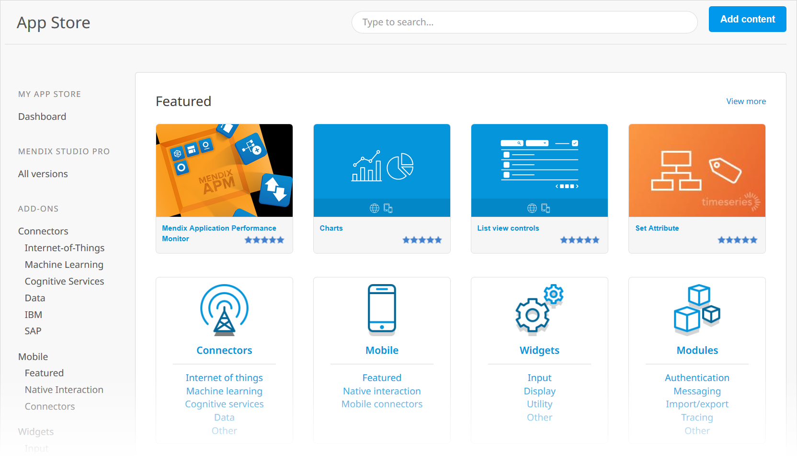
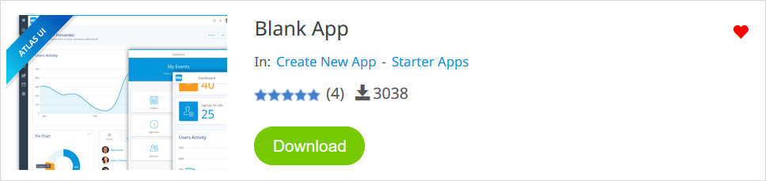
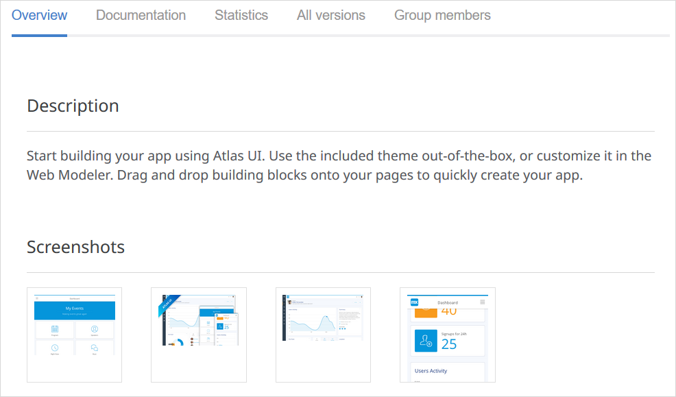
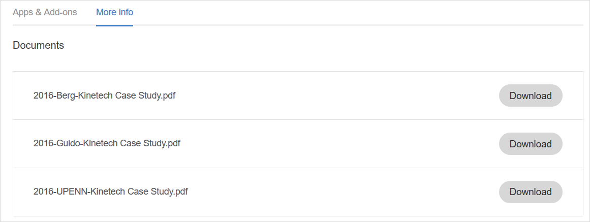

## 1 Introduction

The [Mendix App Store](https://appstore.home.mendix.com/index3.html) is a vibrant marketplace containing complete sample apps that can be used right away as well as various add-ons (such as connectors, widgets, and modules) that can be used to build custom apps more quickly. In the App Store, you can browse all the content, get what you need, and share the content you have created.

This document describes all the different sections of the App Store.

## 2 App Store Home Page

### 2.1 Categories

The home page of the Mendix App Store presents various content categories:

Category | Description
--- | ---
**Featured** | The most important and useful App Store content as determined by Mendix (think of it as a "staff picks" section). 
**Connectors**, **Mobile**, **Modules**, **Widgets** | Add-on categories and sub-categories (for example, Internet-of-Things and Authentication). 
**New content** | The most recently uploaded content. 
**Recent updates** | The most recently updated content. 
**Most popular** | Content that has been downloaded the most in the past seven days. 
**Reviews** | The most recent content reviews along with the author and date of the review. Clicking the name of the review author will bring you to their [Mendix Profile](../mendix-profile/index). Clicking the title of the content will allow you to see the details of what was reviewed. 
**Top App Store contributors** | The top 10 App Store contributors of the last 30 days. Clicking the name of the developer will bring you to their Mendix Profile. Clicking **View full leaderboard** will take you to the [Mendix Leaderboards](https://developer.mendixcloud.com/link/topappstore30) page.

To see a detail page for each category, click **View more**.

### 2.2 Sidebar Menu

The App Store sidebar menu lists all the pages that you can browse for content.

For details on add-ons, see [Add-On Details Page](#AddonDetailsPage).

For details on the Desktop Modeler in the App Store, see [Modeler](#modeler).

{}[**UPDATE LINKS BELOW**]{}

You can also access the [My App Store Dashboard](#myappstore)

?
* [Private App Store](#privateappstore)
* [Solutions](#solutions)
* [Partners](#partners)

## 3 Add-On Details Page {#AddonDetailsPage}

Clicking an App Store item in a menu will bring you to the item's details page. The details page presents the sections described below.

### 3.1 Header

The header for each add-on presents the following details:

* The **Name** and **Category** of the item
* The review average (in stars) and the number of reviews
* The number of times the item has been downloaded
* A heart for favoriting the item (so it will appear in your list of favorites on the [My App Store tab](#myappstore))
* The following buttons (depending on the type of item and what the developer added to share):
	* **Preview** – click this to preview more information or a demo about the content
		* This is only available if the developer has included a demo URL when sharing the content (for details on sharing content, see [How to Share App Store Content](share-app-store-content))
	* **Open** – click this to open a supplementary page for the content (for example, the [Atlas UI](https://atlas.mendix.com/) page, where you can learn more about the Mendix Atlas UI Design language)
	* **Download** – click this to download the content
		* This is only available for content that has a file attached (meaning, all shared  Desktop Modeler content, but not promotions; for details on sharing  Desktop Modeler content, see [How to Share App Store Content](share-app-store-content))
		* For details on how to import downloaded App Store content into the Desktop Modeler, see [How to Import & Export Objects](/howto/integration/importing-and-exporting-objects)
		{}The best practice is to download content from the App Store that is accessible in the  Desktop Modeler, because it then downloads directly into the  Desktop Modeler (for details, see [How to Use App Store Content](use-app-store-content-in-the-modeler)).
		{}

### 3.2 Tabs

The details page for each add-on and app presents the following item information tabs:

*  The **Overview** tab with the following sections:
	* **Description** – a description of the item
	* **Screenshots** – screenshots of the item
	* **User Reviews** – user reviews of the item; to leave a review for the item, click **Add Review** – a section will open where you can add text, rate the content, and submit the review (your reviews will be listed on the [My App Store tab](#myappstore))

	

*  The **Documentation** tab can include details on typical usage scenarios, features and limitations, depedencies, intallation and configuration, and frequently asked questions

	

	* Clicking **Edit documentation** will open a text editor where you can edit the App Store item's documentation

*  The **Statistics** tab charts the downloads of the item over time:

	

*  The **All versions** tab, which lists all the versions (updates) of the item:

	
	
*  The **Content owners** tab, which lists the [content owners](#co) if this is a protected item

	
	

{}[**UPDATE ALL SCREENSHOTS IN SECTION WITH NEW TAB NAME; VERIFY NAME OF NEW TAB**]{}

### 3.3 Additional Info Section

{}

{}

In the **Additional Info** section, you can see the following information (depending on the type of content):

* The **Latest version** number of the item
* The  Desktop Modeler version that the item **Requires** to work
* When the item was **Published**
* The type of **License** for the item
* The type of support Mendix offers for the item (for more information, see [App Store Content Support](app-store-content-support))
* The **URL** for the item page that you can copy and share
* A **View on GitHub** link, which will take you to the GitHub source files of the content
* A link to the documentation on how to install App Store item

### 3.4 Developer Info Section

{}

{}

In the **Developer Info** section, you can see the following information:

* The name, job title, and Mendix level of the App Store content developer
    * Clicking the developer name will bring you to their Mendix Profile
* The numbers for **Added items**, **Updated items**, and **Reviews added** in the Mendix App Store
* The company for which the developer works
    * Clicking the company name will bring you to the company's [Partner Profile](../community-tools/how-to-set-up-your-partner-profile)

## 4 Other Pages

### 4.1 My App Store > Dashboard {#myappstore}

The **My App Store** page presents all of your App Store activity:

* Your numbers for **PUBLISHED CONTENT** and **SUBMITTED REVIEWS**
* **Notifications** on content you favorited
* Your content **Favorites**

The **MY APP STORE** section of the sidebar menu contains the following options:

* **Published** – click this to see the content you have published as well as the content your company has published on the **Published content** page
    * On the **Published by me** tab, you can see the last version of the content you published
        * Click **Manage** to edit the current draft version, create a new draft version (for details, see [How to Share App Store Content](share-app-store-content)), or unpublish content
    * On the **Published by my company** tab, you can see all of the content published by your company
        * Click **Manage** to edit content, create a new draft version, or unpublish the content version you had published (if you are an organization administrator, you can unpublish any content)
* **Favorites** – click this to see the content you have favorited
* **Stats** – click this to see the content that has been downloaded the most in the previous month on the **Downloads overview** page
    * Clicking specific App Store content on this page will show you a **Downloads per month** graph as well as **User Reviews**

The **REVIEWS** section of the sidebar menu contains the following options:

* **Submitted** – click this to see the reviews that you have submitted as well as the reviews your company has submitted
* **Received** – click this to see the reviews that your content has received as well as the reviews that your company's content has received

The **MY COMPANY** section of the sidebar menu contains the following options:

* **Profile** – click this to see the profile of your company (the same profile that appears on the [Partners Tab](#partners))
* **External Downloaders** – click this to go to the [External Downloaders](#ext) page of your company's App Store
* **Content Owners** – click this to go to the [Content Owners](#co) page of your company's App Store

{}[**UPDATE SCREENSHOT ABOVE FOR NEW MENU ITEMS; VERIFY NAMING AND MENU ITEM ORDER**]{}

#### 4.1.1 External Downloaders {#ext}

On this page, a Company Admin with the [Can manage App Store](../company-app-roles/manage-roles#app-store-manager) permission can mark private App Store items downloadable for users from outside the company. They can also add the external downloaders who can download these items.

{}[**ADD SCREENSHOT; VERIFY DESCRIPTION**]{}

This page has two tabs:

* **Users** tab
	* Here you can enter an email address then click **Add External Downloader** to add that user as an external downloader who can download the App Store items marked on the **Downloadable Content** tab (see below)
	* External downloaders will receive an email about being able to access the company's private App Store content, and they will then be able to see all the private App Store content they have access to in their [private App Store](#privateappstore)
	* To remove an external downloader, click the red remove button next to their name
* **Downloadable Content** tab
	* Click **Add Item** to mark certain [private App Store](#privateappstore) items as downloadable for external downloaders

{}[**VERIFY UI TEXT, REMOVE BUTTON FUNCTIONALITY, AND ADD ITEM FOR MARKING CONTENT AS DOWNLOADABLE**]{}

#### 4.1.2 Content Owners {#co}

On this page, a Company Admin with the [Can manage App Store](../company-app-roles/manage-roles#app-store-manager) permission can mark App Store content owners who will have rights to manage protected content.

{}[**ADD SCREENSHOT; VERIFY DESCRIPTION**]{}

This page has two tabs:

* **Content Owners** tab
	* Click **Add Content Owner** to mark users from your company as content owners who can manage protected items
	* To remove a content owner, click the red remove button next to their name
* **Protected Content** tab
	* This tab shows the protected App Store items that can only be edited by content owners
	* Click **Add Item** to mark specific App Store items as protected
	{}An App Store item from your company not marked as protected can be edited by anyone in your company.
	{}
	* To remove an item from protection, click the red remove button next to the item's name

{}[**PROTECTED CONTENT IS NOT JUST PRIVATE APP STORE CONTENT, CORRECT?; VERIFY UI TEXT & DESCRIPTIONS**]{}

### 4.2 Private App Store {#privateappstore}

The private App Store is where your company can store content that will be available only to the developers in your company [external downloaders](#ext). This content will not be reviewed by Mendix.

If you are marked as an external downloader for App Store content from another company, you will also see that content in your private App Store.

For more information, see the [Adding New App Store Content](share-app-store-content#adding) section of *How to Share App Store Content*.

{}[**VERIFY**]{}

### 4.3 Modeler {#modeler}

On the **Modeler** page, you can download any version of the  Desktop Modeler you need by clicking  **Download** for the latest release or the donwload icon for a specific older release:

Clicking the **Release notes** icon will open the [ Desktop Modeler release notes](/releasenotes/desktop-modeler/) for that particular version.

Clicking the **Related downloads** option will open a page with information relating to that Desktop Modeler version.

### 4.4 Solutions {#solutions}

{}[**VERIFY SECTION WILL BE REMOVED**]{}

The **Solutions** page lists off-the-shelf products that are available for reference:

Hovering your mouse pointer over a solution tile will bring up a summary of the solution:

Solutions are not available for download. There is only an **Open** button, which will take you to the specific supplementary page for the solution.

### 4.5 Partners {#partners}

{}[**VERIFY SECTION WILL BE REMOVED**]{}

The **Partners** page lists selected App Store partner companies:

Hovering your mouse pointer over a partner tile will bring up a summary of the company:

Clicking the partner name will bring you to that partner's App Store details page:

On the **Apps & Add-ons** tab of the partner details page, you can browse the apps and add-ons that the partner has contributed to the App Store.

On the **More info** tab, you can view documents that provide more information on what the partner company does:

## 5 Read More

* [How to Use App Store Content](use-app-store-content-in-the-modeler)
* [How to Share App Store Content](share-app-store-content)
* [App Store Content Support](app-store-content-support)
