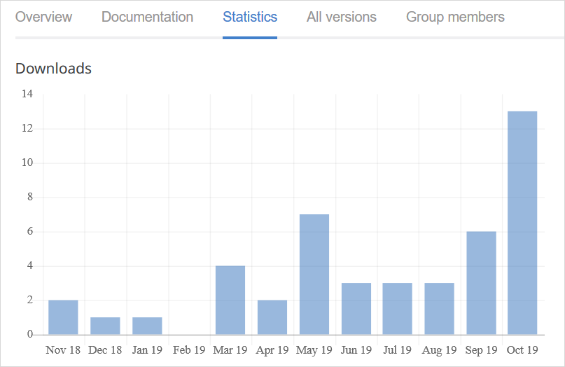
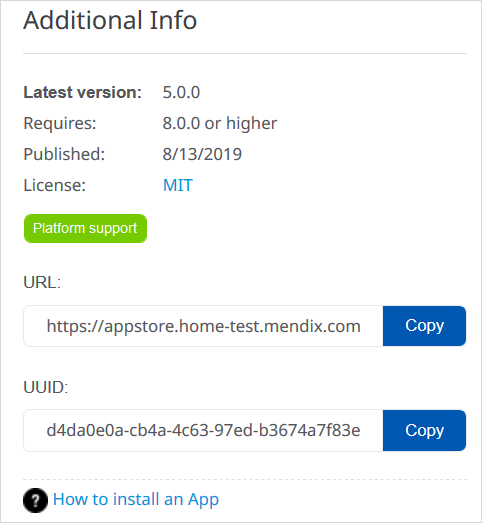

## 1 Introduction

The [Mendix App Store](https://appstore.home.mendix.com/index3.html) is a vibrant marketplace containing complete sample apps that can be used right away as well as various add-ons (connectors, widgets, and modules) that can be used to build custom apps more quickly. In the Mendix App Store, you can browse all the components, get what you need, and share the components you have created.

This document describes the different sections of the Mendix App Store.

## 2 App Store Home Page

The home page of the Mendix App Store presents various content categories:

Category | Description
--- | ---
**Featured** | The most important and useful App Store component as determined by Mendix (think of it as a "staff picks" section). 
**Connectors**, **Mobile**, **Widgets**, **Modules** | Add-on categories and sub-categories (for example, Internet-of-Things and Authentication). 
**New content** | The most recently uploaded components. 
**Recent updates** | The most recently updated components. 
**Most popular** | Components that have been downloaded the most in the past seven days. 
**Reviews** | The most recent component reviews along with the author and date of the review. Clicking the name of the review author will bring you to their [Mendix Profile](../mendix-profile/index). Clicking the title of the component will allow you to see the details of what was reviewed. 
**Top App Store contributors** | The top 10 App Store contributors of the last 30 days. Clicking the name of the developer will bring you to their Mendix Profile. Clicking **View full leaderboard** will take you to the [Mendix Leaderboards](https://developer.mendixcloud.com/link/topappstore30).

To see a detail page for each category, click **View more**.

## 3 Add-On Details Page {#details}

Clicking an App Store component in a menu will bring you to the component's details page. The details page presents the sections described below.

### 3.1 Header

The header for each add-on presents the following details:

* The **Name** and **Category** of the component
* The review average (in stars) and the number of reviews
* The number of times the component has been downloaded
* A heart for favoriting the component (so it will appear in your list of favorites on the [Dashboard](#dashboard))
* The following buttons (depending on the type of component and what the developer added to share):
	* **Preview** – click this to preview more information or a demo about the component
		* This is only available if the developer has included a demo URL when sharing the component (for details on sharing components, see [How to Share App Store Content](share-app-store-content))
	* **Open** – click this to open a supplementary page for the component
	* **Download** – click this to download the component
		* This is only available for components that have a file attached (meaning, all shared Studio Pro components, but not promotion)
		* The best practice is to download a component from the App Store that is accessible in Studio Pro, because it then downloads directly into Studio Pro (for details on importing downloaded App Store components into Studio Pro, see [How to Import & Export Objects](/howto/integration/importing-and-exporting-objects))

### 3.2 Tabs

The details page for each add-on and app presents the following item information tabs:

*  **Overview** tab – contains following sections:
	* **Description** – a description of the component
	* **Screenshots** – screenshots of the component
	* **User Reviews** – user reviews of the component; to leave a review for the component, click **Add Review** – a section will open where you can add text, rate the component, and submit the review (your reviews will be listed on your [Reviews](#my-reviews) page)

	

*  **Documentation** tab – can include details on typical usage scenarios, features and limitations, dependencies, installation and configuration, and frequently asked questions:

	

	* Clicking **Edit documentation** will open a text editor where you can edit the App Store component's documentation

*  **Statistics** tab –  charts the downloads of the component over time:

	

*  **All versions** tab – lists all the versions (updates) of the component:

	
	
*  **Group members** tab – lists the [user group members](#members) if this is an App Store component assigned to a [user group](#user-groups)

	

{}[**VERIFY NAME OF GROUP MEMBERS TAB ABOVE; UPDATE SCREENSHOTS FOR NEW TAB NAME ABOVE**]{}

### 3.3 Additional Info Section {#additional-info}

{}

{}

In the **Additional Info** section, you can see the following information (depending on the type of component):

* The **Latest version** number of the component
* The Studio Pro version that the component **Requires** to work
* When the component was **Published**
* The type of **License** for the component
* The type of support Mendix offers for the component (for more information, see [App Store Content Support](app-store-content-support))
* The **URL** for the component page that you can copy and share
* The **UUID** of the component; if the component is part of the **Getting Started** category of App Store components, this UUID can be used in the [CreateNewApp operation](/apidocs-mxsdk/apidocs/projects-api#createnewapp) in the *Projects API*
* A **View on GitHub** link, which will take you to the GitHub source files of the component
* A link to the documentation on how to install the App Store component

### 3.4 Developer Info Section

{}

{}

In the **Developer Info** section, you can see the following information:

* The name, job title, and Mendix level of the App Store content developer
	* Clicking the developer name will bring you to their [Mendix Profile](/developerportal/mendix-profile/index)
* The numbers for **Added items**, **Updated items**, and **Reviews added** in the Mendix App Store
* The company for which the developer works
	* Clicking the company name will bring you to the company's [Partner Profile](../community-tools/how-to-set-up-your-partner-profile)

## 4 My App Store

### 4.1 Dashboard {#dashboard}

The **Dashboard** page presents your App Store activity:

* Your numbers for **Published Content** and **Submitted Reviews**
* **Notifications** on components you created and favorited
* Content **Drafts** you have created
* Your content **Favorites**

### 4.2 My Content {#content}

On this page, you can see the App Store components for which you have created at least one version:

{}[**UPDATE SCREENSHOT**]{}

{}
You may see the **Company only** label on a component, which means it is your company's private App Store content (for details on how this is configured, see the [Adding New App Store Components](share-app-store-content#private-app-store) section of *How to Share App Store Content*). This content can be shared with [guests](#guests).
{}

To see the component's [details](#details) page, click **View**.

#### 4.2.1 Managing a Component {#manage}

Click **Manage** to manage the component:

{}[**VERIFY "Unpublish" CONDITIONS IN REVIEW**]{}

On this page, you will see the following buttons:

* **Create new draft version** – click this to create a new draft version of the component (for details on creating a draft version, see the [Updating Existing App Store Content](share-app-store-content#updating) section of *How to Share App Store Content*)
* **Unpublish** – click this to remove that version from the component
	* If the component is not the protected content of a [user group](#user-groups), you can only unpublish a version that you have published yourself
	* If the component is protected [content](#content) from a user group, a group [member](#members) can unpublish any version
* **Edit** – click this to edit the component (for details on editing, see the [Adding New App Store Content](share-app-store-content#edit) section of *How to Share App Store Content*)

### 4.3 Drafts

This page contains drafts of App Store content you have started:

Click the name of an App Store component to be taken to the [DRAFT](share-app-store-content#adding) page, where you can continue editing the component details.

Click **Delete** to delete a draft.

### 4.4 Shared with Me {#shared-with-me}

This page contains content shared with you by other companies who have marked you as a [guest](#guests):

### 4.5 Reviews {#my-reviews}

This page contains reviews of [Your content](#content) by other users as well as **Your reviews** that you have written of other content:

### 4.6 Notifications

This page presents a history of notifications on content you have contributed to:

## 5 Your Company's App Store

### 5.1 Company Content

On this page, you can see all the content your company has published:

{}[**UPDATE SCREENSHOT FOR REMOVAL OF "PROTECTED" LABEL**]{}

The **Manage** button is available to you if one of the following conditions is true:

* You are the creator of the component and the component is not assigned to any [user groups](#user-groups)
* The component is assigned to a user group, and you are a [member](#members) of that group
* You are a Company Admin of the company that published the component

To manage a component, click **Manage** (for more information, see the [Managing a Component](#manage) section above).

To see the component's [details](#details) page, click **View**.

### 5.2 Reviews

This page contains reviews of **Your company's content** as well as **Your company's reviews** that users from your company have written of other content.

### 5.3 User Groups {#user-groups}

You can configure user groups for various levels of access to your company's App Store. The available configuration tabs for each user group page are described in the sections below.

{}
The **User Groups** menu item and page are visible to all users. However, only [Company Admins](../company-app-roles/companyadmin-settings) with the [Can manage Company](../company-app-roles/manage-roles#app-store-manager) permission can create and delete user groups. Both [Group admins](#members) and Company Admins can manage user groups.
{}

#### 5.3.1 Members Tab {#members}

On this tab, you can enter an email address and click **Add** to add a member to the user group. User group members can manage the [content](#content) assigned to the group.

Once a member is added, you can select their permission level: **Member** or **Group Admin**. A Group Admin can manage the user group.

{}[**ADD SCREENSHOT**]{}

To remove a member, click **Remove** next to their name.

#### 5.3.2 Guests Tab {#guests}

A guest is a Mendix Platform user from outside your organization who can download the selected private [Content](#content) of this group. To add a guest, enter their email address in the box and click **Add**:

{}[**UPDATE SCREENSHOT**]{}

The guest will receive an email notifying them of access to the private content. They can then see all the private App Store content shared with them in their [Shared with Me](#shared-with-me) page.

To remove a guest, click **Remove**.

#### 5.3.3 Content Tab {#content}

On this tab, you can assign content to this user group that can only be managed by members of this group. To assign content to a user group, click **Assign Content** and select a private App Store component from the dialog box:

{}[**ADD SCREENSHOT**]{}

To manage a component assigned to the user group, click **Manage** (for more information, see the [Managing a Component](#manage) section above).

To see the component's [details](#details) page, click **View**.

To remove a component from the user group, click **Remove**.

If you want [guests](#guests) to be able to download the component, check the **Allow guests to download** box.

#### 5.3.4 Settings Tab

On this tab, you can enter a **Name** and **Description** for the user group.

To delete a group, a Company Admin can click **Delete Group**.

## 6 Read More

* [How to Use App Store Content](app-store-content)
* [How to Share App Store Content](share-app-store-content)
* [App Store Content Support](app-store-content-support)

