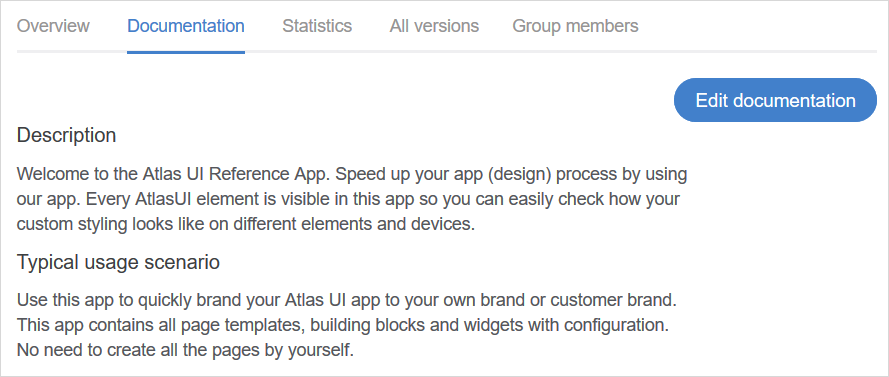
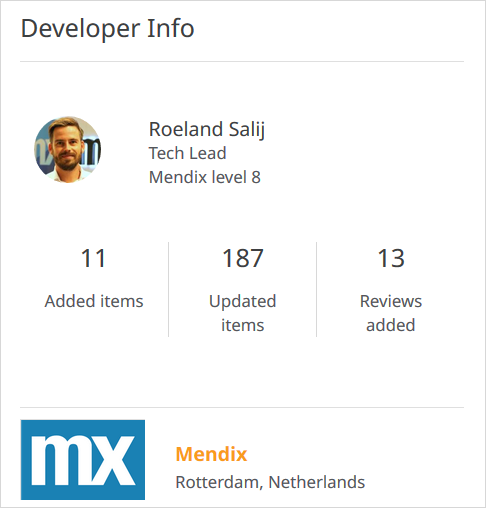
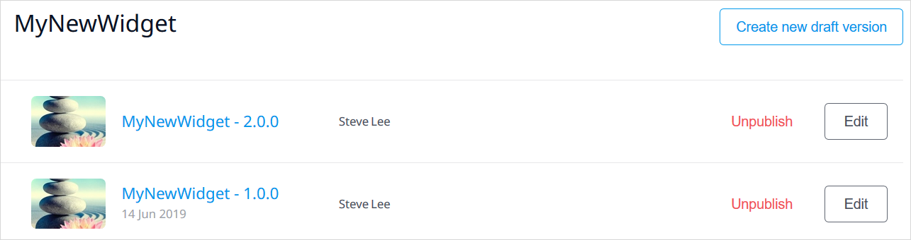
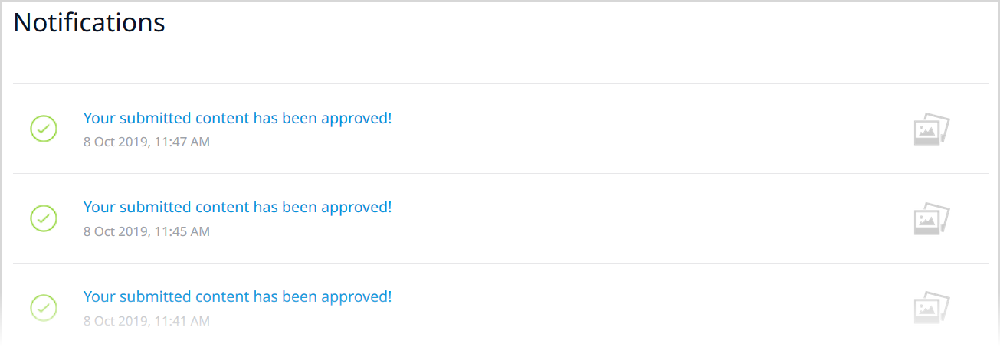
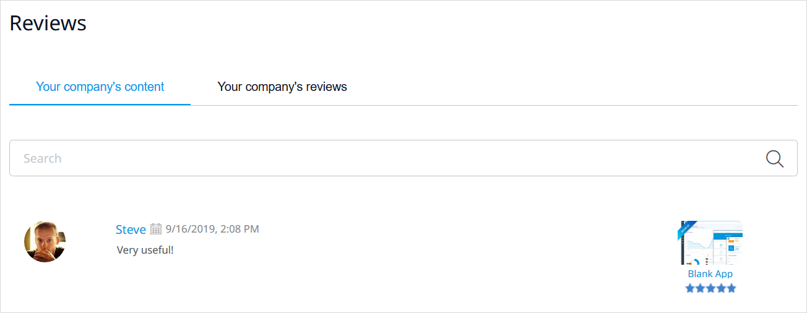

## 1 Introduction

The [Mendix App Store](https://appstore.home.mendix.com/index3.html) is a vibrant marketplace containing complete sample apps that can be used right away as well as various add-ons (such as connectors, widgets, and modules) that can be used to build custom apps more quickly. In the App Store, you can browse all the content, get what you need, and share the content you have created.

This document describes all the different sections of the App Store.

## 2 App Store Home Page

The home page of the Mendix App Store presents various content categories:

Category | Description
--- | ---
**Featured** | The most important and useful App Store content as determined by Mendix (think of it as a "staff picks" section). 
**Connectors**, **Mobile**, **Widgets**, **Modules** | Add-on categories and sub-categories (for example, Internet-of-Things and Authentication). 
**New content** | The most recently uploaded content. 
**Recent updates** | The most recently updated content. 
**Most popular** | Content that has been downloaded the most in the past seven days. 
**Reviews** | The most recent content reviews along with the author and date of the review. Clicking the name of the review author will bring you to their [Mendix Profile](../mendix-profile/index). Clicking the title of the content will allow you to see the details of what was reviewed. 
**Top App Store contributors** | The top 10 App Store contributors of the last 30 days. Clicking the name of the developer will bring you to their Mendix Profile. Clicking **View full leaderboard** will take you to the [Mendix Leaderboards](https://developer.mendixcloud.com/link/topappstore30) page.

To see a detail page for each category, click **View more**.

## 3 Add-On Details Page {#AddonDetailsPage}

Clicking an App Store item in a menu will bring you to the item's details page. The details page presents the sections described below.

### 3.1 Header

The header for each add-on presents the following details:

* The **Name** and **Category** of the item
* The review average (in stars) and the number of reviews
* The number of times the item has been downloaded
* A heart for favoriting the item (so it will appear in your list of favorites on the [Dashboard](#dashboard)
* The following buttons (depending on the type of item and what the developer added to share):
	* **Preview** – click this to preview more information or a demo about the content
		* This is only available if the developer has included a demo URL when sharing the content (for details on sharing content, see [How to Share App Store Content](share-app-store-content))
	* **Open** – click this to open a supplementary page for the content (for example, the [Atlas UI](https://atlas.mendix.com/) page, where you can learn more about the Mendix Atlas UI Design language)
	* **Download** – click this to download the content
		* This is only available for content that has a file attached (meaning, all shared  Desktop Modeler content, but not promotions; for details on sharing  Desktop Modeler content, see [How to Share App Store Content](share-app-store-content))
		* The best practice is to download content from the App Store that is accessible in the  Desktop Modeler, because it then downloads directly into the  Desktop Modeler (for details, see [How to Use App Store Content](app-store-content); and for details on importing downloaded App Store content into the Desktop Modeler, see [How to Import & Export Objects](/howto/integration/importing-and-exporting-objects))

### 3.2 Tabs

The details page for each add-on and app presents the following item information tabs:

*  **Overview** tab – contains following sections:
	* **Description** – a description of the item
	* **Screenshots** – screenshots of the item
	* **User Reviews** – user reviews of the item; to leave a review for the item, click **Add Review** – a section will open where you can add text, rate the content, and submit the review (your reviews will be listed on your [Reviews](#my-reviews) page)

	

*  **Documentation** tab – can include details on typical usage scenarios, features and limitations, depedencies, intallation and configuration, and frequently asked questions:

	

	* Clicking **Edit documentation** will open a text editor where you can edit the App Store item's documentation

*  **Statistics** tab –  charts the downloads of the item over time:

	

*  **All versions** tab – lists all the versions (updates) of the item:

	
	
*  **Content managers** tab – lists the [content managers](#cm) if this is protected App Store content

	

### 3.3 Additional Info Section

{}

{}

In the **Additional Info** section, you can see the following information (depending on the type of content):

* The **Latest version** number of the item
* The  Desktop Modeler version that the item **Requires** to work
* When the item was **Published**
* The type of **License** for the item
* The type of support Mendix offers for the item (for more information, see [App Store Content Support](app-store-content-support))
* The **URL** for the item page that you can copy and share
* A **View on GitHub** link, which will take you to the GitHub source files of the content
* A link to the documentation on how to install App Store item

### 3.4 Developer Info Section

{}

{}

In the **Developer Info** section, you can see the following information:

* The name, job title, and Mendix level of the App Store content developer
	* Clicking the developer name will bring you to their [Mendix Profile](/developerportal/mendix-profile/index)
* The numbers for **Added items**, **Updated items**, and **Reviews added** in the Mendix App Store
* The company for which the developer works
	* Clicking the company name will bring you to the company's [Partner Profile](../community-tools/how-to-set-up-your-partner-profile)

## 4 My App Store

### 4.1 Dashboard {#dashboard}

The **Dashboard** page presents your App Store activity:

* Your numbers for **Published Content** and **Submitted Reviews**
* **Notifications** on content you created and favorited
* Content **Drafts** you have created
* Your content **Favorites**

#### 4.2 My Content {#content}

On this page, you can see the App Store content for which you have created at least one version:

{}You may see certain labels on the content:
* **Protected** – details on this label are described below via the [Enable protection](#protect) button; if the content is protected, only [content managers](#cm) are able to manage it
* **Company only** – this is your company 's private App Store content (for details on how this is configured, see the [Adding New App Store Content](share-app-store-content#private-app-store) section of *How to Share App Store Content*); this content can be shared with [external downloaders](#ext)
{}

Clicking **Manage** opens the content management page:

On this page, you will see the following buttons (depending on your permissions):

* **Enable protection**/**Disable protection** – click this to toggle the protection level for the content
  * Enabling protection assigns the **Protected** label to the content and means that only [content managers](#cm) are able to manage it
  * This button is only visible to Company Admins with the [Can manage App Store](../company-app-roles/manage-roles#app-store-manager) permission
* **Create new draft version** – click this to create a new draft version of the content (for details on creating a draft version, see the [Adding New App Store Content](share-app-store-content#edit) section of *How to Share App Store Content*)
* **Unpublish** – click this to remove that version from the content
* **Edit** – click this to edit the content (for details on editing, see step 6 of the [Adding New App Store Content](share-app-store-content#edit) section of *How to Share App Store Content*)

#### 4.3 Shared with Me {#shared-with-me}

This page contains content shared with you by other companies have marked you as an [external downloader]().

#### 4.4 Reviews

This page contains reviews of **Your content** by other users as well as **Your reviews** that you have written of other content.

#### 4.5 Notifications

This page presents a history of notifications on content you have contributed to:

## 5 Your Company's App Store

### 5.1 Company Content

On this page, you can see all the content your company has published:

The **Manage** button is available to you for the following content:

* Content you have published
* Your company's content that is not protected
* Your company's content that is [protected](#protect) for which you are a [content manager](#cm)

For details on how to manage content, see the [My Content](#content) section above.

### 5.2 Shared with Others {#shared}

{}
This menu item and page are only visible to Company Admins with the [Can manage App Store](../company-app-roles/manage-roles#app-store-manager) permission.
{}

This page contains company-only content that is shared with external downloaders. To set these external downloaders, click **View all people outside your company...** to be taken to the [External Downloaders](#ext) page.

To set the accessible content, click **Share content**, which opens the **Company-only content** dialog box. Here you see a list of company-only content from your company's [private App Store](share-app-store-content#private-app-store) that can be shared by selecting it and clicking **Save**:

Once the content is saved, it is shared with external downloaders and listed on this page:

There are two buttons available for shared content:

* **Remove** – click this to remove the content from being shared with external downloaders
* **View** – click this to go to the App Store page for the content

### 5.3 Reviews

This page contains reviews of **Your company's content** as well as **Your company's reviews** that various users from your company have written of other content.

### 5.4 User Groups

{}
This menu item and page are only visible to Company Admins with the [Can manage App Store](../company-app-roles/manage-roles#app-store-manager) permission.
{}

You can configure your user groups for various levels of access to your company's App Store. The available user groups are described in the sections below.

#### 5.4.1 Content Managers {#cm}

On this page, you can add App Store content managers for your company who will have rights to manage [protected content](#protect). To add a new content manager, enter their email address in the available field and click **Add**:

To remove a content manager, click **Remove** next to their name

####  5.4.2 External Downloaders {#ext}

On this page, you can add external downloaders from outside your company who you can share your company's private App Store content with via the [Shared with Others](#shared) page.

To add an external downloader, enter their email address in the box and click Add:

If the external downloader is registered with Mendix, they will receive an email notifying them of access to private App Store content. They can then see all the private App Store content shared with them in their [Shared with Me](#shared-with-me) page.

To remove an external downloader, click **Remove** next to their name.

## 6 Read More

* [How to Use App Store Content](app-store-content)
* [How to Share App Store Content](share-app-store-content)
* [App Store Content Support](app-store-content-support)

