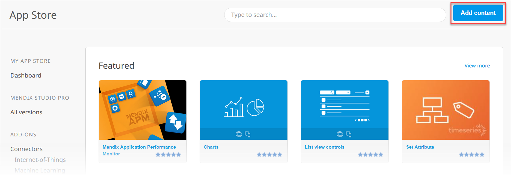
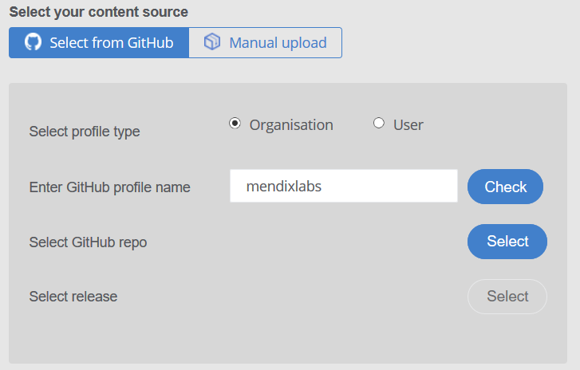
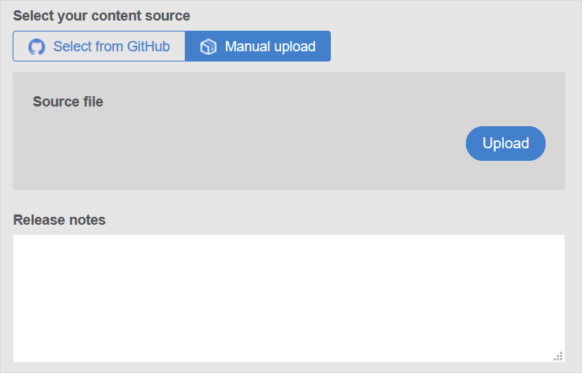
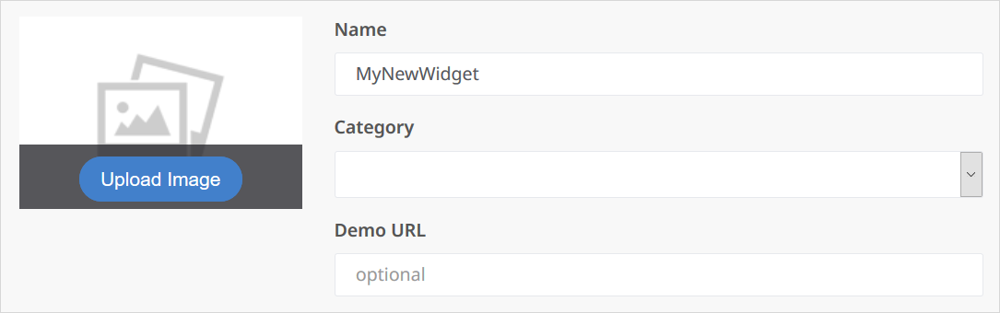
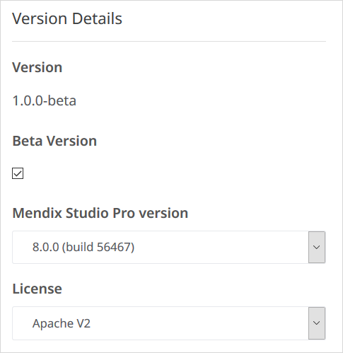
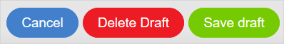
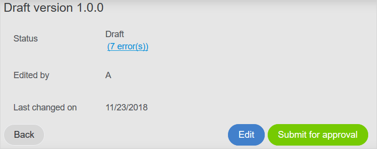
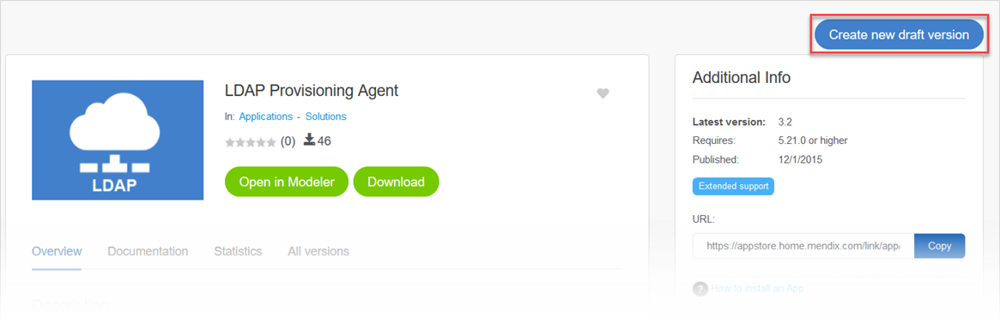

## 1 Introduction

The App Store is driven by contributions from members of the Mendix community who share the connectors, modules, and apps they have built. This how-to shows how to add and update App Store content.

**This how-to will teach you how to do the following:**

* Add new content and promotions to share in the App Store
* Update existing App Store content

## 2 Prerequisites

Before starting this how-to, make sure you have completed the following prerequisites:

* Familiarize yourself with the [App Store Overview](app-store-overview) and [How to Use App Store Content](app-store-content)

## 3 App Store Content Development Guidelines {#submission}

This section presents guidelines for developing content that you will submit to the Mendix App Store.

{}
Submitted App Store content will be reviewed within five working days.
{}

### 3.1 General Guidelines

These are some general guidelines for creating new App Store content :

* Set up a separate project to build and maintain your App Store component
* Use a relatively recent Mendix version when creating the item, not only the latest Mendix version (for example, use Mendix 7.8 and 6.6 )
* Create multiple versions of your App Store component (for example, for Mendix 7 and 6)

Any information the end-user should know about your content can be written on the [Documentation tab](#doc-tab) when you are adding the content to the App Store.

### 3.2 Widget Guidelines

To develop widgets and submit them to the App Store, follow these guidelines:

* The widget must be based on the [AppStoreBoilerplate](https://github.com/mendix/AppStoreWidgetBoilerplate)
* When writing variable and function names, use lowerCamelCase (for example, *mySecondVariable*)
* Add code comments
* Use descriptive variable and function names in both XML and JavaScript
* Always add `"use strict";` to functions
* A function may not be larger than 200 lines of code
* A function may only do one thing, and it should do it properly
* Internal variables should start with an underscore (`_`)
* Using the Dojo Toolkit and its functionalities is preferred, but for external plugins you can use jQuery
* Create a test project based on the [AppStoreBoilerplate](https://github.com/mendix/AppStoreWidgetBoilerplate)
* Create test pages for mobile when content is mobile-supported

### 3.3 Module Guidelines

To develop modules and submit them to the App Store, follow these guidelines:

* Create a folder named **USE_ME** and add the microflows and pages that are relevant for the user
* Create an empty folder with the version number as its name, which will appear in Studio Pro's Project Explorer
* If you add any userlib *jar* files, make sure they are accompanied by a *MyModule.RequiredLib* file so that users know where the *jar* files come from
* Verify that the module's Java actions compile correctly (the easiest way to check is to create a deployment package, as it will clean the deployment folder and rebuild the app; for more information, see [Create Deployment Package Dialog](/developerportal/deploy/environments) and [Environments](../deploy/environments))
* Reduce the use of layouts – using snippets will result in fewer module dependencies and will reduce the number of potential errors (for example, missing layouts)
* User roles and security should be implemented 
* Creating a new release or module export should be done while the security level of the project containing the module is set to **Production**
* The module security status (in the **Project Security**) must be **complete** for the following:
	* Page access
	* Microflow access
	* OData access
	* Entity access
	* Dataset access
* For example pages and microflows to be copied to another module, they should be "excluded from project" in order to encourage duplication and reduce dependency errors 
* Do not rename entities and attributes when creating new versions, as data in these entities will get lost (replacing an existing module is based on the entity names)
* The module should include the English language

## 4 Adding New App Store Content {#adding}

To add content to the App Store, follow these steps:

1.  Click **Add content** in the top-right corner of the App Store home screen:

	

2.  The **DRAFT** page will open, where you need to select the purpose of your contribution:

	* **Share** – components that can be downloaded using Studio Pro – if you select this option, continue to [step #3](#three) below
	* **Promote** – a way to advertise a component or solution while not making it downloadable – if you select this option, continue to [step #4](#four) below

	{}You can only set this in the initial version of your content. You cannot change this setting by updating the App Store component later.
	{}

3.  When adding Studio Pro content, select **your content source**:

	* If you select **Select from GitHub**, follow these steps: 
		a. Select the type of GitHub profile (**Organisation** or **User**) where the content is stored. 
		b. Enter the **GitHub profile name**. 
		c. Click **Check** to confirm that this profile is publicly available in GitHub. 
		d. Select the **GitHub repo** from which the content will be uploaded by clicking **Select**. The system will crawl all of the projects for that GitHub profile and present the Mendix package file (*.mpk*) options to you in a pop-up window. 
		e. Click **Select** on this window when you find the correct *.mpk* file name. 
		f. Select the **release** by clicking **Select**. If there are various releases of the *.mpk* file available, the system will present them to you in a pop-up window. When you find the correct release, click **Select** on this window. 
		g. Check the **Use GitHub README for documentation** check box if you want the repo's *readme.md* file to be included on the App Store component's [Documentation tab](#doc-tab). This is useful for including nicely formatted documentation with screenshots for your App Store component. 
		{}The **Release notes** section is only available for updating a new version of the content (for details see the  [Updating Existing App Store Content](#updating) section below).{} 

		{}
		{}

	* If you select **Manual upload**, follow these steps: 
		a. Select the **Source file** by clicking **Upload**. 
		b. On the **Upload source file** pop-up window, click **Browse** to browse the source files on your computer. 
		c. Select your source file, and click **Save**. 
		d. Enter the **Release notes** that describe your manually uploaded content. 

		{}
		{}

4.  In the **Publish to** drop-down menu, select the location where you want to publish your content:

	* **Public App Store (visible for anyone)** – your content will be available to every developer in the Mendix community (this content will have to be reviewed and approved by Mendix before it is available)
	* **Private App Store (visible for your company)** – your content will receive the **Company only** label and be available only to the developers in your company; selected private content of a user group can also be made available to [user group guests](app-store-overview#guests) for download; this content will not be reviewed by Mendix
	
	{}You can only set this in the initial version of your content. You cannot change this setting by updating the App Store component later.
	{}

6.  In the bottom half of the **DRAFT** screen, do the following: 
	a. Enter a **Name** for your content. 
	b. Select a category for your content from the **Category** drop-down menu (for example, **Connectors**). 
	c. If you have published a demo using your content, enter the **Demo URL**. 
	d. Click **Upload Image** to upload an image for your app. 

	

7.  On the **Overview** tab in the bottom half of the **Share your content** screen, you can do the following:

	* Enter an overview **Description** of your content (for example, "Node control is an native Android app that gives a system administrator access to the Mendix Cloud nodes being administered. From the app, the status of the different environments within a node can be monitored and an environment can be started or stopped.")
	* Upload screenshots by clicking **Add screenshots** and selecting images of the content from your computer
	* Upload a video by clicking **Add video** and selecting a video that demonstrates using the content from your computer

7. On the **Documentation** tab, you can write or edit the documentation that should accompany your app in the editor. You are only able to edit the documentation of your own and your company's content. Note that this is only applicable when the **Use GitHub README for documentation** check box is not checked.

	* The documentation template includes the following sections that you must fill out in order to submit your content:
		* An extended **Description** of the content
		* The **Typical usage scenario** for the content
		* The **Features and limitations** for the content
	* These sections are optional:
		* Any **Dependencies** (for example, the required Studio Pro version, modules, images, and styles)
		* The **Installation** steps and details
		* The **Configuration** steps and details
		* Any **Known bugs**
		* Any **Frequently Asked Questions**

	{}{}

	The editor comes with a set of basic formatting tools, such as bold, bullet lists, and URL links.

	You can attach images to your documentation in one of two ways:

	* Drag the image from file explorer to the editor (this will upload your image)
	* Click the Image button in the editor tools and enter a URL which points to an image

	Uploaded images cannot be resized, but linked images can.

9. Note that there is nothing for you to do on the **Statistics** and **All versions** tabs. The **Statistics** tab will chart the downloads of your content over time. The **All versions** tab will list the various versions of your content that have been updated.
10. In the **Version Details** section on the bottom-right of the screen, do the following: 
	a. Check the **Beta version** check-box if the content is in beta. 
	b. Select the **Mendix Studio Pro version** on which you built the content. 
	c. Select the type of **License** you want applied to your app (if applicable): 
	
	* **Apache V2** (for more information, see [Apache License 2.0](https://www.apache.org/licenses/LICENSE-2.0)) 
	* **GNU General Public License, version 3** (for more information, see [GNU General Public License v3.0](https://www.gnu.org/licenses/gpl-3.0.en.html)) 
	* **Mendix EULA** (for more information, see [Mendix Terms of Use](https://www.mendix.com/terms-of-use/)) 
* **MIT** (for more information, see [MIT License](https://opensource.org/licenses/MIT)) 
	
	{}{}
	
	You can request other license types to be added as **License** options by clicking the **Feedback** button on the right side of the App Store screen.
11. After entering the information for your content, you can click one of these buttons in the middle of the screen:

	{}{}

	* Click **Cancel** to cancel your changes to the content information
	* Click **Delete Draft** to delete the draft of the content information you are working on
	* Click **Save draft** to save the draft of the content information, which will open the **Draft version** section at the top of the screen:

	{}{}

	In this section, you can do the following:

	* In the **Status** section, if applicable, click the **error(s)** link  bring up the **Warning** pop-up window that lists the information you need enter or fix before you submit the content
	* Click **Back** to go to the list of content drafts in the **My App Store** tab
	* Click **Edit** to continue editing the content information
	* Click **Submit for approval** to submit your App Store content for approval at Mendix

## 5 Updating Existing App Store Content {#updating}

{}
If an existing App Store component is assigned to a [user group](app-store-overview#user-groups) as specific user group [content](app-store-overview#content), you can only update the component if you are a member of that group.
{}

To update content that has already been published, follow these steps:

1. Go to the information page for the content you want to update (for example, by selecting **Published** on the **My App Store** tab and finding an app you want to update).
2.  Click **Create new draft version**:
	
	
	
	{}
	Only one draft version of a component can exist at a time, so when one draft version is in progress, another draft cannot be initiated. If there is a draft version in progress, click **View draft** to see it.
	{}

3. On the **DRAFT** page, you can edit the content details (as described in the [Adding New App Store Content](#adding) section above).
4.  In the **Version Details** section, you must select the **Update type** so that the content is saved as a new version:

	* **Major update** – a large change (which will save the content from version 5.0 to version 6.0, for example)
	* **Minor update** – a medium-sized change (which will save the content from version 6.0 to version 6.1.0, for example)
	* **Patch** – a small change (which will save the content from 6.1.0 to 6.1.1, for example)
	* **Custom** – your own version number (which allows you to add minor or patch updates to previous major versions, or to skip versions rather than having to increment by 1; note that custom versioning is only available if there has been a version 1.0.0)

	{}{}
	
	For descriptions of the other fields, see the [version details step above](#version-details).

## 6 Read More

* [App Store Overview](app-store-overview)
* [How to Use App Store Content](app-store-content)
