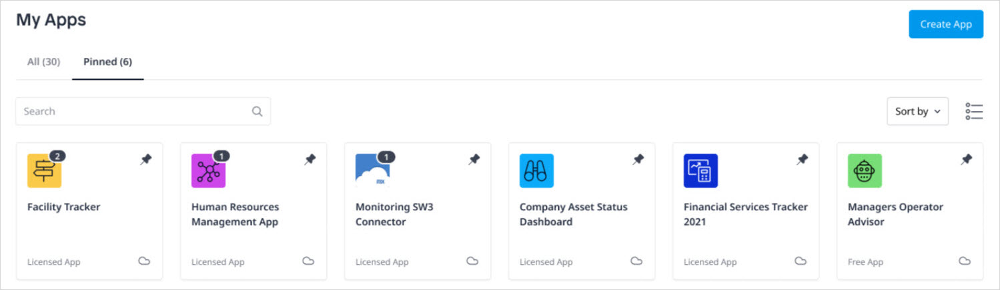
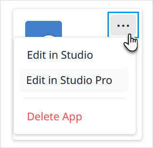
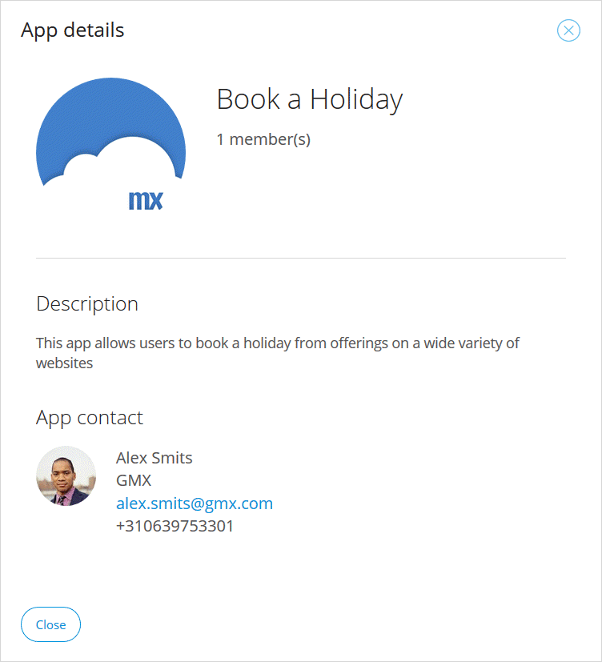

## 1 Introduction

The **My Apps** page shows you a summary of your apps:

**All** displays all the apps for which you are an [Team](/developerportal/collaborate/team) member. Any apps you pin with the pin icon will appear in the **Pinned** tab. 

## 2 Viewing Apps

Click an app tile to see the app [Buzz](/developerportal/collaborate/buzz).

### 2.1 Sorting the View {#view}

Using the drop-down menu, you can choose to sort the apps in the following ways:

* **Most Recent** first
* Alphabetical order of **App Name**

### 2.2 Selecting Actions

By clicking the ellipsis (**…**) in the app tile, you can quickly perform a number of actions:

The actions available depend on the app selected:

* **Edit in Mendix Studio**
* **Edit in Mendix Studio Pro**
* **Delete App** – allows you to delete your app, provided you are the only team member (you will be warned of the consequences and asked for confirmation before the app is deleted)

### 2.3 Go to Environments {#environments}

To go to the [environments](/developerportal/deploy/environments) of your deployed app, click the cloud icon in the bottom-right corner of the app tile.

## 3 My Company's Apps & Buzz {#my-company-apps}

In the header, you can click links to see your **Company Apps** and **Company Buzz**:

On the **My Company's Apps** page, you will see all the apps created by members of your [company](/developerportal/control-center/index#company).

You can also sort the order of the apps here.

If you click an app for which you are a team member, you will be taken to the app [Buzz](/developerportal/collaborate/buzz).

If you click an app for which you are not an team member, you will see the app details:

{}

{}

For details on **Company Buzz**, see the [Company Buzz](/developerportal/collaborate/buzz#company-buzz) section of *Buzz*.
