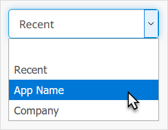
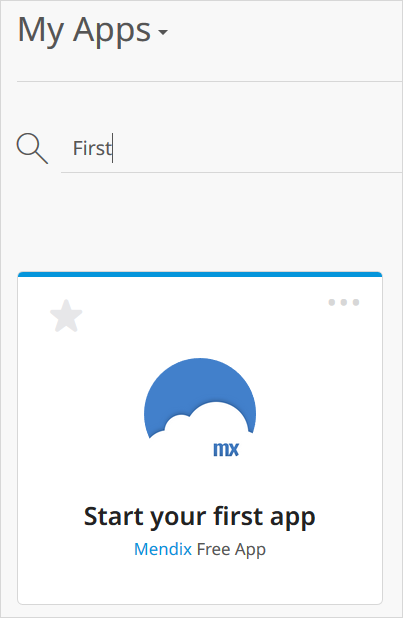
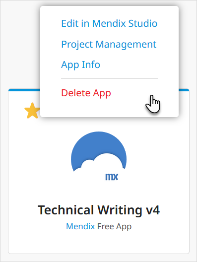

## 1 Introduction

The **Apps** menu item shows you a summary of your apps and, additionally, allows you to see all the apps for your company and all the licensed nodes to which you have access.

You get to the apps list by clicking **Apps** in the top menu bar of the Developer Portal:

You can choose between the following options:

The sections describe these options:

* [My Apps](#my-apps)
* [My Company's Apps](#my-company-apps)
* [Nodes](#nodes)

## 2 My Apps {#my-apps}

You will see all the apps of which you are an [App Team](../collaborate/team) member:

Click an app tile to see the app [Buzz](/developerportal/collaborate/buzz).

### 2.1 Sorting the View {#view}

Using the drop-down menu, you can choose to sort the apps in the following ways:

* Most **Recent** first
* Alphabetical order of **App Name**
* Alphabetical order of **Company**

### 2.2 Searching for an App

You can find a specific app by typing the search term by the magnifying glass icon and pressing <kbd>Enter</kbd>:

### 2.3 Selecting Actions

By clicking the ellipsis (…) in the app tile, you can quickly perform a number of actions:

The actions available depend on the app selected:

* **Edit in Mendix Studio**
* **Edit in Mendix Studio Pro** – for apps where Mendix Studio is not enabled
* **Project Management** – opens the app [Buzz](/developerportal/collaborate/buzz)
* **App Info** – opens the [general settings](/developerportal/settings/general-settings) of the app
* **Delete App** – allows you to delete your app, provided you are the only team member (you will be warned of the consequences and asked for confirmation before the app is deleted)

### 2.4 Favoriting an App {#favoriting}

To favorite an app, click the star so that it turns yellow in the top-left corner of the app's tile:

To see all your favorite apps, click the star toggle to the right of the [view drop-down menu](#view):

## 3 My Company's Apps {#my-company-apps}

On the **My Company's Apps** page, you will see all the apps created by people in your [company](/developerportal/company-app-roles/index):

{}

{}

You cannot change the sort order of your apps.

If you click an app for which you are a team member, you will be taken to the app [Buzz](/developerportal/collaborate/buzz).

If you click an app for which you are not an App Team member, you will see the app details:

{}

{}

## 4 Nodes {#nodes}

This shows a list of all the licensed Mendix Cloud nodes to which you have access:

Clicking the **Details button** will take you to the [Environments](/developerportal/deploy/environments) page for the app that is deployed to this node.
