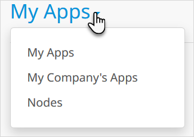
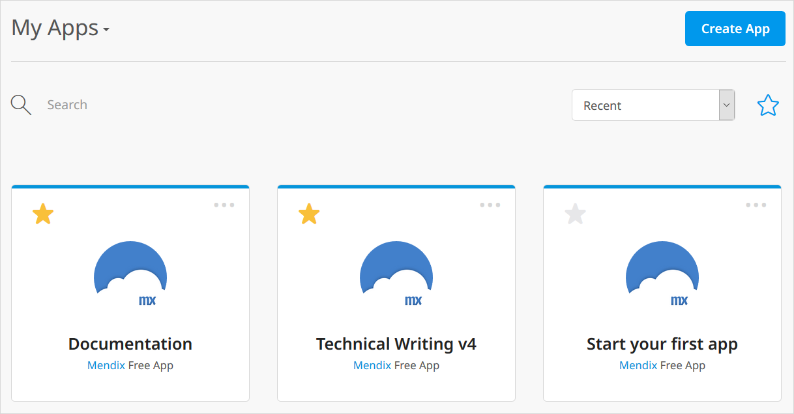

## 1 Introduction

The **Apps** menu item shows you a summary of your apps and, additionally, allows you to see all the apps for your company and all the licensed nodes to which you have access.

You get to the apps list by clicking **Apps** in the top menu bar of the Developer Portal.

You can choose between seeing your apps, your company's apps, and licensed nodes by clicking the down arrow next to the page title:

See below for a description of these lists and the options for each list.

## 2 My Apps

You will see all the apps of which you are a team member.

Click on an app to see the app [Buzz](/developerportal/collaborate/buzz).

### 2.1 Changing the View

You can either see the your apps as a list:

or as tiles:

You can swap between the two views by clicking on the appropriate icon: 

### 2.2 Sorting the View

Using the dropdown you can choose the list of apps sorted by:

* Most **Recent** first
* Alphabetical order of **App Name**
* Alphabetical order of **Company**

### 2.3 Searching for an App

You can find a specific app by typing the search term by the magnifying glass icon and pressing <kbd>Enter</kbd>.

### 2.4 Selecting Actions

By clicking the ellipsis (…) in the app tile or list, you can quickly perform a number of actions.

The actions available depend on the app selected. The actions include

* **Edit in Mendix Studio**
* **Edit in Mendix Studio Pro** – for apps where Mendix Studio is not enabled
* **Project Management** – opens the app [Buzz](/developerportal/collaborate/buzz)
* **View Production** – opens the production version of the app (this will be the sandbox version of a Free App)
* **View Acceptance** – opens the acceptance version of the app
* **App Info** – opens the [general settings](/developerportal/settings/general-settings) of the app
* **Delete App** – allows you to delete your app, provided you are the only team member (you will be warned of the consequences and asked for confirmation before the app is deleted)

## 3 My Company's Apps

You will see all the apps created by people in your [company](/developerportal/company-app-roles/index).

You can change the way the list is displayed in the same way as for the list of your own apps. However, you cannot change the sort order, and you will not see the ellipsis with the quick actions which you get for the list of your apps.

If you click an app for which you are not a team member you will see some app details.

{}

{}

If you are a team member you will be taken to the app [Buzz](/developerportal/collaborate/buzz).

### 3.1 Changing the View

As with **My Apps** you can either see the apps as a list or as tiles. You can swap between the two views by clicking on the matching icon: 

### 3.2 Searching for an App

You can find a specific app by typing the search term by the magnifying glass icon.

## 4 Nodes

This shows a list of all the licensed Mendix Cloud nodes to which you have access.

Clicking the **Details button** will take you to the [Environments](/developerportal/deploy/environments) page for the app which is deployed to this node.
