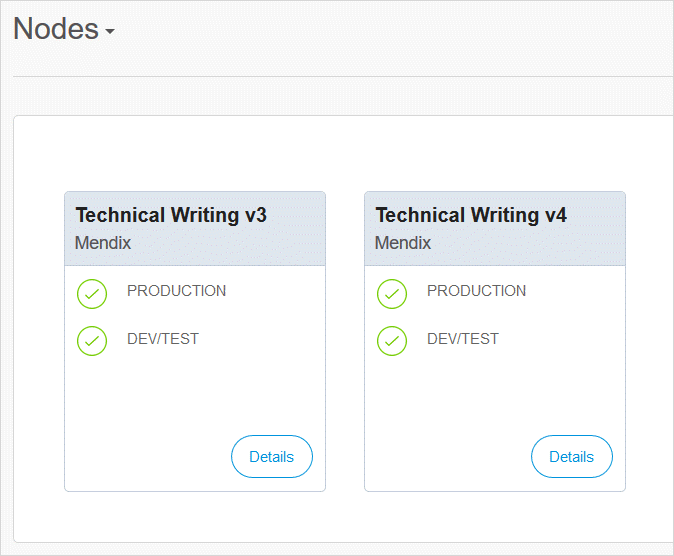

## 1 Introduction

The **Apps** menu item shows you a summary of your apps and, additionally, allows you to see all the apps for your company and all the licensed nodes to which you have access.

You get to the apps list by clicking **Apps** in the top menu bar of the Developer Portal and choosing between the following options:

The sections below describe these options:

* [My Apps](#my-apps)
* [My Company's Apps](#my-company-apps)
* [My Company's Buzz](#my-company-buzz)

For details on the **Cluster Manager** option, see [Creating a Private Cloud Cluster](/developerportal/deploy/private-cloud-cluster).

## 2 My Apps {#my-apps}

You will see all the apps of which you are an [App Team](../collaborate/team) member:

Click an app tile to see the app [Buzz](/developerportal/collaborate/buzz).

### 2.1 Sorting the View {#view}

Using the drop-down menu, you can choose to sort the apps in the following ways:

* **Most Recent** first
* Alphabetical order of **App Name**

### 2.2 Selecting Actions

By clicking the ellipsis (**…**) in the app tile, you can quickly perform a number of actions:

The actions available depend on the app selected:

* **Edit in Mendix Studio**
* **Edit in Mendix Studio Pro**
* **Delete App** – allows you to delete your app, provided you are the only team member (you will be warned of the consequences and asked for confirmation before the app is deleted)

### 2.4 Pinning an App {#pinning}

To pin an app, click the pin icon so that it turns black in the bottom-left corner of the app's tile:

To see all your pinned apps, click the **Pinned** tab at the top of My Apps page.

## 3 My Company's Apps {#my-company-apps}

On the **My Company's Apps** page, you will see all the apps created by members of your [company](/developerportal/control-center/#company):

{}

{}

You cannot change the sort order of your apps.

If you click an app for which you are a team member, you will be taken to the app [Buzz](/developerportal/collaborate/buzz).

If you click an app for which you are not an App Team member, you will see the app details:

{}

{}

## 3 My Company's Buzz {#my-company-buzz}

This shows a list of all the licensed Mendix Cloud nodes to which you have access:

Clicking the **Details button** will take you to the [Environments](/developerportal/deploy/environments) page for the app that is deployed to this node.
