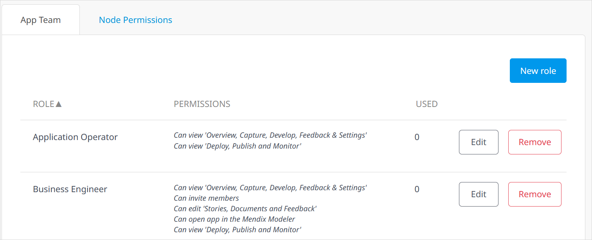
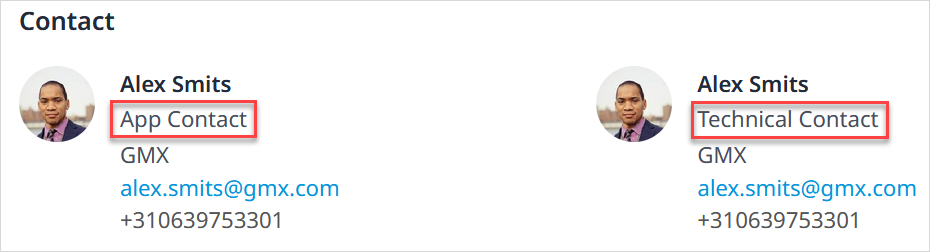
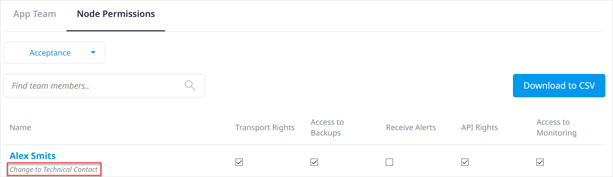

## 1 Introduction

The roles defined in Developer Portal for an [app project](/developerportal/apps-list/) and [App Team](team) are described below.

## 2 App Team Member

If you want to join an App Team, you have to ask a current App Team member (with the **Invite** permission) to send an invitation. Because App Team members are not visible to users outside that App Team, you can ask the [App Contact](../settings/general-settings) to send the invite. This means it is important the App Contact has the correct permissions to manage the app (for example, the Scrum Master role; for more information on roles and permissions, see the [App Team Roles](#app-team-roles) section below).

## 3 App Team Roles {#app-team-roles}

Within an App Team, there are six predefined roles that can be provisioned to App Team members. Each App Team role has access to permission areas based on the following factors:

* Who can edit the backlog and current [Sprint](../collaborate/stories)
* Who can edit the app model
* Who has the correct [Node Permissions](../deploy/node-permissions) for access to the node information (please note that node permissions must be provisioned by the [Technical Contact](#technical-contact))
* Who can change the app's [general settings](../settings/general-settings)

These are the predefined App Team roles:

| Role | Explanation |
| ------------ | -------------|
| Application Operator | An App Team member who does not actively develop the app, but is responsible for operations on the app's cloud node. |
| Business Engineer | An App Team member who contributes to the development of the app. |
| Guest | A user of the app who should have insight into the backlog but does not actively participate in development (for example, a stakeholder). |
| Product Owner | The product owner of the Scrum team who is responsible for managing the app's backlog.|
| Scrum Master | The Scrum Master of the Agile App Team. In addition to contributing to development, the Scrum Master manages all the settings within the app. If you create a new app, you will automatically become the Scrum Master. |

### 3.1 Editing App Team Roles {#edit-app-team-roles}

Mendix Admins can edit and create new team roles within the company in [Control Center](../control-center/index).

As a Scrum Master, you can edit roles for the specific app of which you are the Scrum Master by selecting **Team** > **Manage Team** (which will take you to the **App Team** tab of the **Settings** > **Security** page), clicking **Role settings,** then making your edits or clicking **New role** to create a custom new App Team role for that app

## 4 App Contact {#app-contact}

When you view the [General settings](../settings/general-settings) for a specific app, you will see the two roles responsible for the app: **App contact** and **Technical contact**. These are users you can contact with questions related to the app.

The App Contact is visible to regular users and is the go-to person for questions on the app. If you build your own app, you will automatically become the App Contact and you will have the **Scrum Master** [App Team role](#app-team-roles). 

### 4.1 Changing the App Contact {#change-app-contact}

To change the App Contact, you need to have a **Scrum Master** role or possess the App Team **Settings** permission.

Change the App Contact by following these steps:

1. Go to the [Developer Portal](http://home.mendix.com), click **Apps** in the top navigation panel, and select the app for which you want to change the App Contact.
2. Click **General** under the **Settings** category.
3.  Click **Edit App Info** in the top-right corner.

	{}
	{}

4. Below **App Contact**, select a new App Contact from the drop-down menu, then click **Save**. 

{}
You should provide the new App Contact with the Scrum Master role. Because the App Contact will be the contact for regular users, they will thus be able to perform app operations on behalf of all Scrum Masters.
{}

## 5 Technical Contact {#technical-contact}

The Technical Contact manages the technical deployment settings of the app. The Technical Contact can be responsible for [Mendix Cloud](../deploy/mendix-cloud-deploy) or various [deployment](../deploy) platforms. A Mendix application will always be set up and delivered with a Technical Contact assigned to it. The Technical Contact needs an MxID before Mendix can activate a license for an application.

### 5.1 Technical Contact Responsibilities

The responsibilities of a Technical Contact depend on whether you are hosting your app in the Mendix Cloud or on premises.

#### 5.1.1 Mendix Cloud

For apps in the Mendix Cloud, the Technical Contact is the first point of contact for the app. In this scenario, the Technical Contact does the following:

* Receives notifications for upcoming maintenance operations on the application
* Can configure the alert settings in the **Monitoring** tab of the cloud node
* Can receive alerts from the Mendix app when problems arise (for example, CPU load is high, running out of disk space)
* Make adjustments to environments (for example, resize and add new environments) 

As a Technical Contact, you can perform all the regular operations on the Mendix Cloud node in the [Developer Portal](http://home.mendix.com). Additionally, you can manage the access rights of your team members so that they can deploy, stop and start the app, and perform other actions. For more information, see [Node Permissions](/developerportal/deploy/node-permissions).

The Technical Contact is also responsible for managing licenses (as in, renewals, activations, and upgrades) and is the first point of contact for the Mendix Support department. Please note that Mendix is responsible for Mendix Cloud app renewals, and you can contact your Customer Success Manager (CSM) if you want to expand the license.

#### 5.1.2 On-Premises

When a Mendix app is on premises, it is running on the customer's own infrastructure. For managing licenses in this scenario, Mendix sends license renewal notifications to the Technical Contact via email. As a Technical Contact, if you want to expand the license (for example, for more users), you need to contact your Account Executive.

### 5.2 Changing the Technical Contact {#change-technical-contact}

To change the Technical Contact, you need to be a **Technical Contact**.

{}
It is currently not possible to select more than one Technical Contact in the Mendix Cloud. However, for on-premises installations, it is possible to select more than one Technical Contact. Contact [Mendix Support](https://support.mendix.com) with your request.
{}

If you are the current Technical Contact for an app, make another App Team member the Technical Contact by following these steps:

1. Go to the [Developer Portal](http://home.mendix.com), click **Apps** in the top navigation panel, and select the app for which you want to change the Technical Contact.
2. Click **Security** under the **Settings** category.
3. Select the **Node Permissions** tab.
4.  Below the name of the new Technical Contact, click **Change to Technical Contact**. The Technical Contact will be changed for all environments, and the change will be automatically saved.

	
