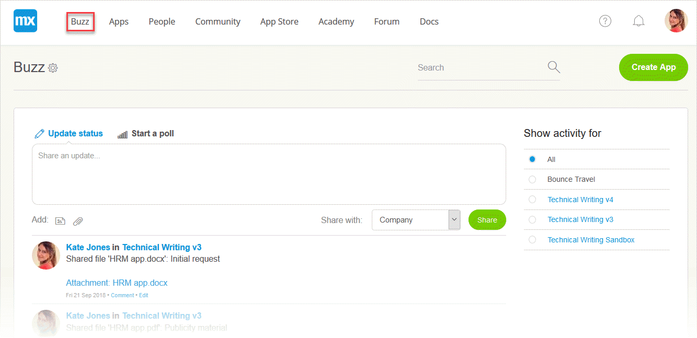
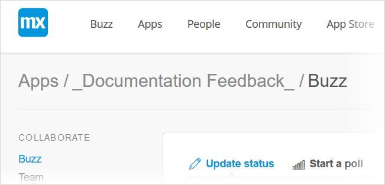

## 1 Introduction

In the **Developer Portal**, there are two types of **Buzz** pages:

*   **The company Buzz**

    

*   **The app Buzz**

    

## 2 App Buzz

The app Buzz is the landing page after you open the app in the **Developer Portal**. Here you can view the latest updates on your app.

You can find the app Buzz by following these steps: 

1. Go to the [Developer Portal](http://home.mendix.com). 
2. Click **Apps** and double-click to select an app. You will automatically be forwarded to the app Buzz page.

### 2.1 Conversations

The Buzz lets you see and share ideas as well as collaborate with your team. You can communicate with your team by the following actions:

*   Updating the status
*   Starting a poll

### 2.2 Team

On the right side of the screen, you can see your team members and invite new team members. To invite new members, click the plus sign (**+**).

When you click **Show all**, you will be forwarded to the **Team** page.

## 3 Related Content

*   [Collaborate](/developerportal/collaborate)
