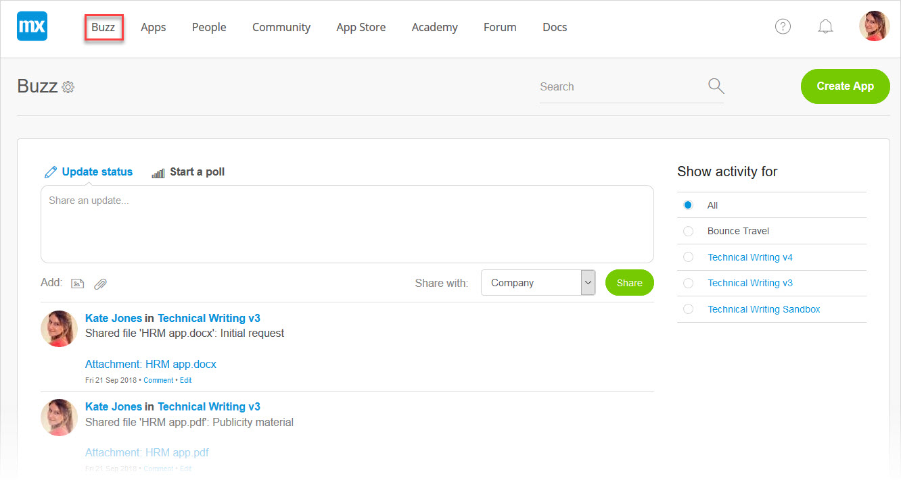
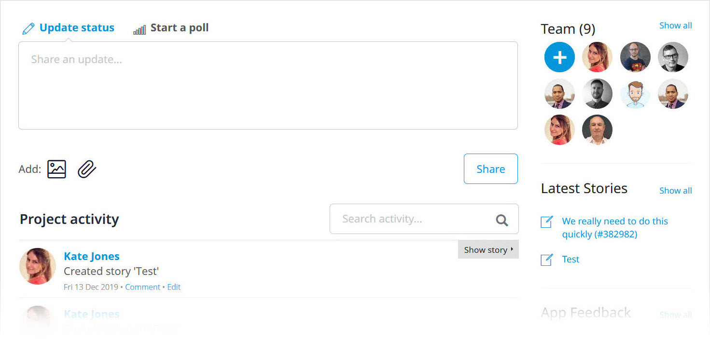
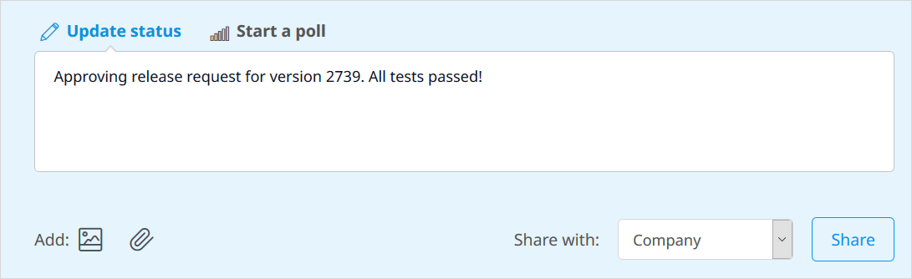
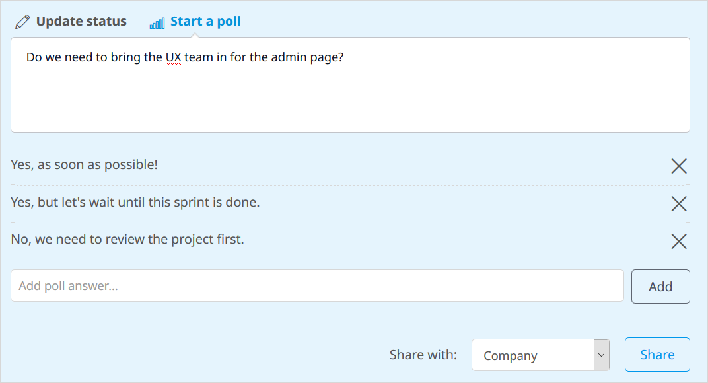

## 1 Buzz Locations

In the Developer Portal, the Buzz lets you see Mendix app activity in your company as well as collaborate and share ideas with your App Team. There are two types of **Buzz** pages:

* The company Buzz, which is the landing page when you sign in to the Developer Portal:

    

    *   You can view the Buzz activity for **All** (**Company**), or you can filter the activity you see and the comments you share in the **Show activity for** and **Share with** menus

* Buzz for a specific app, which is the landing page when you open that app project:

    

    * You also see your fellow **Team** members on the right side of the app's Buzz page
      * To invite new [App Team](team) members, click the **+** icon
      * Click **Show all** to go to the **Team** page for the app

## 2 Communicating on the Buzz

### 2.1 Updating Your Status

The easiest way to communicate with others in your company and on your team is by leaving comments in the Buzz. Click **Update status** to leave a relevant comment about an app project and participate in ongoing discussions about your Mendix apps.

You can also add attachments for support and to add to the discussion with your colleagues.

### 2.2 Starting a Poll

If you want to hear from various people in your company or on your App Team, click **Start a poll** to design and implement a quick poll on a relevant question:

In the **Add poll answer** box, you can add various answer choices. This is a great way to collaborate with and get feedback from your App Team!

## 3 Related Content

*   [App Team](team)
*   [Springs & Stories](stories)

