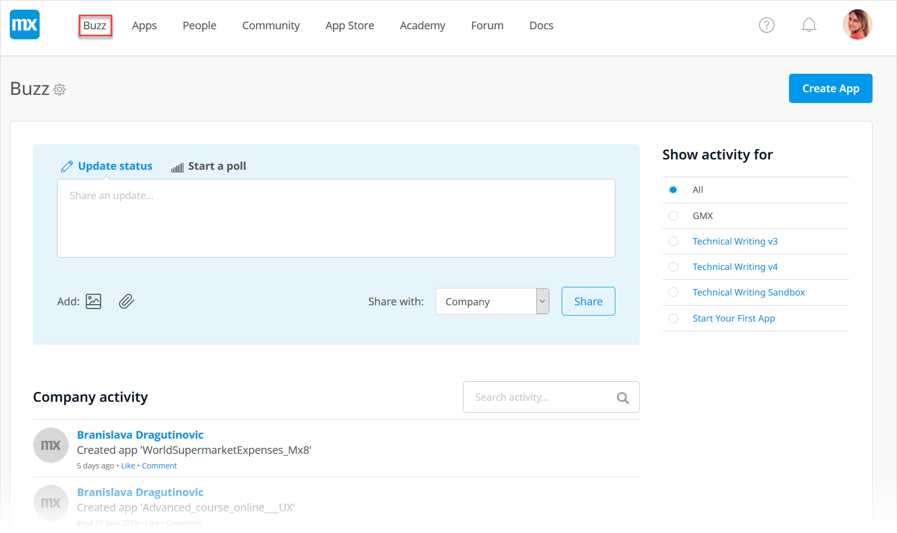
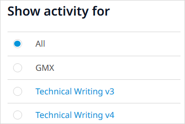
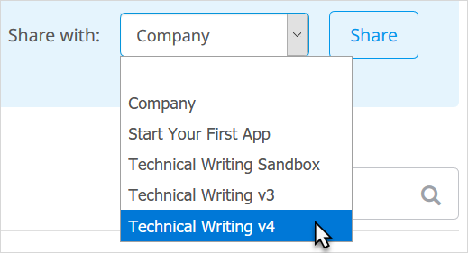

## 1 Buzz Locations

Located in the Developer Portal, Buzz lets you see Mendix app activity in your company as well as collaborate and share ideas with your App Team. There are two types of **Buzz** pages: Company Buzz and App Buzz.

### 1.1 Company Buzz

Company Buzz is the landing page when you first sign in to the Developer Portal:

Initially, you will see the Buzz activity for **All** apps for which you are a team member *plus* all Buzz activity for your company.

You can choose to see only activity for your company by selecting the company name (**Mendix** in the example above) under **Show activity for**.

Below the company name is a list of apps for which you are a team member. Clicking on the app name will take you to the [App Buzz](#app-buzz) for that app, described below.

### 1.2 App Buzz {#app-buzz}

App Buzz is Buzz for a specific app. It is the landing page when you open that app project:

You can see the size of your **Team** and your fellow App Team members on the right side of the page.

Click the **+** icon to invite new members to your App Team directly from this page.

Click **Show all** to go to the [Team](team) page for the app.

**Latest Stories** shows the last few stories created for this app project. Click **Show all** to see all the [Stories](stories).

**App Feedback** shows the last few items of feedback for this app project. Click **Show all** to see all the [Feedback](feedback).

In App Buzz, you can manage your app by clicking the options to the left of the Buzz feed. These are grouped into the following categories:

* [Collaborate](index)
* [Develop](/developerportal/develop/index)
* [Deploy](/developerportal/deploy/index)
* [Operate](/developerportal/operate/index)
* [Settings](/developerportal/settings/index)

## 2 Communicating on Buzz

By default, communication via Company Buzz can be seen by all Mendix users in the company.

You can choose to communicate with a single App Team by selecting the app from the **Share with** drop-down menu.

In App Buzz, you will only be communicating with App Team members.

### 2.1 Updating Your Status

The easiest way to communicate with others in your company and on your team is by leaving comments in Buzz. Click **Update status** to leave a new message. You can also **Add** attachments to support the discussion with your colleagues or **Edit** one of your own previous messages. You can delete your message if it is no longer valid by clicking **Edit** > **Delete**. 

To continue a conversation, you can also **Comment** on an ongoing discussion and **Like** a message to show your support.

In App Buzz, a comment can come from Mendix Studio and refer to a specific document (a page, microflow, navigation document, or the domain model). You can navigate to this document in Studio by clicking the corresponding button, such as **Show page** or **Show microflow**:

For more information on making comments in Studio, see [Buzz](/studio/collaboration-buzz).  

### 2.2 Starting a Poll

If you want to hear from various people in your company or on your App Team, click **Start a poll** to design and implement a quick poll on a relevant question:

In the **Add poll answer** box, you can add various answer choices. This is a great way to collaborate with and get feedback from your App Team!

## 3 Read More

* [App Team](team)
* [Stories](stories)
