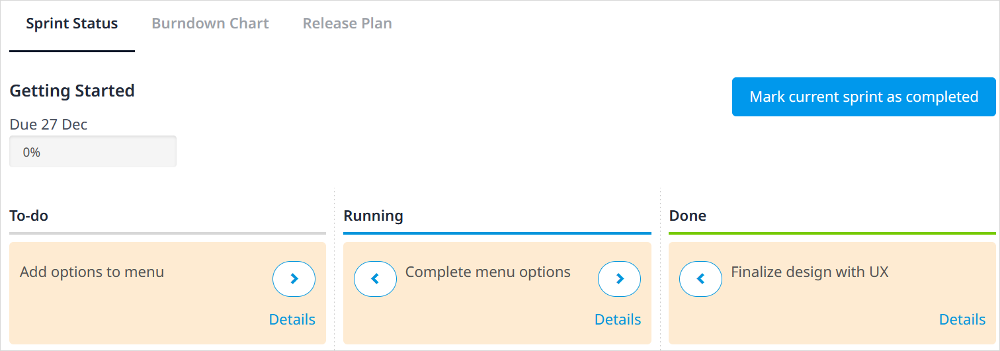

## 1 Introduction

The **Planning** page of the Developer Portal provides an overview of the progression of the [stories](/developerportal/collaborate/stories) for the app.

This page has three tabs, which are described below.

## 2 Sprint Status

On this tab, there is a Kanban overview of the [stories](/developerportal/collaborate/stories) in the current Sprint. 

There is also a percentage bar of the stories that are done and the deadline date of the current Sprint:

You can click **Mark current sprint as completed** only when all stories have the **Done** status.

When you click **Details** for a story, you will be taken to the [Story Details](/developerportal/collaborate/stories#story-details) page.

{}
All the changes made on this page are directly passed on to the **Stories** page and vice versa.
{}

## 3 Burndown Chart {#burndown}

{}
This tab will be removed on the August 31st, 2021.
{}

This tab graphically presents the progress of the current Sprint:

* **Ideal Burndown** – the expected progress if the Sprint is completed at a consistent rate
* **Remaining Effort** – the amount of story points that still have to be completed
* **New Stories** – the amount of new story points added on a specific day

Under **Sprint History**, you can view burndown charts for completed sprints.

## 4 Release Plan {#release-plan}

{}
This tab will be removed on the August 31st, 2021. Make sure that you save your data before it is removed by using the **Export to Excel** button.
{}

Under this tab, you will get an overview of all the springs.

Click **Edit** to make changes in a specific Sprint or release (for example, to change the name, date, or duration of the Sprint).

Click **Plan Something** to plan a **Sprint**, **Release**, or **Other**.

{}
All the changes made on this page are directly passed on to the **Stories** page and vice versa.
{}

## 5 Read More

* [Team Server](team-server)
