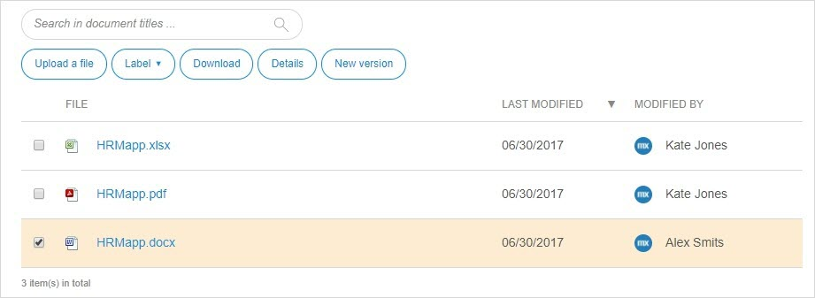

## 1 Introduction

On the **Documents** page, you can upload new files and replace them with a newer version.

All file types are allowed and are scanned for viruses by Mendix.

## 2 Actions

Above the files, you can find the following action buttons:

* Upload a file
* Select existing **Labels** or create a new label for the selected file
* **Download** the selected file
* View the **Details** of the file
* Replace the file with a **New Version**

### 2.1 File Details

In **Details**, you can see the description of the file, the comments, and all the versions of this file.

You can perform the following actions:

* Download the document
* Upload new version
* Delete the document

## 3 Related Content

* [App Buzz](/developerportal/collaborate/appbuzz)
* [Collaborate](/developerportal/collaborate)
* [Feedback](/developerportal/collaborate/feedback)
* [Team](/developerportal/collaborate/team)
