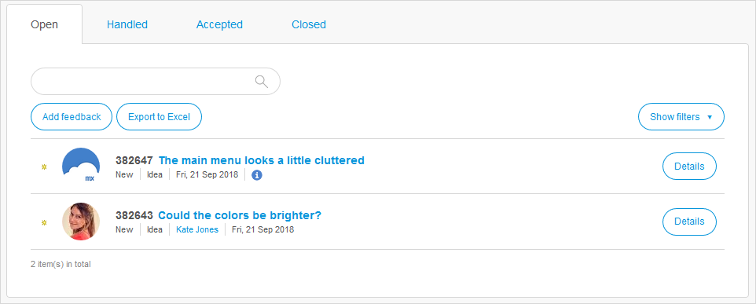
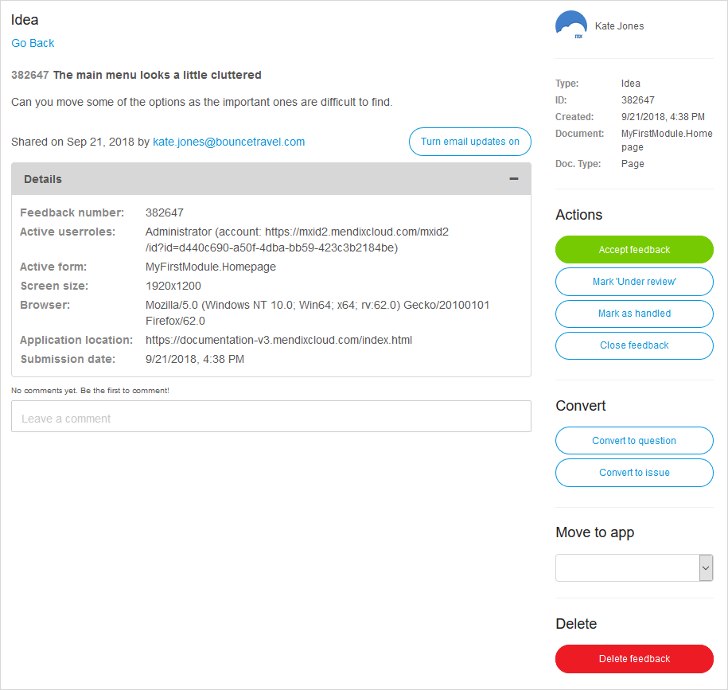

## 1 Introduction

On the **Feedback** page of the Developer Portal, you can view and manage the feedback that has been submitted about an app.

This feedback comes from different sources:

* Submitted via the [Mendix Feedback Widget](use-feedback-widget)
* Submitted via the [Mendix Feedback & Collaboration Widget](use-collaboration-widget)
* Submitted on the **Feedback** page itself (for details, see the [Actions](#actions) section below)

### 1.1 Types of Feedback {#types}

There are three types of feedback items:

| Type         | Description                                                |
| ------------ | ---------------------------------------------------------- |
| Idea     | An idea for a change or new feature.                       |
| Question | A question about the platform.                             |
| Issue    | An issue or a bug that needs to be investigated for a fix. |

### 1.2 Feedback Stages {#stages}

Feedback can go through four different stages:

| Stage        | Description                                                  |
| ------------ | ------------------------------------------------------------ |
| Open     | The feedback is awaiting a response from the App Team.       |
| Handled  | The App Team has looked into the feedback and has requested further information. |
| Accepted | The App Team has accepted the feedback and added this feedback as a story to the sprint. For more information, see [Adding a Feedback Story to Your Backlog](#adding) below. |
| Closed   | The App Team has closed the feedback.                        |

Feedback in each stage is shown in a separate tab on the **Feedback** page.

## 2 Feedback Actions {#actions}

These are the general feedback actions available on the tabs of the **Feedback** page:

* Clicking **Add feedback** will add a new feedback item to the **Open** tab of the app project
* Clicking **Export to Excel** will export the listed feedback items in an *.xls* file
	* For the export, you can filter on the **Submitted after** date, **Label**, **Status** of feedback, and **Type** of feedback
* Clicking **Show filters** allows you to filter on the types of feedback being listed: **Ideas**, **Questions**, and/or **Issues**

## 3 Feedback Details

Clicking on the title of a feedback item or on **Details** opens the item's details page:

You can perform various actions for reviewing and processing a feedback item on this page, which are described below.

### 3.1 Reviewing a Feedback Item

To review the feedback and start any necessary investigation, you can read the description and then click **Details** for technical details about the feedback item:

On the item's details page, you can also **Turn email updates on/off**. This is useful for when you comment on a feedback item and perform further [processing](#processing) actions on it.

In the **Leave a comment** box, you can post a comment and start an exchange with the Mendix community member who submitted the feedback. This is a good place to ask for clarification. You can also attach files to your comment.

### 3.2 Processing a Feedback Item {#processing}

To process the feedback, you can select one of the following in the **Actions** menu:

| Action                  | Description                                                  |
| ----------------------- | ------------------------------------------------------------ |
| Accept feedback    | Signifies the feedback is valid and that you want to add a story to your backlog on the basis of the feedback item. For more details, see [Adding a Feedback Story to Your Backlog](#adding) below). |
| Mark 'Under review' | Notifies the user who submitted the feedback as well as your team that the item is under review. |
| Mark as handled    | Changes the status of the item from Open to Handled so that the item will not pollute your open items list. For more information, see the  [Feedback Stages](#stages) section. |
| Close feedback      | Closes the feedback item. You can close a feedback item when, for example, you can solve and implement it yourself, or when a duplicate has already been accepted. |

You can also change the feedback item's type by clicking **Convert to idea** or **Convert to question**. For more information, see the [Types of Feedback](#types) section.

Finally, you can click **Delete feedback** to delete the item. This action will remove all the associated messages as well. Note that this action cannot be undone.

### 3.3 Adding a Feedback Item to Your Backlog {#adding}

After clicking **Accept feedback**, you can create a story on the basis of the feedback item and add it to your backlog. To do that, follow these steps:

1. Enter a logical name for the story in **As story** and a description in **Story description**.
2. Decide whether the feedback item should be classified as a bug or feature in **Identify as**.
3. Select the sprint (or backlog) to which you want to add the story in **Plan for sprint**.
4. Select the label(s) (if available ) to be added to the story under **Assign labels**.

    

Once a feedback item is connected to a user story, the user who submitted the story will automatically be updated on the progress made on that story:

* Adding a story with feedback attached from your backlog to a sprint will result in a message that the item has been planned
* Completing a sprint that contains a story with feedback attached will result in a message that the item has been completed

## 4 Related Content

* [Mendix Profile](../mendix-profile/index)
* [How to Use the Mendix Feedback Widget](use-feedback-widget)
* [How to Use the Mendix Feedback & Collaboration Widget](use-collaboration-widget)
* [Stories](stories)
* [Stories](../collaborate/stories)
