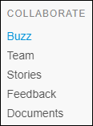

## 1 Introduction

The **Collaborate** category supports collaboration with your team and the tracking of sprints and other tasks in the app.

This category is divided into the five pages presented below.

## 2 Buzz

The **Buzz** lets you see and share ideas as well as collaborate with your team. You will get an overview of new team members, new stories and their changes, and added or completed sprints.

For more details, see [App Buzz](appbuzz).

## 3 Team

The **Team** page shows an overview of your team members. It's also the place to **Invite Members** and **Manage your team**.

Click **Name** or **Role** to filter in an ascending or descending order. The default sorting order is ascending by **Name**.

For more details, see [Team](team).

## 4 Stories

The **Stories** page lets you add, edit, and delete stories, sprints, and labels. You can also import to and export from Excel and view the history.

For more details, see [Stories](stories).

## 5 Feedback

The **Feedback** pages show an overview of the feedback provided about the app. There are two ways of submitting feedback:

1. Add feedback on the **Feedback** page in the Developer Portal.
2. Add feedback by going to the app (to go to the app, click **View App**).

{}

The **Feedback** button in the **Developer Portal** is used to provide feedback on the Mendix platform. It is intended for low priority issues, questions, and ideas on how to improve the Mendix platform.

{}

For more details, see [Feedback](feedback) and [How to Provide Feedback on Mendix](../howto/feedback-mendix).

## 6 Documents

The **Documents** pages lets you upload files related to the app. It is possible to replace a current file with a newer version, add labels, comment, and download files.

For more details, see [Documents](documents).
