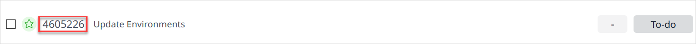
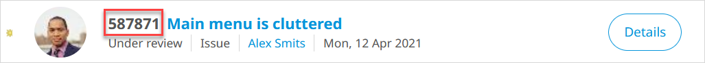

## 1 Introduction

To go directly to the desired element of your app in the Developer Portal, you can use deep links.

**This how-to will teach you how to do the following:**

* Find the App ID, Story ID, and Feedback Item Number for your app
* Create deep links for your app, story, and feedback item

## 2 Getting the AppID, storyID & feedbackItemNr {#id}

To create a deep link, you need the app ID, story ID, or feedback item number or the desired element in the Developer Portal:

*  For the app ID, select **Collaborate** > **General Settings** – you will find the ID at the bottom of the page:

	

*  For the story ID, select **Collaborate** > **Stories** – the ID is next to the story title:

	

*  For the feedback item number, select **Collaborate** > **Feedback** – the number is next to the feedback item title:

	

## 3 Creating a Developer Portal Deep Link

If you want to provide links directly to a specific element in your app in the Developer Portal, follow these steps:

1. Paste the URL to the Developer in your browser's address bar (as in, `https://sprintr.home.mendix.com/` or `https://cloud.home.mendix.com/`).
2. Paste the desired App ID, Environment ID, Story ID, or Feedback Item Number after the final slash.

The following deep links can be used:

* Specific app: `https://sprintr.home.mendix.com/link/project/<appID>`
* Stories overview for app: `https://sprintr.home.mendix.com/link/capture/<appID>`
* Specific story ID: `https://sprintr.home.mendix.com/link/story/<storyID>`
* Feedback for app: `https://sprintr.home.mendix.com/link/feedback/<appID>`
* Specific feedback item: `https://sprintr.home.mendix.com/link/showfeedback/<feedbackItemNr>`
* Environments for app: `https://cloud.home.mendix.com/link/deploy/<appID>`
* Metrics for app: `https://cloud.home.mendix.com/link/metrics/<appID>`
* Alerts for app: `https://cloud.home.mendix.com/link/monitor/<appID>`
* Alerts for environment: `https://cloud.home.mendix.com/link/monitor/<appID>/<envID>`
* Logs for app: `https://cloud.home.mendix.com/link/logs/<appID>`

## 4 Read More

* [How to Manage General App Settings](general-settings)
