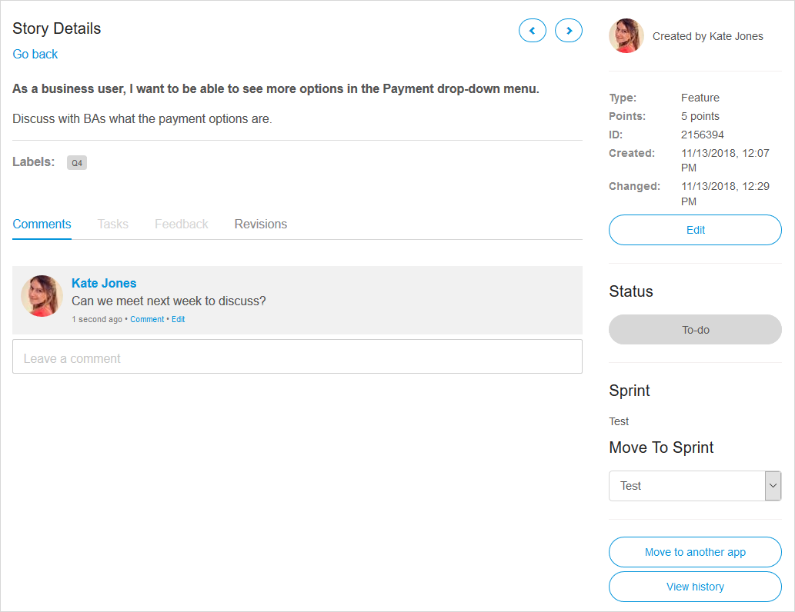

## 1 Introduction

In **Stories**, you are able to manage Sprints, stories, and labels. These components are often used in an Agile development environment, in which teams work in short development cycles (Sprints) of 2–4 weeks.

By adding your Sprints to Mendix, you will have a clear overview of your tasks and can easily view the status of your development. You can create, refine, and prioritize user stories collaboratively using the stories' conversation threads. User stories can be estimated and organized into Sprints which can be monitored using Scrum boards and burndown charts.

{}

You can also manage the progress of tasks and Sprints from within Mendix Studio Pro.

{}

## 2 Actions

You can perform the actions described below via the buttons on your app project's *Stories* page.

### 2.1 Creating a New Story {#new-story}

Every Sprint contains a number of stories that describe specific functionality to be implemented, built, or fixed. The size of each story can be indicated by allocating it a number of Story points.

To add a new story, click **New story** and fill in some details, including what your story is about and what type of story it is. The **Labels** you add in the new story can be reused in other stories (see [Label](#label) for more details).

### 2.2 Creating a New Sprint {#sprint}

To add a new Sprint, click **New sprint** and fill in some details, including the name of the Sprint or release and where it should be located in the structure of your **Stories** page.

### 2.3 Moving a Story {#moving}

To move a story, select the story, click **Move to**, then select the Sprint where the story should be moved:

### 2.4 Using Labels {#label}

To add a label to a story or create a new label, use the options under **Label**:

You can also perform various actions to [manage labels](#manage-labels).

## 3 More Actions

Via the **More** button, you can perform the actions described below.

### 3.1 Delete Selection

Click **Delete selection** to delete the selected story:

### 3.2 Complete Current Sprint

Click **Complete current sprint** to complete a Sprint. Note that all stories have to be marked **Done** before you are able to complete a Sprint.

You will receive this confirmation message, so make sure you are able to confirm completion!

### 3.3 Import / Export

Click **Import / Export** to import stories from or export stories to Excel:

In Mendix, it is always possible to export data from your app project. If you select **Export a single sprint to Excel**, you can edit the Sprint and then import it back to save the changes.

If you select **Updates stories from Excel**, you can use an an Excel sheet from a previous export as a template for the import. The Developer Portal recognizes items by using the **ID** column. The imported content will appear as stories for your app project.

When editing stories in Excel, follow these guidelines:
* To add a new story or task, simply add a new line on the correct position and type in the item's name
* To reorder an item, adjust the depth by adding or removing the plus signs (make sure they stay in the correct order where every item is the same or 1 position lower than the item above it)
* To remove an item, replace its depth with a single minus sign (make sure  that any tasks connected to it are either moved or are also removed)

### 3.4 Manage Labels {#manage-labels}

Click **Manage labels** to open a page where you can list and manage your labels:

| Button | Description |
| --- | --- |
| New Label | allows you to create a new label and allows you to assign a color to it. You can also create a new label by typing a new label name when you are creating a story. |
| Configure Label | allows you to change the name and/or color of an existing label. |
| Merge Label | allows you to merge the selected label into another label. All stories which have the selected label are labeled with the other label and the selected label is deleted. |
| Remove Label | allows you to remove the selected label from any stories to which it has been applied. The label is then deleted. |

### 3.5 Manage Story Template

Click **Manage story template** to create and edit the default tasks that you can add as tasks to every new story for your app project:

To enable these default tasks, select the **Add default tasks based on story template** check box when creating a [new story](#new-story).

{}
Only team members with sufficient rights can manage story templates.
{}

### 3.6 History {#history}

Click **History** to view the history of collaboration actions for the app.

On this page you can:

* Click **Show item** to see details of a story
* Click **Revert change** to revert changes

## 4 Managing Stories

There are various actions you can perform when managing stories. These are described below.

### 4.1 Accessing Story Details {#accessing-details}

Select a story and click **Details** (below the story title) to open the **Story Details** page. 

{}

{}

On this page, you can perform a number of actions:

* View the details such as **Type** and date **Created**
* Click **Edit** to edit the **Title**, **Description**, **Story type**, **Story points**, **Status**, and **Labels** of the story as well as see the history of edits made to the story
* See the story's **Status** and click to update it (the available statuses are **To-do**, **Running**, and **Done**)
* View the **Sprint** that contains the story as well as move the story via **Move to Sprint** (for details, see the [Moving Stories](#moving-stories) section below)
* Click **Move to another app** to move the story to a different app's backlog
* Click **View history** to view the history of changes to the story (for more information, see the [History](#history) section above)

Also on this page, you can access the following tabs:

* **Comments** – on this tab, you can view and add comments about the story to collaborate with your App Team
* **Tasks** – you can see the tasks that were added to the story here (for more information, see the [Adding Tasks to a Story](#adding) section below)
* **Feedback** – here you can see the feedback item linked to the story (for details, see the [Adding a Feedback Item to Your Backlog](feedback#adding) section of *Feedback Management*)
* **Revisions** –  on this tab, you can see the committed revision of the app project that is linked to the story (which is configured in the [Related stories](/refguide/commit-dialog#stories) tab of the **Commit** dialog box in Studio Pro)

### 4.2 Adding Tasks to a Story {#adding}

Stories of the *Feature* type can be translated into tasks that need to be completed to finish the story.

To add a task to the story, follow these steps:

1. Select the story you created and click **Add task**:

	

2.  Add a title and description for your task:

	

3. Click **Post task** to save the new task for the story.

{}
You can also add sub-tasks to tasks, which will create a nested structure of stories with tasks.
{}

After you have completed the task, check the box:

### 4.3 Moving Stories  {#moving-stories}

If you need to reorder stories or move a story to a different Sprint, there are three ways to do this:

1.  Select the story and drag it to the desired Sprint location:

	

2.  Click **Details** for the story you want to move to another Sprint, and on the **Story Details** page, select the Sprint to which you want to move the story from the **Move To Sprint** drop-down menu:

	
	
3. Select the story and use the **Move to** button to select the new Sprint (for details on this method, see the [Moving a Story](#moving) section).

{}
Moving a story will move any tasks and sub-tasks as well.
{}

### 4.4 Managing Stories in Mendix Studio Pro 

In addition to managing your sprints in the Developer Portal, you can view them in Studio Pro.

To manage stories in Studio Pro, follow these steps:

1. Open your app project in Studio Pro by clicking **Edit App** > **Edit in Mendix Studio Pro**:

	

2. Open the **Stories** pane:

	

3. You will see your active sprints in the **Stories** pane:

	

To change the status of a story in Studio Pro, just click the current status. For example, click the **To-do** **Status** to change it to **Running**:

When you return to your app project in the Developer Portal, you will see the new story status:

Changing the status of a story or updating story points automatically synchronizes the updates between the Developer Portal and Studio Pro!

## 5 Read More

* [Buzz](buzz)
* [App Team](team)
* [Feedback](feedback)
