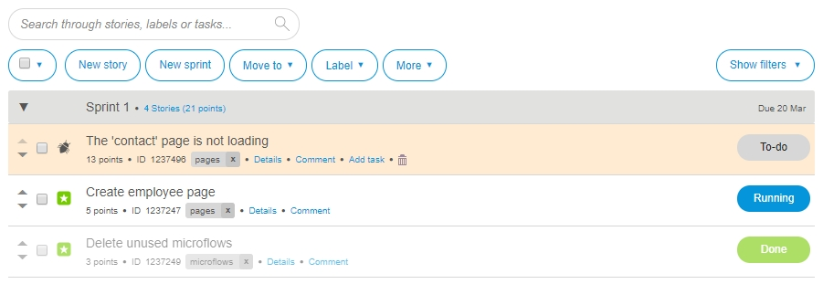

## 1 Introduction

In **Stories**, you are able to manage sprints, stories, and labels. 

For more information, see [How to Manage Sprints and Stories](/developerportal/howto/managing-your-application-requirements-with-mendix).

## 2 Actions

Above the stories, you can find the following action buttons:

* **New story** – add a new story
* **New sprint** – add a new sprint
* **Move to** – move the selected story to a different sprint
* **Label** – use existing labels or create a new label for the selected story
* **More**
   * **Delete selection** – delete the selected story
   * **Complete current sprint** – complete the current sprint; all stories have to be **Done** before completing the current sprint 
   * **Import / Export** – import/export to Excel
   * **Manage labels** – rename, merge, or delete a label
   * **Manage story template** – create and edit default tasks that you can add as a task to every new story
   * **History** – show the details of a story and/or revert changes

### 2.1 New Story

To create a new story , you must first select the correct **Sprint** and provide the following information:

* The title of the story
* **Story type**
    * **Feature**
    * **Bug**
* The number of **Story points**
* Add **Labels** or use existing labels
* A **Description** of the story
* **Add default tasks based on story template** (if necessary)
  * The default tasks created in the **Story template** will automatically appear as sub-tasks in this story

### 2.2 New Sprint

In this section, you are able to plan the following:

* **Sprint**
    * **Name**
    * The order of the sprint
    * The **Duration** of the sprint
    * The start date of the sprint
* **Release**
    * **Name**
    * **Date**
    * **Description**
* **Other**
    * **Name**
    * **Date**
    * **Description**
    * **Who is responsible?**

### 2.3 Import / Export to Excel

The export options are the following:

* **Export all stories to Excel (including completed sprints)**
* **Export all stories to Excel**
* **Export single sprint to Excel**
* **Update stories from Excel**

## 3 Filter

It is possible to filter on the following:

* **Sprints**
    * **Archived**
    * **Current**
    * **Upcoming**
    * **Backlog**
* **Story**
    * **Done**
    * **Feature**
    * **Bug**

## 4 Related Content

* [Feedback](/developerportal/collaborate/feedback)
* [How to Manage Sprints and Stories](/developerportal/howto/managing-your-application-requirements-with-mendix)
