## 1 Introduction

In **Stories**, you are able to manage Sprints, stories, and labels for your app. These components are often used in an Agile development environment, in which teams work in short development cycles (Sprints) of 2–4 weeks.

By adding your Sprints to Mendix, you will have a clear overview of your tasks and can easily view the status of the development of your app. You can create, refine, and prioritize user stories collaboratively using the stories' conversation threads. User stories can be estimated and organized into Sprints which can be monitored using Scrum boards and burndown charts.

{}
You can also manage the progress of tasks and Sprints from within Mendix Studio Pro via the [Stories pane](/refguide/stories-pane).
{}

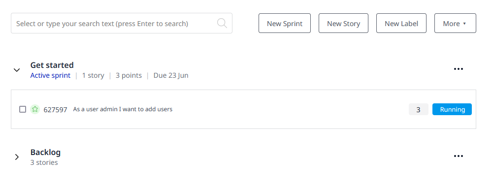

This page has four tabs, which are described below.

## 2 Overview

The sections below describe the main actions to be performed on the **Overview** tab.

### 2.1 Creating a New Sprint {#new-sprint}

Click **New Sprint** to open the **Edit Sprint** dialog box:

{}
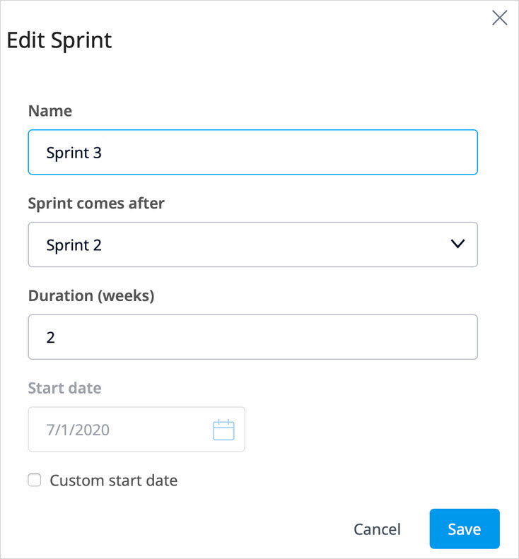
{}

Fill in the following details:

* **Name** – the name of the Sprint
* **Sprint comes after** –  where the Sprint should be located in the structure of your **Stories** page
* **Duration (in weeks)** –  how many weeks the Sprint should last
* **Start date** – the start date of the Sprint; this will be set automatically for right after the previous Sprint ends, unless the **Custom start date** box is checked and a start date is entered manually.

For more information on Sprints, see the [Sprint Actions](#sprint-actions) section below.

### 2.2 Creating a New Story {#new-story}

Each Sprint contains a number of stories that describe the specific functionality to be implemented, built, or fixed. Click **New Story** to open the **New Story** dialog box:

{}
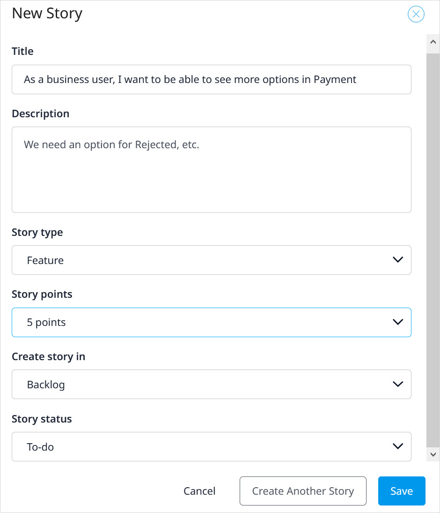
{}

Fill in the following details:

* **Title** – the title of the story
* **Description** – a description of the story
* **Story type** – select whether the story describes a **Feature** or **Bug**
* **Create story in** – the Sprint in which the story should be started; the default is **Backlog**
* **Story status** – select **To-do** (default), **Running**, or **Done**
* **Assignee** – select a team member you wish to assign to this story
* **Story points** – the size of the story

You can also create a story via the [New Story](#new-story) button for Sprint or from within a new Sprint by clicking **Add a new story**:

{}

{}

For more information on stories, see the [Story Actions](#story-actions) section below.

### 2.3 Creating a New Label {#new-label}

Click **New Label** to create a new label for your app:

{}
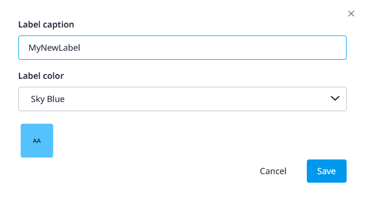
{}

* **Label caption** – the caption of the label
* **Label color** – select a color from the drop-down list for easy visibility (the small square below the drop-down list shows how the color looks)

### 2.4 More Actions {#more}

Click **More** to access the following options:

* **Import / Export** – opens the **Import / Export** page; for details, see the [Importing & Exporting to Excel](#import-export) section below
* **Manage Labels** – opens a page where you can manage labels at the app level; for details, see the [Managing Labels](#managing-labels) section below
* **Completed Sprints** – opens a page where completed Sprints are archived; for details, see the [Completed Sprints](#completed-sprints) section below
* **History** – opens the **Project History** page; for details, see the [History](#history) section below
* **Switch To Old UI** – opens the old Stories UI

#### 2.4.1 Importing & Exporting to Excel {#import-export}

After you click **Import / Export**, you will be asked what you want to do:

{}
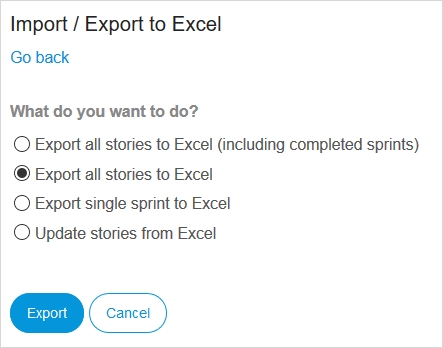
{}

In Mendix, you can export stories from your app at any time. If you select **Export single sprint to Excel**, you can select just the stories in one Sprint and export these to Excel to work on.

You can also **Export all stories to Excel** and even **Export all stories to Excel (including completed sprints)**.

If you select **Updates stories from Excel**, you can use an an Excel sheet from a previous export as a template for the import. The Developer Portal recognizes existing items by using the **ID** column. The imported content will become stories for your app.

When editing stories in Excel, follow these guidelines:

* To add a new story or task,  add a new line on the correct position and enter the item's name
* To reorder an item, adjust the depth by adding or removing the plus signs (make sure they stay consistent with every item being the same or one level deeper than the item above it)
* To remove an item, replace its depth with a single minus sign (make sure that any tasks associated with it are either moved or are also removed)

#### 2.4.2 Managing Labels {#managing-labels}

The **Manage Labels** page is where you can add or remove your labels:

{}
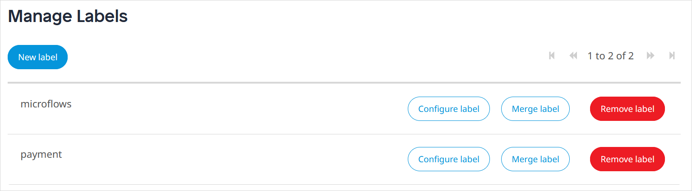
{}

The following buttons are available:

* **New Label** – enables creating a new label and allows you to assign a color to it; you can also create a new label by typing a new label name when you are creating a story
* **Configure Label** – enables changing the name and/or color of an existing label
* **Merge Label** – enables merging the selected label into another label; all stories which have the selected label are labeled with the other label and the selected label is deleted
* **Remove Label** – enables removing the selected label from any stories to which it has been applied; the label is then deleted

#### 2.4.3 Completed Sprints {#completed-sprints}

The **Completed Sprints** page presents an overview of Sprints that have been completed and archived:

{}
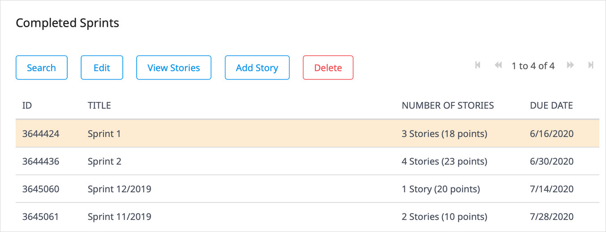
{}

The following buttons are available:

* **Search** – enables searching Sprints based on their ID or title
* **View** – shows the full details of the archived Sprint
* **View Stories** – enables viewing the stories of the selected Sprint
* **Add Story** – enables adding a story to the selected Sprint
* **Delete** – enables deleting the selected Sprint and its stories

#### 2.4.4 History {#history}

The **Project History** page presents the collaboration actions for the app. On this page, you can see what change was made, who performed it, and when it occurred:

{}
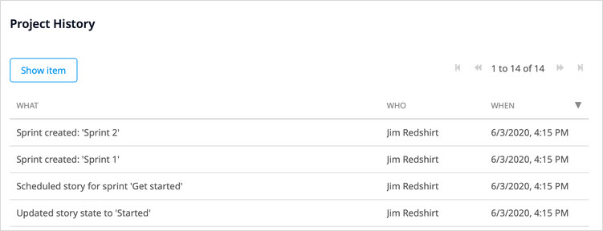
{}

When you select a history item and click **Show item**, the details of the story, Sprint, or [feedback item](feedback) will be presented.

### 2.5 Sprint Actions {#sprint-actions}

For each Sprint, the following options are provided via the menu button on the right:

{}
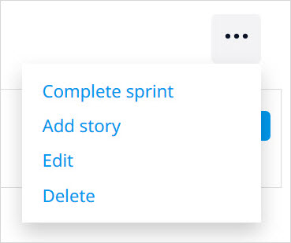
{}

* **Complete Sprint** (only available for the Sprint identified as an **Active Sprint**) – enables completing the Sprint, which will move it to the [Completed Sprints](#completed-sprints) page
* **Add Story** – enables [creating a new story](#new-story) 
* **Edit** – opens the [Edit Sprint](#new-sprint) dialog box
* **Delete** – delete the Sprint

### 2.6  Story Actions {#story-actions}

When you select a story, you can perform the following actions:

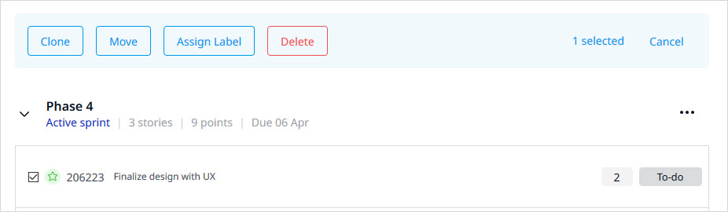

* **Clone** – enables duplicating a selected story and its tasks, story points, status, and labels into a new user story; this can enable utilizing a user story as a template
* **Move** –  enables moving a story to another Sprint
* **Assign Label** – enables assigning existing labels to a story
* **Delete** – enables deleting a story (note that if you delete a story, it is gone forever)

{}
These actions support multi-selection of stories, except for the **Clone** action.
{}

#### 2.6.1 Accessing Story Details  {#story-details}

When you click a story title, the **Story Details** page opens:

{}
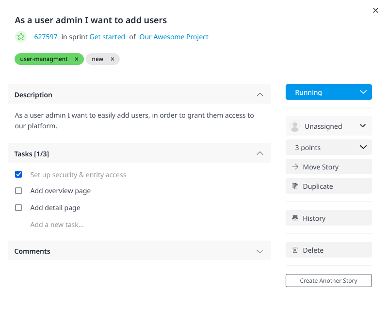
{}

On this page, you can perform a number of actions:

* Change the **Title** or **Description** by clicking it
* Add or remove **Labels**
* See the story's **Status** and click to update it (available statuses are **To-do**, **Running**, and **Done**)
* Assign a team member to work on the story
* Change the **Story points**
* View, add, and manage the **Tasks** of the story (you can mark them as **Done** by selecting the check box in front of the task)
* Leave **Comments** on the story to collaborate with your team

You can also do this following on this page:

* **Move** a story to a different app or Sprint (for details, see the [Moving Stories](#move-stories) section below)
* **Duplicate** a story and its tasks, story points, status, and labels into a new user story
* View the **Feedback** on which this story is based (if applicable; for details, see the [Adding a Feedback Item to Your Backlog](feedback#adding) section of *Feedback Management*)
* View the committed **Revisions** linked to the story (which are configured in the [Related stories](/refguide/commit-dialog#stories) tab of the **Commit** dialog box in Studio Pro)
* Click **History** to view the history of changes to the story
* **Delete** the story

#### 2.6.2 Moving a Story {#move-stories}

If you need to reorder stories or move a story to a different Sprint, there are three ways to do this:

* Select the story, click **Move**, and then select the new Sprint from the **Move Stories** dialog box

	{}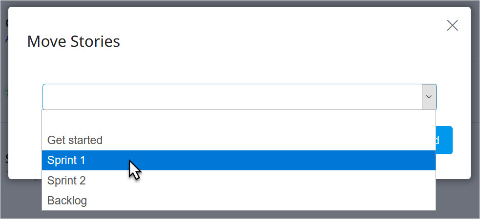
	{}

* Select the story and drag it to the desired Sprint location:

	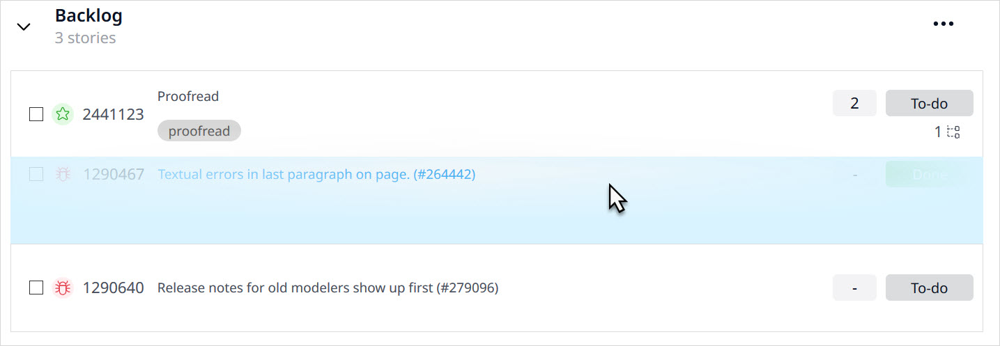

* Click the story title to open the **Story Details** page, then click **Move Story**:

	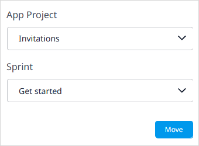

{}
Moving a story will move the tasks as well.
{}

#### 2.6.3 Adding a Task to a Story {#adding-task}

To add a task to a story, access the [Story Details](#story-details) page and under **Tasks**, start typing in the **Add a new task** box.

### 2.7 Managing Stories in Mendix Studio Pro 

In addition to managing your Sprints in the Developer Portal, you can view them in Studio Pro.

To manage stories in Studio Pro, follow these steps:

1. Open your app in Studio Pro by clicking **Edit in Studio Pro** in the top-right corner of the page.
2. Open **View** > **Stories**. You can see your active Sprints in the **Stories** pane.

    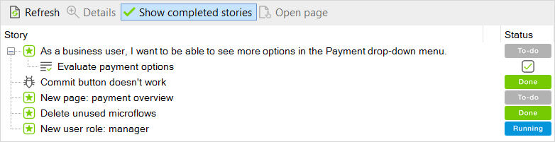

3. To change the status of a story in Studio Pro, click the current status. For example, click the **To-do** **Status** to change it to **Running**:

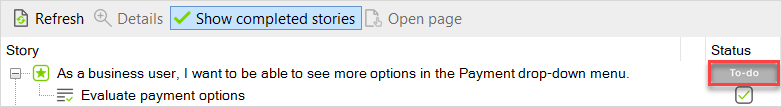

When you return to your app in the Developer Portal, you will see the new story status:

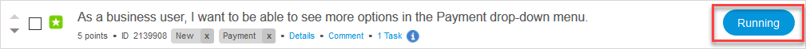

{}
Changing the status of a story or updating story points automatically synchronizes the updates between the Developer Portal and Studio Pro. For more information on how to change the status of your story, see the [Changing the Status of a Story or a Task](/refguide/stories-pane#changing-status) section in *Stories Pane*.
{}

## 3 Sprint Status

On the **Sprint Status** tab, there is a Kanban overview of the [stories](/developerportal/collaborate/stories) in the current Sprint. 

There is also a percentage bar of the stories that are done and the deadline date of the current Sprint:

You can click **Mark current sprint as completed** only when all stories have the **Done** status.

When you click **Details** for a story, you will be taken to the [Story Details](/developerportal/collaborate/stories#story-details) page.

{}
All the changes made on this page are directly passed on to the **Stories** page and vice versa.
{}

## 4 Burndown Chart {#burndown}

{}
The **Burndown Chart** tab will be removed on the August 31st, 2021.
{}

This tab graphically presents the progress of the current Sprint:

* **Ideal Burndown** – the expected progress if the Sprint is completed at a consistent rate
* **Remaining Effort** – the amount of story points that still have to be completed
* **New Stories** – the amount of new story points added on a specific day

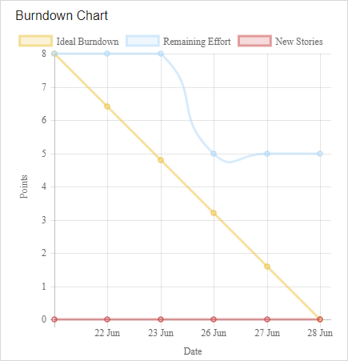

Under **Sprint History**, you can view burndown charts for completed Sprints.

## 5 Release Plan {#release-plan}

{}
The **Release Plan** tab will be removed on the August 31st, 2021. Make sure that you save your data before it is removed by using the **Export to Excel** button.
{}

On this tab, you will get an overview of all the springs.

Click **Edit** to make changes in a specific Sprint or release (for example, to change the name, date, or duration of the Sprint).

Click **Plan Something** to plan a **Sprint**, **Release**, or **Other**.

{}
All the changes made on this page are directly passed on to the **Stories** page and vice versa.
{}

## 6 Read More

* [Buzz](buzz)
* [Team](team)
* [Team Server](team-server)
* [Feedback](feedback)
