## 1 Introduction

In **Stories**, you are able to manage sprints, stories, and labels. 

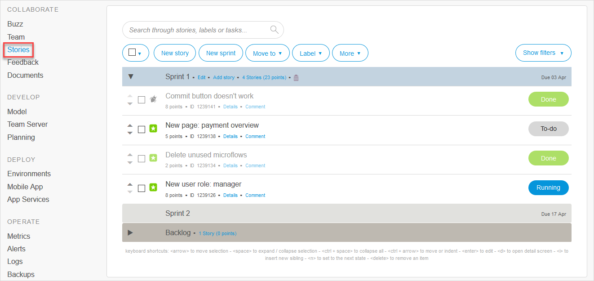

For more information, see [How to Manage Sprints and Stories](/developerportal/howto/managing-your-application-requirements-with-mendix).

## 2 Actions

You can perform the actions described below via the buttons that are available about your app project's stories.

### 2.1 New Story {#new-story}

To add a new story, you need to fill in some details, including what your story is about and what type of story it is.

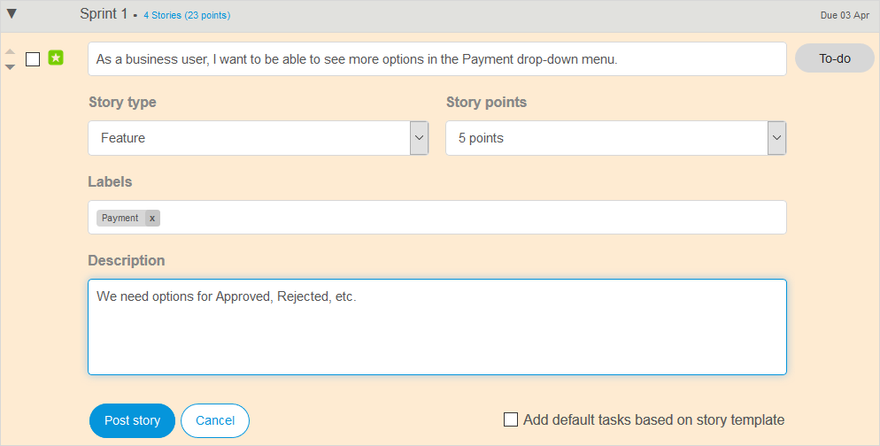

### 2.2 New sprint

To add a new sprint, you need to fill in some details, including the name of the sprint or release and where it should be located in the structure of your **Stories** page.

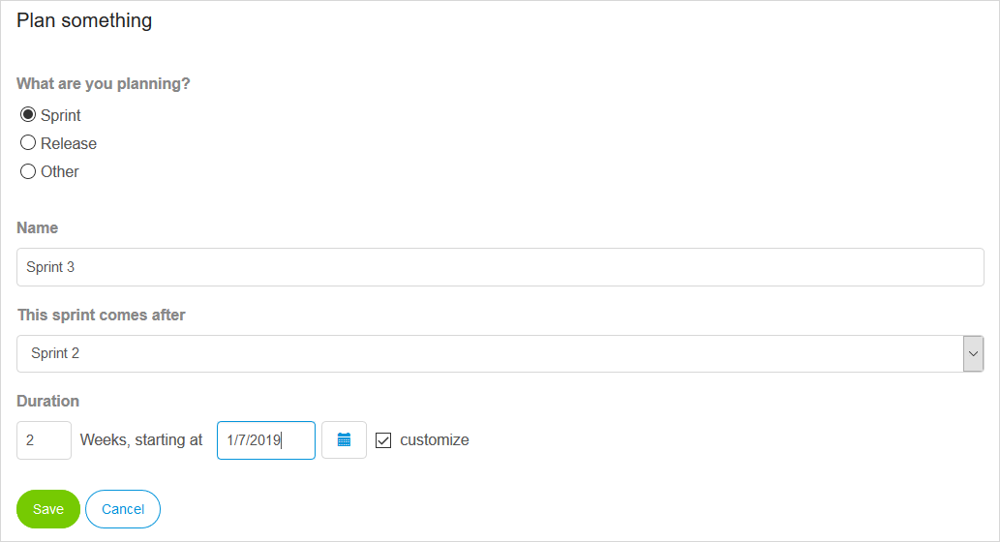

### 2.3 Move To

To move a story, select it and then click the sprint where it should be moved.

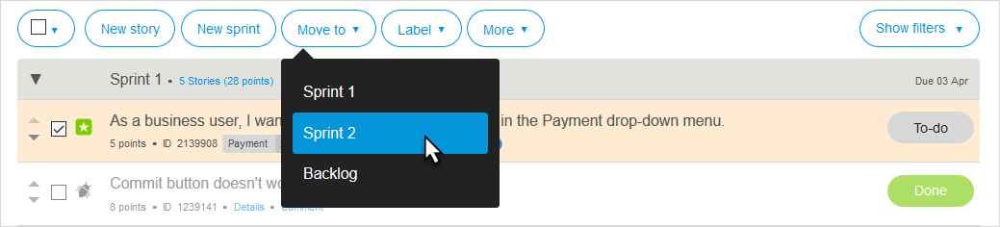

### 2.4 Label

To identify and organize stories, you can create and use labels.

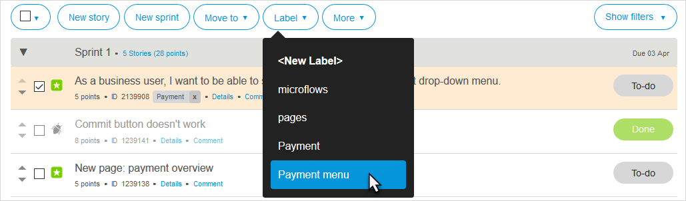

You can also perform various actions to [manage labels](#manage-labels).

## 3 More Actions

Via the **More** button, you can perform the actions described below.

### 3.1 Delete Selection

Click **Delete selection** to delete the selected story.

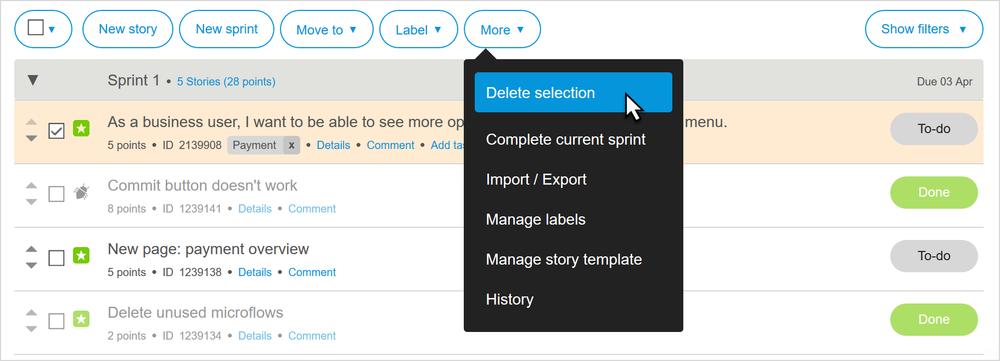

### 3.2 Complete Current Sprint

Click **Complete current sprint** to complete a sprint. Note that all stories have to be marked **Done** before you are able to complete a sprint.

You will receive this confirmation message, so make sure you are able to confirm completion!

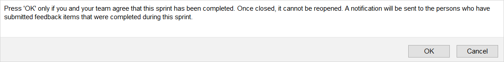

### 3.3 Import / Export

Click **Import / Export** to import stories from or export stories to Excel.

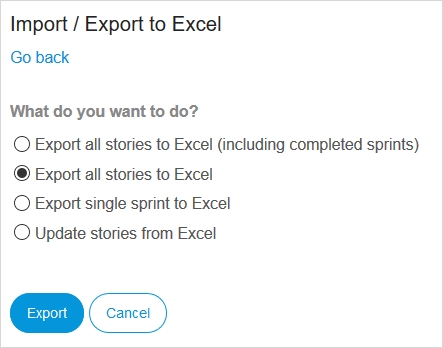

If you select **Export a single sprint to Excel**, you can edit the sprint and then import it back to save the changes.

If you select **Updates stories from Excel**, you can use an an Excel sheet from a previous export as a template for the import. The Developer Portal recognizes items by using the **ID** column.

When editing stories, follow these guidelines:
* To add a new story or task, simply add a new line on the correct position and type in the item's name
* To reorder an item, adjust the depth by adding or removing the plus signs (make sure they stay in the correct order where every item is the same or 1 position lower than the item above it)
* To remove an item, replace its depth with a single minus sign (make sure  that any tasks connected to it are either moved or are also removed)

### 3.4 Manage Labels {#manage-labels}

Click **Manage labels** to edit, merge, create, and delete labels.

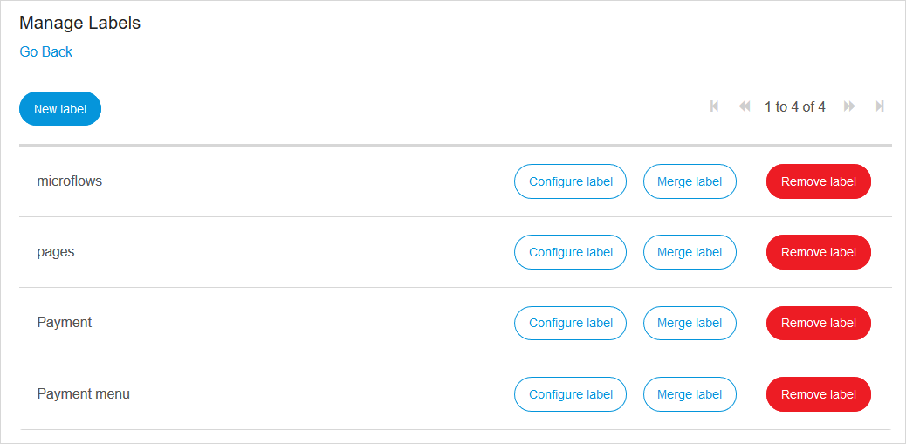

### 3.5 Manage Story Template

Click **Manage story template** to create and edit the default tasks that you can add as tasks to every new story for your app project.

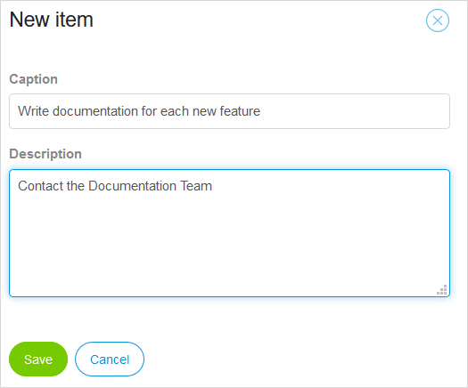

To enable these default tasks, select the **Add default tasks based on story template** check box when creating a [new story](#new-story).

### 3.6 History

Click **History** to view the history details for stories (via **Show item**) and revert changes if necessary (via **Revert change**).

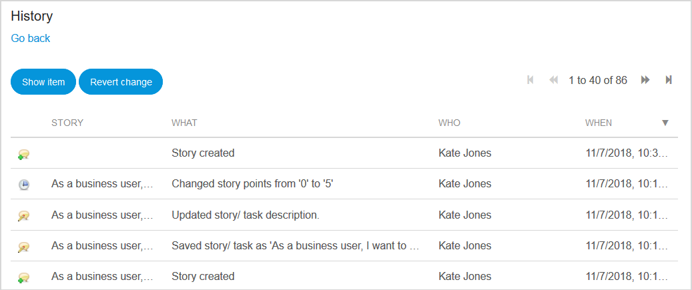

## 4 Related Content

* [How to Manage Sprints and Stories](/developerportal/howto/managing-your-application-requirements-with-mendix)
* [Feedback](/developerportal/collaborate/feedback)
