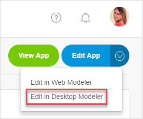

## 1 Introduction

In **Stories**, you are able to manage sprints, stories, and labels. These components are often used in an Agile development environment, in which teams work in short development cycles of 2–4 weeks. By adding your sprints to Mendix, you will have a clear overview of your tasks and can easily view the status of your development cycle. You can also manage the progress of tasks and sprints from within the Desktop Modeler.

## 2 Actions
You can perform the actions described below via the buttons that are available about your app project's stories.

### 2.1 Creating a New Story {#new-story}

Every sprint contains a number of story points that describe specific functionality to be implemented, built, or fixed.

To add a new story, click **New story** and fill in some details, including what your story is about and what type of story it is. The **Labels** you add in the new story can be reused in other stories (see [Label](#label) for more details).

### 2.2 Creating a New Sprint

To add a new sprint, click **New sprint** and fill in some details, including the name of the sprint or release and where it should be located in the structure of your **Stories** page.

### 2.3 Moving a Story {#moving}

To move a story, select the story, click **Move to**, then select the sprint where the story should be moved.

### 2.4 Label {#label}

To add a label to a story or create a new label, use the options under **Label**.

You can also perform various actions to [manage labels](#manage-labels).

## 3 More Actions

Via the **More** button, you can perform the actions described below.

### 3.1 Delete Selection

Click **Delete selection** to delete the selected story.

### 3.2 Complete Current Sprint

Click **Complete current sprint** to complete a sprint. Note that all stories have to be marked **Done** before you are able to complete a sprint.

You will receive this confirmation message, so make sure you are able to confirm completion!

### 3.3 Import / Export

Click **Import / Export** to import stories from or export stories to Excel:

With Mendix, it is always possible to export data from your app project. If you select **Export a single sprint to Excel**, you can edit the sprint and then import it back to save the changes.

If you select **Updates stories from Excel**, you can use an an Excel sheet from a previous export as a template for the import. The Developer Portal recognizes items by using the **ID** column. The imported content will appear as stories for your app project.

When editing stories, follow these guidelines:
* To add a new story or task, simply add a new line on the correct position and type in the item's name
* To reorder an item, adjust the depth by adding or removing the plus signs (make sure they stay in the correct order where every item is the same or 1 position lower than the item above it)
* To remove an item, replace its depth with a single minus sign (make sure  that any tasks connected to it are either moved or are also removed)

### 3.4 Manage Labels {#manage-labels}

Click **Manage labels** to edit, merge, create, and delete labels.

### 3.5 Manage Story Template

Click **Manage story template** to create and edit the default tasks that you can add as tasks to every new story for your app project.

To enable these default tasks, select the **Add default tasks based on story template** check box when creating a [new story](#new-story).

### 3.6 History

Click **History** to view the history details for stories (via **Show item**) and revert changes if necessary (via **Revert change**).

## 4 Managing Stories

There are various actions to perform when managing stories, which are described below.

### 4.1 Adding Tasks to a Story

Stories can be translated into tasks that need to be completed to finish the story.

To add a task to the story, follow these steps:

1. Select the story you created and click Add task:

  

2. Add a title and description for your task:

  

3. Click **Post task** to save the new task for the story.

{}
You can also add sub-tasks to tasks, which will create a nested structure of stories with tasks.
{}

After you have completed the task, check the box:

### 4.2 Moving Stories

If you need to reorder stories or move a story to a different sprint, there are three ways to do this:

*  Select the story and drag it to the desired sprint location:

	

*  Click **Details** for the story you want to move to another sprint, and on the **Story Details** page, select the sprint to which you want to move the story from the **Move To Sprint** drop-down menu:

	
	
* Select the story and use the **Move to** button to select the new sprint (for details on this method, see the [Moving a Story](#moving) section)

{}
Moving a story will move any tasks and sub-tasks as well.
{}

### 4.3 Managing Stories in the Desktop Modeler 

In addition to managing your sprints in the Developer Portal, you can view them in the Mendix Desktop Modeler.

To manage stories in the Desktop Modeler, follow these steps:

1. Open your app project in the Desktop Modeler by clicking **Edit App** > **Edit in Desktop Modeler**:

  

2. Open the **Stories** pane:

  

3. You will see your active sprints in the **Stories** pane:

  

To change the status of a story in the Desktop Modeler, just click the current status. For example, click the **To-do** **Status** to change it to **Running**:

When you return to your app project in the Developer Portal, you will see the new story status:

Changing the status of a story or updating story points automatically synchronizes the updates between the Developer Portal and the Modeler!

## 5 Related Content

* [Feedback](/developerportal/collaborate/feedback)
