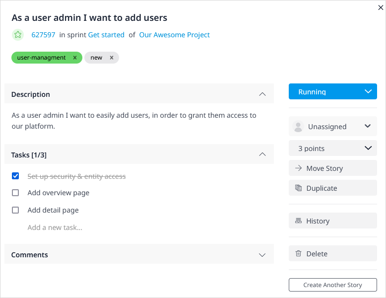
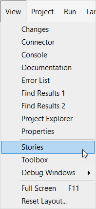

## 1 Introduction

In **Stories**, you are able to manage Sprints, stories, and labels for your app project. These components are often used in an Agile development environment, in which teams work in short development cycles (Sprints) of 2–4 weeks.

By adding your Sprints to Mendix, you will have a clear overview of your tasks and can easily view the status of the development of your app project. You can create, refine, and prioritize user stories collaboratively using the stories' conversation threads. User stories can be estimated and organized into Sprints which can be monitored using Scrum boards and burndown charts.

{}
You can also manage the progress of tasks and Sprints from within Mendix Studio Pro via the [Stories pane](/refguide/stories-pane).
{}

## 2 Main Actions

The sections below describe the main actions to be performed on the **Stories** page.

### 2.1 Creating a New Sprint {#new-sprint}

Click **New Sprint** to open the **Edit Sprint** dialog box:

{}

{}

Fill in the following details:

* **Name** – the name of the Sprint
* **Sprint comes after** –  where the Sprint should be located in the structure of your **Stories** page
* **Duration (in weeks)** –  how many weeks the Sprint should last
* **Start date** – the start date of the Sprint; this will be set automatically for right after the previous Sprint ends, unless the **Custom start date** box is checked and a start date is entered manually.

For more information on Sprints, see the [Sprint Actions](#sprint-actions) section below.

### 2.2 Creating a New Story {#new-story}

Each Sprint contains a number of stories that describe the specific functionality to be implemented, built, or fixed. Click **New Story** to open the **New Story** dialog box:

{}

{}

Fill in the following details:

* **Title** – the title of the story
* **Description** – a description of the story
* **Story type** – select whether the story describes a **Feature** or **Bug**
* **Story points** – the size of the story
* **Create story in** – the Sprint in which the story should be started; the default is **Backlog**
* **Story status** – select **To-do** (default), **Running**, or **Done**

You can also create a story via the [New Story](#new-story) button for Sprint or from within a new Sprint by clicking **Add a new story**:

{}

{}

For more information on stories, see the [Story Actions](#story-actions) section below.

### 2.3 More Actions

Click **More** to access the following options::

* **Import / Export to Excel** – opens the **Import / Export to Excel** page; for details, see the [Importing & Exporting to Excel](#import-export) section below
* **Manage Labels** – opens a page where you can manage labels at the app project level; for details, see the [Managing Labels](#managing-labels) section below
* **Completed Sprints** – opens a page where completed sprints are archived; for details, see the [Completed Sprints](#completed-sprints) section below
* **History** – opens the **Project History** page; for details, see the [History](#history) section below

#### 2.3.1 Importing & Exporting to Excel {#import-export}

After you click **Import / Export**, you will be asked what you want to do:

{}

{}

In Mendix, you can export stories from your app project at any time. If you select **Export a single sprint to Excel**, you can select just the stories in one Sprint and export these to Excel to work on.

You can also **Export all stories to Excel** and even **Export all stories to Excel (including completed sprints)**.

If you select **Updates stories from Excel**, you can use an an Excel sheet from a previous export as a template for the import. The Developer Portal recognizes existing items by using the **ID** column. The imported content will become stories for your app project.

When editing stories in Excel, follow these guidelines:

* To add a new story or task,  add a new line on the correct position and enter the item's name
* To reorder an item, adjust the depth by adding or removing the plus signs (make sure they stay consistent with every item being the same or one level deeper than the item above it)
* To remove an item, replace its depth with a single minus sign (make sure that any tasks associated with it are either moved or are also removed)

#### 2.3.2 Managing Labels {#managing-labels}

The **Manage labels** page is where you can add or remove your labels:

{}

{}

The following buttons are available:

* **New Label** – enables creating a new label and allows you to assign a color to it; you can also create a new label by typing a new label name when you are creating a story
* **Configure Label** – enables changing the name and/or color of an existing label
* **Merge Label** – enables merging the selected label into another label; all stories which have the selected label are labeled with the other label and the selected label is deleted
* **Remove Label** – enables removing the selected label from any stories to which it has been applied; the label is then deleted

#### 2.3.3 Completed Sprints {#completed-sprints}

The **Completed Sprints** page presents an overview of Sprints that have been completed and archived:

{}

{}

The following buttons are available:

* **Search** – enables searching Sprints based on their ID or title
* **Edit** – enables editing the selected Sprint
* **View Stories** – enables viewing the stories of the selected Sprint
* **Add Story** – enables adding a story to the selected Sprint
* **Delete** – enables deleting the selected Sprint and its stories

#### 2.3.4 History {#history}

The **Project History** page presents the collaboration actions for the app project. On this page, you can see what change was made, who performed it, and when it occurred:

{}

{}

When you select a history item and click **Show item**, the details of the story, Sprint, or [feedback item](feedback) will be presented.

## 3 Sprint Actions {#sprint-actions}

For each Sprint, the following options are provided via the menu button on the right:

{}

{}

* **Complete Sprint** (only available for the Sprint identified as a **Active Sprint**) – enables completing the Sprint, which will move it to the [Completed Sprints](#completed-sprints) page
* **New Story** – enables [creating a new story](#new-story) 
* **Edit** – opens the [Edit Sprint](#new-sprint) dialog box
* **Delete** – delete the Sprint

## 4 Story Actions {#story-actions}

When you select a story, you can perform the following actions:

* **Clone** – enables duplicating a selected story and its tasks, story points, status, and labels into a new user story; this can enable utilizing a user story as a template
* **Move** –  enables moving a story to another sprint
* **Assign Label** – enables assigning existing labels to a story
* **Delete** – enables deleting a story (note that if you delete a story, it is gone forever)

{}
These actions support multi-selection of stories, except for the **Clone** action.
{}

### 4.1 Accessing Story Details  {#story-details}

When you click a story title, the **Story Details** page opens:

{}

{}

On this page, you can perform a number of actions:

* Change the **Title** or **Description** by clicking it
* See the story's **Status** and click to update it (available statuses are **To-do**, **Running**, and **Done**)
* Change the **Story points**
* See, add, and manage the **Tasks** of the story (you can mark them as **Done** by checking the box in front of the task)
* Leave a **Comment** on the story to collaborate with your App Team

You can also do this following on this page:

* **Move** a story to a different app project or Sprint (for details, see the [Moving Stories](#move-stories) section below)
* **Duplicate** a story and its tasks, story points, status, and labels into a new user story
* See the **Feedback** on which this story is based (if applicable; for details, see the [Adding a Feedback Item to Your Backlog](feedback#adding) section of *Feedback Management*)
* See the committed **Revisions** linked to the story (which are configured in the [Related stories](/refguide/commit-dialog#stories) tab of the **Commit** dialog box in Studio Pro)
* Click **History** to view the history of changes to the story
* **Delete** the story

### 4.2 Moving a Story {#move-stories}

If you need to reorder stories or move a story to a different Sprint, there are three ways to do this:

* Select the story and use the **Move** button to select the new Sprint from the **Move Stories** dialog box

	{}
	{}

* Select the story and drag it to the desired Sprint location:

	

* Click the story title to open the **Story Details** page, then click **Move Story**:

	
	
{}
Moving a story will move the tasks as well.
{}

### 4.3 Adding a Task to a Story {#adding-task}

To add a task to a story, access the [story details](#story-details) page and on the **Tasks** tab, click **Add**. This will open the **Edit Task** dialog box:

{}

{}

Fill in the following details:

* **Title** – the title of the task
* **Description** – the description of the task

Once saved, the number of tasks appears under the story on the main **Stories** page:

{}

{}

Clicking the number will bring you back to the **Tasks** tab of the story details.

## 5 Managing Stories in Mendix Studio Pro 

In addition to managing your sprints in the Developer Portal, you can view them in Studio Pro.

To manage stories in Studio Pro, follow these steps:

<<<<<<< HEAD
1. Open your app project in Studio Pro by clicking **Edit in Mendix Studio Pro**:
=======
1. Open your app project in Studio Pro by clicking **Edit in Studio Pro** in the top-right corner of the page:
>>>>>>> ad-edit-app

	{}
	{}

2. Open the **Stories** pane:

	

3. You will see your active sprints in the **Stories** pane:

	

To change the status of a story in Studio Pro, click the current status. For example, click the **To-do** **Status** to change it to **Running**:

When you return to your app project in the Developer Portal, you will see the new story status:

Changing the status of a story or updating story points automatically synchronizes the updates between the Developer Portal and Studio Pro! 

For more information on how to change the status of your story, see the [Changing the Status of a Story or a Task](/refguide/stories-pane#changing-status) section in *Stories Pane*.

## 6 Old Stories UI {#old}

To switch to the old version of the UI, click **Disable new UI**: 

### 6.1 Main Actions

#### 6.1.1 Creating a New Story

To add a new story, click **New story** and fill in some details, including what your story is about and what type of story it is. The **Labels** you add in the new story can be reused in other stories (see [Using Labels](#label) for more details).

#### 6.1.2 Creating a New Sprint

To add a new Sprint, click **New sprint** and fill in some details, including the name of the Sprint or release and where it should be located in the structure of your **Stories** page.

#### 6.1.3 Moving a Story{#moving-a-story}

To move a story, select the story, click **Move to**, then select the Sprint to which the story should be moved.

#### 6.1.4 Using Labels{#label}

To add a label to a story or create a new label, use the options under **Label**. You can also perform various actions to [manage labels](#manage-labels).

### 6.2 More Actions

Using the **More** button, you can perform the actions described below.

#### 6.2.1 Complete Current Sprint

Click **Complete current sprint** to complete a Sprint. Note that all stories have to be marked **Done** before you are able to complete a Sprint. You will receive a confirmation message, so make sure you are able to confirm completion!

#### 6.2.2 Import / Export

For details, see the [Importing & Exporting to Excel](#import-export) section above.

#### 6.2.3 Manage Labels{#manage-labels}

For details, see the [Managing Labels](#managing-labels) section above.

#### 6.2.4 History

Click **History** to view the history of collaboration actions for the app. On this page, you can click the following:

* **Show related story** – presents the details of the story
* **Revert change** – reverts changes

### 6.3 Managing Stories

There are various actions you can perform when managing stories. These are described below.

#### 6.3.1 Accessing Story Details

Select a story and click **Details** (below the story title) to open the **Story Details** page. For more information, see the [Accessing Story Details](#story-details) section above.

#### 6.3.2 Adding Tasks to a Story{#adding}

Stories of the *Feature* type can be translated into tasks that need to be completed to finish the story. To add a task to the story, follow these steps:

1. Select the story you created and click **Add task**:

	

2.  Add a title and description for your task.
3. Click **Post task** to save the new task for the story.

After you have completed the task, check the box:

#### 6.3.3 Deleting a Story or Task{#deleting}

To delete a story or a task, click the trash can icon below the title of the story/task. After you confirm the deletion, the story/task will be removed from the system permanently.

If you delete a story, its tasks will be deleted as well.

If you delete a story that is linked to a feedback item, you will be asked to choose to reopen or unlink the feedback item. Reopening the feedback item will revert it to the [Open](/developerportal/collaborate/feedback#stages) status. To unlink the feedback item means it will remain in the [Accepted](/developerportal/collaborate/feedback#stages) status. Either way, the story will be deleted.

#### 6.3.4 Moving Stories

If you need to reorder stories or move a story to a different Sprint, there are three ways to do this:

*  Select the story and drag it to the desired Sprint location:

	

*  Click **Details** for the story you want to move to another Sprint, and on the **Story Details** page, select the Sprint to which you want to move the story from the **Move To Sprint** drop-down menu
* Select the story and use the **Move to** button to select the new Sprint (for details on this method, see the [Moving a Story](#moving-a-story) section)

{}
Moving a story will move the tasks as well.
{}

## 7 Read More

* [Buzz](buzz)
* [App Team](team)
* [Feedback](feedback)
