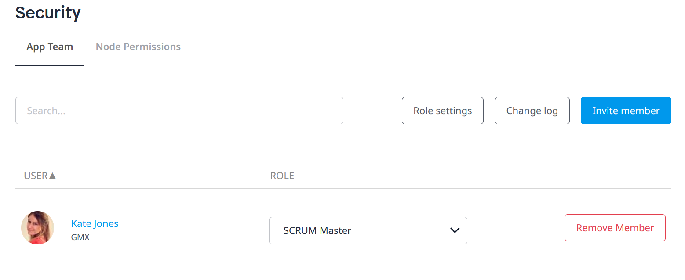

## 1 Introduction

Your team can include all of your colleagues working on an app. As well as developing, team members might have other roles such as ideating or reviewing. The Mendix Developer Portal enables developers from both IT and business with mixed experience levels to collaborate.

To view and manage your team members, follow these steps:

1. Click **Apps** in the top navigation panel of the [Developer Portal](http://sprintr.home.mendix.com) and select the app you want to manage.
2. Click **Team** under the **Collaborate** category.

## 2 Managing the Team {#managing}

When you click **Manage Team** in the top-right corner of the screen, you will be forwarded to the **Collaborate** > **Security** page. Note that only the following roles can see the **Manage Team** button: [Scrum Master](/developerportal/collaborate/app-roles#team-roles), [Mendix Admin](/developerportal/control-center), or a [custom role](/developerportal/collaborate/app-roles#team-roles) with  the **App Settings** permission.

On the  **App Team** tab of the **Security** page, you can do the following:

* Select a new **Role** for a team member (for details on available roles, see [App Roles](/developerportal/collaborate/app-roles))
* Click **Remove Member** to remove that person from the team
* Click **Invite member** to invite a new person to the team (see the [Inviting Team Members](#inviting) section below for more details)
*  Click **Role settings** to view and edit the permissions for the team roles (clicking **Security Guide** on this dialog box will present useful information for configuring roles)

	{}
	{}

* Click **Change log** to view the change log for the team and [node permissions]()

## 3 Inviting Team Members {#inviting}

To invite members, click **Invite Member** on the **Team** page, or click the **+** icon next to the team in app Buzz, and follow these steps:

1. Enter the email address(es) for those you want to invite to the team.
2. Add a personal message (optional).
3. Confirm the invitation(s).

## 4 Read More

* [App Roles](/developerportal/collaborate/app-roles)
* [Settings](/developerportal/settings)
* [Stories](stories)
