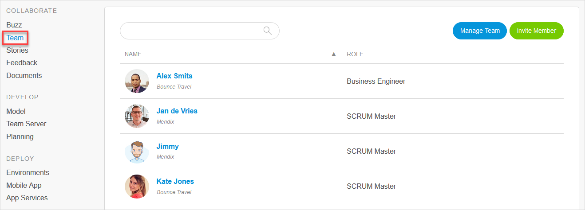

## 1 Introduction

Your App Team can include all of your colleagues working on developing an app as well as ideating for and reviewing it. Mendix enables developers from both IT and business with mixed experience levels to collaborate in the Developer Portal while building dynamic applications.

To view and manage your App Team members, follow these steps:

1. Click **Apps** in the top navigation panel of the [Developer Portal](http://home.mendix.com) and select the app you want to manage.
2. Click **Team** under the **Collaborate** category.

On the **Team** page, you will see an overview with the following information about the team members:

* **Name**
* **Role** – the developer's App Team role (for details on available roles, see the [App Team Roles](../company-app-roles/index#app-team-roles) section of *Company & App Roles*)

### 2 Managing the Team

When you click **Manage Team** in the top-right corner of the screen, you will be forwarded to the **Settings** > **Security** page. 

{}Only the following roles can see the **Manage Team** button:
* [SCRUM Master](../company-app-roles/index#app-team-roles)
* [Company Admin](../company-app-roles/#company-admin)
* A custom role with **App Settings** permission
{}

On the  **App Team** tab of the **Security** page, you can do the following:

* Select a new **Role** for a team member
* Click **Remove member** to remove that person from the App Team
* Click **Add member** to add a new person to the App Team (see the [Inviting Team Members](#inviting) section below for more details)
*  Click **Role settings** to view and edit the permissions for the App Team roles

	{}
	{}

* Click **Change log** to view the change log for the App Team

### 3 Inviting Team Members {#inviting}

To invite members, click **Invite Member** on the **Team** and follow these steps:

1. Enter the email address(es) for who you want to invite to the App Team.
2. Add a personal message (optional).
3. Confirm the invitation(s).

## 4 Related Content

* [Company & App Roles](/developerportal/company-app-roles/index)
* [How to Manage Company & App Roles](/developerportal/company-app-roles/manage-roles)
* [Company Admin Settings](/developerportal/company-app-roles/companyadmin-settings)
* [Settings](/developerportal/settings)
