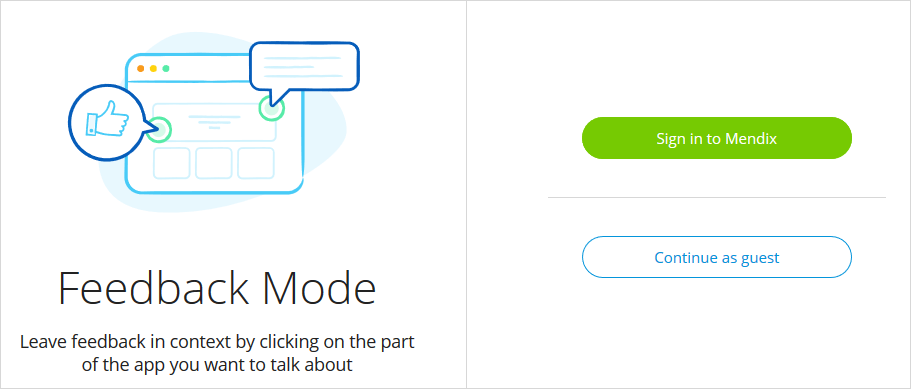
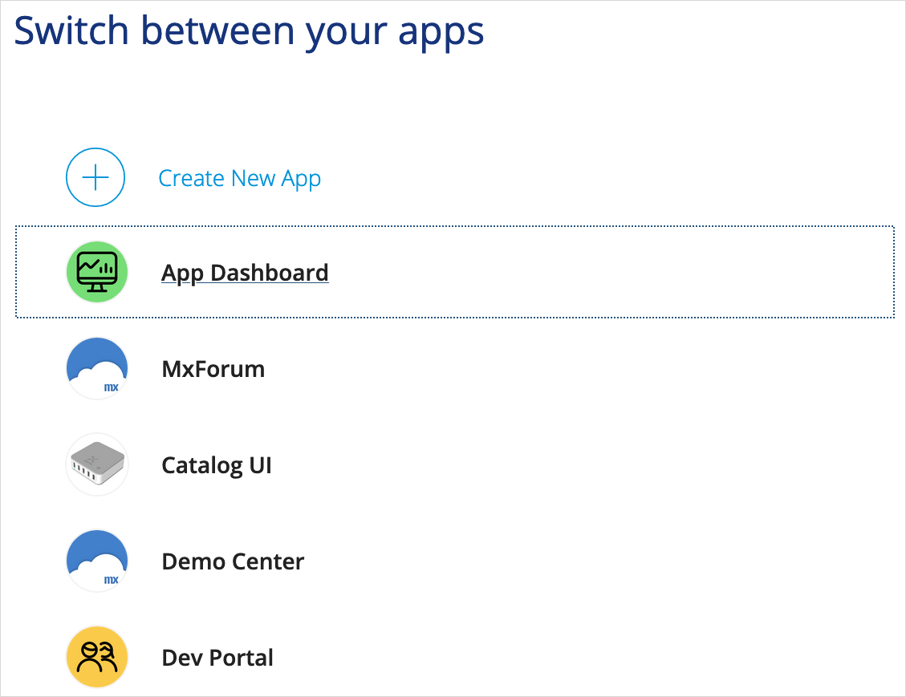
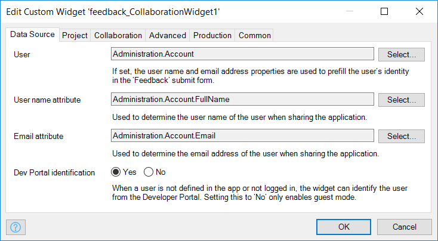

## 1 Introduction

In Mendix you can allow the end-user to provide feedback out of the box. The feedback is fully integrated with the collaboration features of the Developer Portal. You can then review and process the feedback, and convert it into [user stories](../collaborate/stories) which you can use to improve your app.

This collaboration is enabled by the [Mendix Feedback Widget](https://appstore.home.mendix.com/link/app/199/). With this widget, you can make use of the fully integrated Mendix app feedback, access the editing capabilities in Mendix Studio, check out a mobile view of the app, and easily share the app via email.

{}
This how-to covers the Mendix Feedback Widget [version 8.1.0 and above](#above) as well as [version 5.1.3 and below](#below). There are different usage and configuration steps for these different versions of the widget.

If you are trying to upgrade your Mendix Feedback Widget from version 7 to version 8, Studio Pro will not recognize the current configuration of this widget. Add the Mendix Feedback Widget into your page again and configure it accordingly. Then delete the old one.

If you encounter the following issue, you need to delete the old mpk file in folder **/widgets/FeedbackWidget.mpk**` of your project.

{}

**This how-to will teach you how to do the following:**

* Use a widget to leave feedback on an app, edit an app, get a mobile view of an app, and share an app
* Add the widget to your app project
* Configure the widget

## 2 Prerequisites

Before starting this how-to, make sure you have completed the following prerequisite:

* Create an app containing an application model with no errors

## 3 Widget Version 8.1.0 & Above {#above}

The sections below describe using and configuring the latest versions of the Mendix Feedback Widget.

### 3.1 Using the Widget

This version of the Mendix Feedback can be used in a variety of ways, which are described below.

#### 3.1.1 Submitting Feedback on an App

When you click the **Feedback** icon, the platform first checks if you are signed in. If you are already signed in, you will be in **Feedback Mode** right away. If you are not signed in, you will need to either **Sign in to Mendix** or **Continue as a guest** to enter feedback mode:

Once you are in feedback mode, you can click anywhere on the screen to leave a comment:

And voila! A screenshot of the current page is created automatically, which you can choose to attach to your feedback. After clicking **Send**, your feedback will go straight to the **Feedback** page of the app project in the Developer Portal. For more information, see [Feedback](index).

When you have left your feedback, you need to exit the feedback mode by clicking this button:

{}
For details on how to see all the feedback you have submitted, see the [Feedback](../mendix-profile/index#feedback) section of *Mendix Profile*.
{}

#### 3.1.2 Editing an App

Clicking the **Edit** icon opens the app page in Studio. If you have permissions to edit the app, you can start editing and collaborating right away!

#### 3.1.3 Viewing an App

When you click the **Mobile view**  icon, a pop-up window is displayed that enables viewing your app on a mobile device:

You can access this mobile view by installing the [Mendix Mobile app](https://play.google.com/store/apps/details?id=com.mendix.SprintrMobile) and then scanning the QR code in the pop-up window.

For more information, see [Getting the Mendix Mobile App](/refguide/getting-the-mendix-app) and [Developing Hybrid Mobile Apps](/refguide/developing-hybrid-mobile-apps).

#### 3.1.4 Sharing an App

When you click the **Share** icon on the widget, a pop-up window appears for sharing your app via **Email**:

{}
{}

You can add as many email addresses as you like and email your app to colleagues for further collaboration and feedback.

#### 3.1.5 Switching Between Apps

{}
This feature is available when the following conditions are met: 
* You are using version 8.1.0 or above of the widget 
* You have configured the widget to show the App Switcher (for details, see the [Configuring the Widget](#configuring) section below) 
* Your app uses [Mendix SSO](/developerportal/deploy/mendix-sso)
{}

When you click the **App Switcher** button, a pop-up window appears with a list of other Mendix SSO-enabled apps that you have access to:

{}
{}

After you click an app, you will be redirected to it. 

### 3.2 Adding & Configuring the Widget

You should use the latest version of the Mendix Feedback widget, as it will provide the most up-to-date features for leaving feedback and communicating with the App Team.

The sections below describe how to make sure you have the latest version of the widget installed and how to configure the widget in your app project.

#### 3.2.1 Adding the Widget to Your App Project

To ensure you have the latest version of the widget included in your app, follow these steps:

1.  Download the latest version of the [Mendix Feedback Widget](https://appstore.home.mendix.com/link/app/199/) from the App Store. You are strongly encouraged to use version 8.2.1 or above of the widget.

2.  When the widget is included in your app project, you need to ensure that it is added to the homepage of the application. Open the homepage from your app's **Project** > **Navigation**:

	

3.  If the widget has not been added automatically, add it to the desired page or layout by selecting **Add widget** > **Add-on widgets** > **Feedback & Collaboration Widget** and dropping it into a position in the page:

	

{}
You can place the widget on any form in your app project, but it needs to be placed on only one form. If the user accesses that form, the widget will remain in the browser until the session is expired. This means you only need to place the widget on the home form. You can use this mechanism to limit the feedback to certain user roles as well. To do that, just place the widget on their home forms but not on the home form of other users.
{}

#### 3.2.2 Configuring the Widget {#configuring}

All the configuration properties are explained on the various tabs of the properties dialog box for the widget:

The feedback feature requires the following properties to be set:

* **Project** tab > **App ID** – the unique identifier of your app project available in your app's [General](../settings/general-settings) settings in the Developer Portal
* **Advanced** tab > **Feedback server location** – the URL of the Developer Portal server (usually `https://sprintr.home.mendix.com`)

For the best user experience, your are strongly encouraged to apply Mendix SSO to your app and connect the [MendixSSO](/developerportal/deploy/mendix-sso) module to version 8.2.1 or above of the Mendix Feedback Widget. For version 8.1.0 or above of the widget, you need to set the following:

*  **Authentication** tab > **Decrypted Token Entity** – select the entity **DecryptedToken** from MendixSSO module
*  **Authentication** tab > **Decrypted Token Value** – after selecting **Decrypted Token Entity**, select the **Value** attribute from it
*  **Authentication** tab > **ID token provider** – select the **DS_GetCurrentIdToken** microflow from the MendixSSO module

The result should look like this:

{}
If Mendix SSO is applied and the above **Authentication** settings are configured correctly, the end-user can leave feedback without having to enter their name and email address. If your app does not have Mendix SSO, you should configure the **Data Source** properties so that the end-user's name and email address are prefilled when they leave feedback. If the **Data Source** properties are not configured, the end-user will have to manually enter their name and email address when they leave feedback.
{}

The App Switcher feature requires the [MendixSSO](/developerportal/deploy/mendix-sso) module to be implemented and the following property to be set:

* **Advanced** tab > **Show App Switcher button** – set to **Yes**

You can also configure the widget for certain actions in your app project, for example:

* **Project** tab > **Allow screenshots**
* **Project** tab > **Hide Mendix logo**
* **Collaboration** tab > **Share button**

## 4 Widget Version 5.1.3 & Below {#below}

The sections below describe using and configuring earlier versions of the Mendix Feedback Widget.

### 4.1 Submitting Feedback on an App

The main purpose of the Mendix Feedback Widget is to enable app end-users to provide feedback on apps. By just clicking **Feedback** when you are logged in to a Mendix app, you can comment on low-priority issues, ask questions, and propose ideas for improvement. That feedback is then reviewed and processed. For details on how feedback is addressed for an app project, see [Feedback Management](index).

{}
Via the Feedback Widget, you can also also provide feedback on how various parts of the Mendix Platform are working, such as the [Developer Portal](https://appstore.home.mendix.com/index3.html), [App Store](https://appstore.home.mendix.com/index3.html), [Forum](https://forum.mendixcloud.com/index4.html), [Academy](https://gettingstarted.mendixcloud.com/link/home), and [documentation](https://docs.mendix.com/). However, note that the **Feedback** button is not a support option. If there are real platform problems, please contact [Mendix Support](http://support.mendix.com).
{}

To provide feedback via the Mendix Feedback Widget, follow these steps:

1. Click the **Feedback** button on the right-side of the screen.
2. Fill in the feedback you want to send to Mendix. The feedback can be an **Issue**, **Idea**, or **Question**. A description of the feedback (in **Additional information**) and a screenshot of the screen (via the **Include a snapshot of this page** check box) are recommended.
3.  Click **Send Feedback**:

	{}
	{}

After clicking **Send feedback**, your feedback will go straight to the [Feedback](index) page of your app project in the Developer Portal.

{}
For details on how to see all the feedback you have submitted, see the [Feedback](../mendix-profile/index#feedback) section of *Mendix Profile*.
{}

### 4.2 Configuring the Widget in Your App Project

To configure the Mendix Feedback Widget, follow these steps:

1. Open the widget **Properties** by double-clicking the widget on the page. 
2. Select the **User** entity that is used in your application to store the name and email address of the user. Note that this object must be a specialization of the **User** entity within the **System** module (for example, **Account** in the **Administration** module).
3. Select the **Username attribute** that stores the name of the user and the **Email address attribute**. This will be used to automatically fill in the name and email address of the user who is logged in when submitting feedback in the app.
4.  Decide whether you want to allow users to upload a file and screenshot to the feedback item (via **Allow file upload** and **Allow screenshot upload**, respectively). 

	{}
	{}

5.  Open the **Configuration** tab of the widget properties.
6.  Ensure that the **Feedback server** is set to `https://sprintr.home.mendix.com/`.
7.  Ensure that the **Project identifier** is filled in correctly. The project identifier is your **App ID**, and it is automatically filled in for the Mendix Feedback Widget. If necessary, you can find the identifier of your app in the [Developer Portal](http://home.mendix.com) by opening your app and clicking **General** under the **Settings** category:

	

8.  If you have configured multiple home pages for different user roles, you need to add the Mendix Feedback Widget to each home page for the user role from which you want to gather feedback. This can easily be done by copying the configured widget to the other relevant layouts and pages.
